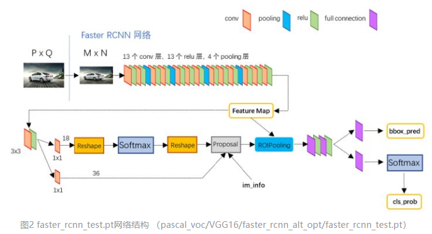
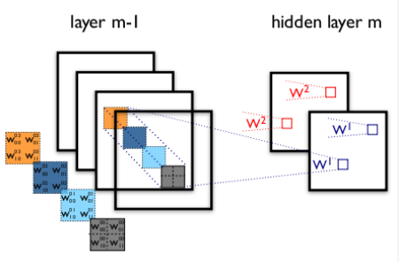
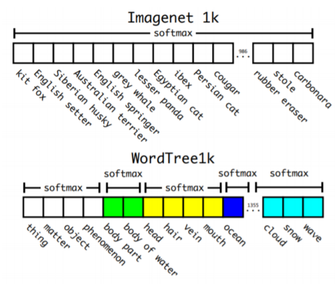

CV方向
======

[TOC]

介绍faster rcnn的流程以及损失函数，为什么这么设计损失函数
---------------------------------------------------------

    图片输入经过conv得到特征图 -> 
    生成anchors -> 
    softmax分类器提取anchors -> 
    bbox reg回归anchors -> 
    Proposal -> 
    softmax判定前景背景 + 对proposals进行bounding box regression 

AlexNet在LeNet基础上的提升 
---------------------------

1，用relu代替sigmoid作为CNN的激活函数。在较深的网络时，成功解决sigmoid在网络较深情况下的梯度弥散问题。

2，dropout随机忽略一部分神经元，避免过拟合（alexnet最后几个全连接层都用到）

3，以前CNN都是用平均池化，改进后用max
pooling。避免平均池化的模糊化效果；步长比池化核尺寸小，输出有重叠和覆盖，提升了丰富性。

4，LRN层，对局部神经元中响应大的值变更大，增强泛化能力。

LRN层。

local response
normalizatiion，局部响应归一化层。因为relu响应结果是无界的。需要归一化。默认across-channels。

之后的BN：

更高的学习率，更快的训练过程；防止过拟合，移除或使用较小的dropout；取消LRN层。

调参
----

<http://lamda.nju.edu.cn/weixs/project/CNNTricks/CNNTricks.html>

Relu，sigmoid，tanh，linear四种激活函数的比较
-------------------------------------

神经网络中的激活函数，目的就是引入非线性，不完全正确，可以理解成这个函数必须在连续函数空间稠密。

sigmoid：

relu：

线性激活函数 linear 【输入的加权和再加上 bias。这个函数十分简单，但是功能也很有限。】

Sigmoid的优点在于输出范围有限，数据在传输过程中不容易发散；输出范围是0\~1，可以作为输出层，输出表示概率；求导容易。但是饱和时梯度太小。

为何relu比sigmoid和tanh强？

主要因为gradient特性不同。Sigmoid和tanh在饱和区平缓，接近于0，易丢失信息，会减缓收敛速度。

relu求导更容易。

而且relu是单边的，更符合生物神经元的特征。

Relu更容易优化，因为分段性质。

如何理解anchor？
----------------

SPP的本质是将不同尺寸的输入resize成为相同尺寸的输出。

Anchor的本质是将相同尺寸的输出，推导得到不同尺寸的输入。

一般是在最末层的 feature map
上再用3\*3的窗口去卷积特征。当3\*3的卷积核滑动到特征图的某一个位置时，以当前滑动窗口中心为中心映射到原图的一个区域(注意
feature map
上的一个点是可以映射到原图的一个区域的，这个很好理解，感受野起的作用)，以原图上这个区域的中心对应一个尺度和长宽比，就是一个anchor了。fast
rcnn 使用3种尺度和3种长宽比（1:1；1:2；2:1），则在每一个滑动位置就有 3\*3 = 9
个anchor。

Region proposal的作用是什么
---------------------------

<https://www.zhihu.com/question/265345106>

Input Image经过CNN特征提取，首先来到Region Proposal网络。由Regio Proposal
Network输出的Classification，这并不是判定物体在COCO数据集上对应的80类中哪一类，而是输出一个Binary的值p，可以理解为，人工设定一个threshold=0.5。RPN网络做的事情就是，如果一个Region的，则认为这个Region中可能是80个类别中的某一类，具体是哪一类现在还不清楚。到此为止，Network只需要把这些可能含有物体的区域选取出来就可以了，这些被选取出来的Region又叫做ROI
（Region of Interests），即感兴趣的区域。当然了，RPN同时也会在feature
map上框定这些ROI感兴趣区域的大致位置，即输出Bounding-box。

比如，我上午第四节课饿得不行，我就想着中午要吃什么？附近好多西餐厅和中餐厅，餐厅里菜品有很多。但是我生活费不够了。。gg。。不太想吃（吃不起）西餐，所以无论西餐厅里有什么菜品，我都不会考虑；只有路过中餐厅时，我才会进去看看具体吃什么菜。

So,
RPN网络做的事情就是，把一张图片中，我不感兴趣的区域——花花草草、大马路、天空之类的区域忽视掉，只留下一些我可能感兴趣的区域——车辆、行人、水杯、闹钟等等，然后我之后只需要关注这些感兴趣的区域，进一步确定它到底是车辆、还是行人、还是水杯（分类问题）。。。。你可能会看到另一对通俗易懂的词语，前景（车、人、杯）和背景（大马路、天空）。

到此为止，RPN网络的工作就完成了，即我们现在得到的有：在输入RPN网络的feature
map上，所有可能包含80类物体的Region区域的信息，其他Region（非常多）我们可以直接不考虑了（不用输入后续网络）。

如何理解多通道+多卷积核做卷积
-----------------------------

输入图像layer
m-1有4个通道，同时有2个卷积核w1和w2。对于卷积核w1，先在输入图像4个通道分别作卷积，再将4个通道结果加起来得到w1的卷积输出；卷积核w2类似。所以对于某个卷积层，无论输入图像有多少个通道，输出图像通道数总是等于卷积核数量！

所以对多通道图像做1x1卷积，其实就是将输入图像于每个通道乘以卷积系数后加在一起，即相当于把原图像中本来各个独立的通道“联通”在了一起。

为什么RCNN用SVM做分类器，不直接用CNN全连接后接softmax输出
---------------------------------------------------------

RCNN训练可以理解成：先通过所有样本训练出能提取特征的合理的CNN网络，再将这个合理的CNN提取每个样本的特征，最后将这大量的特征提供给各类别的SVM分类训练【SVM正负样本选取：GT为正样本，iou小于0.3为负样本，其余区域ignore。rcnn要处理的信息不仅信息量大而且信息间的相关性也很大，因此用svm来解决多标记学习问题是合理的】。在RCNN训练过程中SVM作为监督分类器也会被训练，目的是找到最优参数配置。

SVM作为线性分类机器学习方法经典，动机是寻找最优支持向量来分割平面。当问题是多分类时，SVM将线性不可分的数据映射到更高层次的超平面空间从而达到线性可分，主要依赖于数据中位于分割平面的一部分支持向量，不需要很多样本，所需训练数据是hard-negative
mining
(初始时用所有样本训练，但是这样负样本可能远多于正样本，经过一轮训练后将score最高即最容易被误判的负样本加入新的负样本训练集，进行训练，重复以上步骤至达到停止条件比如分类器性能不再提升)【适用于小样本训练，在样本不平衡时依然可以不发生过拟合】，而softmax是基于回归的原则，使用全局数据的随机采样进行训练。可见，SVM与LR是从两个不同角度去解决分类问题。

同时，CNN连接的LR与单纯的LR有区别，CNN在训练的同时就会趋于提取样本中的feature的signature特征，也就是说CNN在卷积训练过程中就是一个对线性不可分数据增加其线性可分程度的过程【理解：低层的卷积会倾向于提取普遍特征，高层的卷积倾向于提取抽象特征，这类特征可以认为比低层的普遍特征具有更高的线性可分性】。

介绍yolo的流程
--------------

**V1**

将物体检测当做一个回归问题来处理。

1，S\*S的网格，有object的中心落在这个网格，则这个网格负责预测这一个object。

2，损失函数均用均方差，由预测位置的误差、Bbox的尺寸的IOU误差、分类误差、置信度loss（判断是否有物体的中心落在某个格子）组成。

【大物体IOU误差和小物体IOU误差对网络训练中loss贡献值接近；小物体会对网络优化造成很大影响】

**V2**

<https://wyf0912.github.io/2018/04/04/YOLO-v1-v3/>

1.  direct location prediction

【不太懂】

3，实现在分类和检测数据集上的联合训练。

对于检测数据集，可以用来学习预测物体的边界框、置信度以及为物体分类，而对于分类数据集可以仅用来学习分类，但是其可以大大扩充模型所能检测的物体种类。

WordTree 中的根节点为 "physical
object"，每个节点的子节点都属于同一子类，可以对它们进行 softmax
处理。在给出某个类别的预测概率时，需要找到其所在的位置，遍历这个路径，然后计算路径上各个节点的概率之积。

在训练时，如果是检测样本，按照 YOLOv2 的 loss
计算误差，而对于分类样本，只计算分类误差。在预测时，YOLOv2 给出的置信度就是
，同时会给出边界框位置以及一个树状概率图。在这个概率图中找到概率最高的路径，当达到某一个阈值时停止，就用当前节点表示预测的类别。·

4，batch normalization，提高收敛性。

在每层卷积后加入BN，有助于规范化模型，不会过拟合。

5，high resolution classifier

以448\*448分辨率输入，先448微调分类网络，10epoch，再训练检测网络。

6，conv with anchor boxes

通过预测偏移量而不是坐标值，能够简化问题。

候选框变多了，召回率提升很明显。

7，dimension cluster（维度聚类）

传统聚类是用欧式距离，大的box有大error，作者采用IOU作为聚类的距离。

再训练集的bbox上跑一下k-means聚类（IOU作为聚类距离），找到一个比较好的值，k=5，网络在每个网格单元预测5个bbox，每个bbox有五个坐标值。

8，fine-grained feature（细粒化特征）

在不同层次的特征图上获取不同分辨率的特征。

将 26 × 26 × 512 feature map 转化成了 13 × 13 × 2048 的
featuremap，然后拼接在了原来 13 × 13 的 feature map 后面。

9，Multi-scale training

尺寸越大正确率越高，速度越慢。

多尺度训练，每10个batch随机选择一个新的图片尺寸，由于采用下采样参数32，所以不同尺寸大小选择为32的倍数，最小320，最大608.网络自动改变尺寸并继续训练。

9，改用darknet-19作为目标检测框架，加快运算速度。

10，分类和检测分开训练。

训练分类时，DarkNet19在ImageNet用SGD跑160epochs，输入尺寸224调到448，lr到0.001，跑10个epochs。

训练检测时，把分类网络改为检测网络，去掉原来网络最后的卷积层，而是使用3个3\*3\*1024的conv，并且每个新增的卷积层后都接一个1\*1卷积，数量是类别数量。

**V3**

多尺度预测，

V2有个passthrough层，类似resnet，讲最后层1313连接上一层的2626，加强对小目标检测的精度。V3使用类似FPN的上采样和融合做法，1313,2626,5252，虽然v3每个网格预测3个边界框，看起来比v2每个预测5个要少，但是多尺度融合，使得边界框的数量比以前多很多。

Bbox预测

Logistic回归预测objectness
score，每个GT只匹配一个bbox。如果此bbox不属于GT，则这个bbox的误差就仅仅含有objectness的loss，而不含有坐标和类别的loss。

准确率(Precision)、召回率(Recall)、F值(F-Measure)、ROC曲线、PR曲线
------------------------------------------------------------------

<https://blog.csdn.net/qq_29462849/article/details/81053135>

如果我们希望：被检索到的内容越多越好，这是追求“查全率”，即A/(A+C)，越大越好。

如果我们希望：检索到的文档中，真正想要的、也就是相关的越多越好，不相关的越少越好。这是追求“准确率”，即A/(A+B)，越大越好。

F-feature，综合评价指标；综合考虑P和R。

当F1较高时能说明试验方法比较有效。

ROC全称是受试者工作特征，ROC曲线下的面积就是AUC，用来衡量二分类问题。

,

左上角的点(TPR=1,FPR=0)，为完美分类，也就是这个医生医术高明，诊断全对。点A(TPR\>FPR)，说明医生A的判断大体是正确的。中线上的点B(TPR=FPR)，也就是医生B全都是蒙的，蒙对一半，蒙错一半；下半平面的点C(TPR\<FPR)，这个医生说你有病，那么你很可能没有病，医生C的话我们要反着听，为真庸医。

AUC越大，分类器分类效果越好。

数据处理方法和性能度量（西瓜书）
--------------------------------

说一说常见的正则化手段，L1和L2正则化的不同
------------------------------------------

<https://blog.csdn.net/jningwei/article/details/79234406>

正则化，regularization，就是约束。防止过拟合。

通过限制参数值域空间，显式地控制模型复杂度，避免过拟合。

正则化手段包括了：

L1正则化、L2正则化、Elastic网络正则化、最大范数约束、Dropout、使用验证集。

L1正则化，

L2正则化，

Elastic网络正则化，

最大范数约束，

Dropout，

使用验证集，纯粹用于调超参，多次使用，验证集需要足够泛化性。

【测试集其实目的就是加试一下验证集是否泛化充分】

机器学习中验证集的作用，及如何使用
----------------------------------

<https://blog.csdn.net/u014038273/article/details/80145317>

bp算法可训练了参数只有权重，关于其他参数的设计，可以通过验证集来进行模型选择。

验证集可以用来调超参，比如模型结构，学习率，不同优化器。

验证集可以用在训练过程中，一般训练的时候几个epoch结束，跑一次验证集看看效果。可以及时发现模型或参数问题，比如模型在验证集中发散、出现奇怪结果（比如无穷大）、mAP不增长或者增长很慢等情况。即可终止训练，重新调参。而不需要等到训练结束。

另一个好处是验证模型的泛化能力，如果在验证集上效果比训练集差很多，就该考虑是否过拟合了。

还可以用验证集对比不同的模型。设计几个模型去跑，验证集有标签，就可以看效果。

CNN的一系列为什么
---------------------------------------------------------------------
[CNN做卷积][https://blog.csdn.net/qq_28778507/article/details/85091003]，可以提取特征，减小计算量。

CNN有步长，是因为一般认为人对外界的认知是从局部到全局的，图像之间的联系也是局部的像素联系较为紧密，距离较远的像素相关性则较弱。因而每个神经元没有必要对全局图像进行感知，只需要对局部感知，然后在更高层将局部信息综合起来得到全局信息。步长的存在是为了使filter滑动，这样就可以在整张图片中任何位置都能提取出这个特征，得到相对的空间信息。关于步长的选择，当stride=1时，它是逐个像素挨个提取，当stride！=1时，可以看成它在下采样相当于固定点的pool，降维的同时忽略掉部分特征，可以减少过拟合。

CNN有pooling，Pooling层会损失细节，损失细节可以减少无关的信息，这样可以减少参数和计算量，同时降维和防止过拟合，它是一个特征选择，信息过滤的过程，它损失了一些特征，这些特征可能是视觉上的冗余性，同时降低了对计算性能的要求，随着现在运算速度的提高，pooling层使用的越来越少。

CNN使用激活函数，每一层的输出都是上层输入的线性函数，无论神经网络有多少层，输出都是输入的线性函数，与只有一个隐藏层效果相当，这种情况就是多层感知机（MLP）。引入激活函数之后，深层神经网络有了意义，它不再是线性函数，他可以逼近任意函数。

## loss的类型

## 深度学习最全优化方法总结比较（SGD，Adagrad，Adadelta，Adam，Adamax，Nadam）

<https://zhuanlan.zhihu.com/p/22252270>

## 给一张散点图，怎么做方差最大的回归

怎么处理样本不均衡，尤其是每个图像检测模型中
--------------------------------------------

Faster rcnn为什么会有anchor，没有anchor会怎么样
-----------------------------------------------

Faster rcnn中的ROI pooling层有什么不足，什么是ROI align，什么是双线性插值
-------------------------------------------------------------------------

LR为什么用sigmoid函数，这个函数的优缺点？为什么不用其他函数（sigmoid是伯努利分布的指数形式）
--------------------------------------------------------------------------------------------

Max pooling层怎么做的
---------------------

目标检测的三种方法
------------------

目标检测常用网络，RCNN，SPP，fast rcnn，faster rcnn的区别
---------------------------------------------------------

Softmax公式，信息熵公式
-----------------------

训练时，mini-batch与GPU的内存匹配
---------------------------------

训练到最后，loss值很大，但是精度在上升
--------------------------------------

如果loss开始一直不变，但是从某点开始下降的原因
----------------------------------------------

梯度爆炸（loss发散，出现nan）
-----------------------------

优化策略比较
------------

卷积神经网络中，没有zero padding的情况下，输入7\*7，filter3\*3，stride=3，会怎么样
----------------------------------------------------------------------------------

CNN中卷积的实现
---------------

语义分割和实例分割
------------------

算法方向
========

各类排序算法
------------

树和二叉树
----------

单链表和双链表
--------------

图论和最小生成树
----------------

动态规划问题
------------

推荐算法
--------

线性回归和逻辑回归
------------------

随机森林和决策树
----------------

SVM
---

贝叶斯算法
----------

SVM原问题和对偶问题的关系
-------------------------

决策树过拟合哪些办法，前后剪枝
------------------------------

深度学习基础
============

什么是熵，熵怎么求
------------------

Crf与HMM的区别以及常用点
------------------------

CNN中常用的技术点和tricks
-------------------------

是否可以将任何非线性作为激活函数
--------------------------------

Batch大小如何影响测试正确率
---------------------------

损失函数重要吗
--------------

L0，L1，L2正则化
----------------

无监督学习方法有哪些，介绍
--------------------------

空洞卷积（dilated conv）的理解
------------------------------

卷积层中感受野的大小计算
------------------------

梯度下降算法与牛顿法的优缺点
----------------------------

解决训练样本类别不平衡问题
--------------------------

各个激活函数的优缺点
--------------------

目标检测领域的常见算法
----------------------

Batch normalization如何实现，作用
---------------------------------

Momentum优化算法原理，作用
--------------------------

梯度消失和梯度爆炸
------------------

生成模型和判别模型
------------------

从贝叶斯的角度来看，正则化等价于对模型参数引入先验分布，对正则化的理解，并阐述引入L2和L1分别对应什么分布
--------------------------------------------------------------------------------------------------------

简述回归，分类，聚类方法的区别和联系，并分别举一个例子，简要介绍算法思路
------------------------------------------------------------------------

分类问题的评价标准
------------------

常用的池化操作有哪些
--------------------

1\*1卷积核的作用
----------------
理解：

作用：
1，降维、升维
2，减少参数
3，跨通道信息交互
4，增加非线性特性

卷积层和全连接层的区别
----------------------

解决过拟合的方法
----------------

深度学习优化算法有哪些，随便介绍一个
------------------------------------

L1正则为什么可以把系数压缩成0，坐标回归的具体实现细节
-----------------------------------------------------

简要谈谈TensorFlow的计算图
--------------------------

谈谈判别式模型和生成式模型
--------------------------
