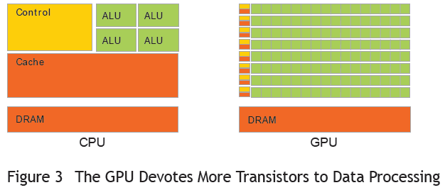

# GPU并行编程的运算架构

多核CPU与GPU的计算网格：

ALU指的是arithmetic logic unit，算术逻辑单元。CPU计算和GPU计算都是靠的ALU。

GPU绝大部分的芯片面积是ALU，而且超大阵列排布，可以并行运算，所以浮点计算速度快。

相比而言，CPU大部分面积要给控制单元和Cache，因为其要承担整个计算机的控制工作。

更为细致的GPU并行计算架构：

计算网格由多个流处理器构成，每个流处理器又包含n多块。

 1. 线程

线程是 GPU 运算中的最小执行单元，线程能够完成一个最小的逻辑意义操作。

2. 线程束

线程束是 GPU 中的基本执行单元。GPU 是一组 SIMD 处理器的集合，因此每个线程束中的线程是同时执行的。这个概念是为了隐藏对显存进行读写带来的延迟所引入的。

目前英伟达公司的显卡此值为 32，不可改动，也不应该对其进行改动。

3. 线程块

一个线程块包含多个线程束，在一个线程块内的所有线程，都可以使用共享内存来进行通信、同步。但一个线程块能拥有的最大线程/线程束，和显卡型号有关。

4. 流多处理器

流多处理器就相当于 CPU 中的核，负责线程束的执行。同一时刻只能有一个线程束执行。

5. 流处理器

流处理器只负责执行线程，结构相对简单。

# GPU 和 CPU 在并行计算方面的不同

1. 任务数量

CPU 适合比较少量的任务，而 GPU 则适合做大量的任务。

2. 任务复杂度

CPU 适合逻辑比较复杂的任务，而 GPU 则适合处理逻辑上相对简单的任务 (可用比较少的语句描述)。

3. 线程支持方式

由于 CPU 中线程的寄存器组是公用的，因此CPU 在切换线程的时候，会将线程的寄存器内容保存在 RAM 中，当线程再次启动的时候则会从 RAM 中恢复数据到寄存器。

而 GPU 中的各个线程则各自拥有其自身的寄存器组，因此其切换速度会快上不少。

当然，对于单个的线程处理能力来说，CPU 更强。

4. 处理器分配原则

CPU 一般是基于时间片轮转调度原则，每个线程固定地执行单个时间片；而 GPU 的策略则是在线程阻塞的时候迅速换入换出。

5. 数据吞吐量

GPU 中的每个流处理器就相当于一个 CPU 核，一个 GPU 一般具有 16 个流处理器，而且每个流处理器一次能计算 32 个数。