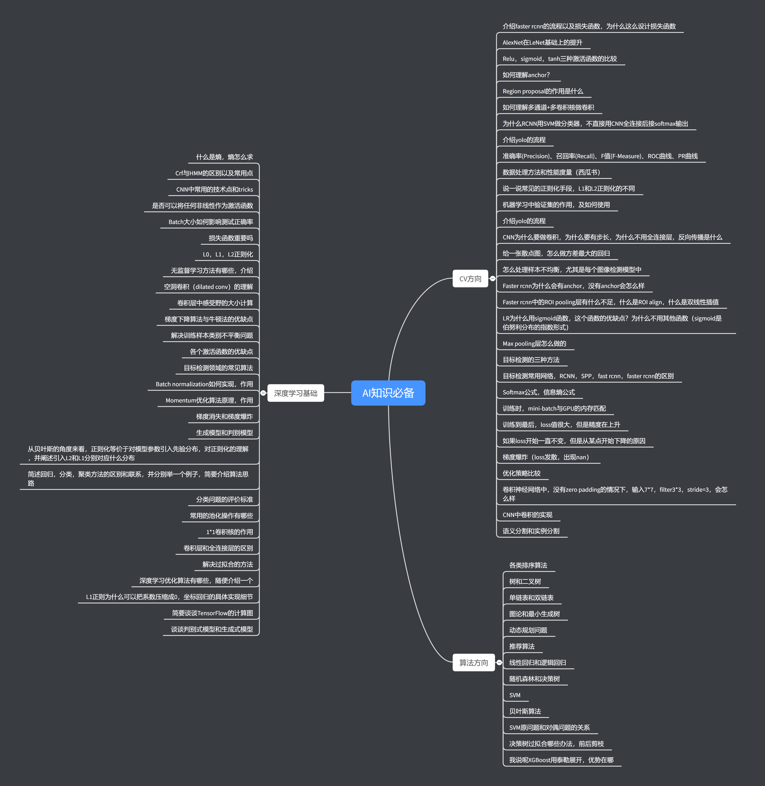

# object-detection

【https://blog.csdn.net/witnessai1/article/details/52551362
Markdown使用大全】

## CV经典问题

## 人脸识别
**主要介绍MTCNN + FaceNet**

## 基于深度学习的目标检测
### **R-CNN系列：**

**RCNN—\>SPPNet—\>FastRCNN—\>FasterRCNN—\> R-FCN—\>RetinaNet—\>Mask RCNN**

### **单次目标检测器：**

**YOLOv1—\> SSD—\> v2—\> v3—\>MobileNet，M2Det**

## 如何调参

**经典问题 + Detectron问题调参 + Face调参**
