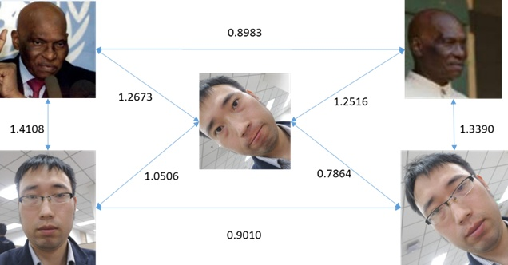

MTCNN + FaceNet
============

https://segmentfault.com/a/1190000015917420

opencv很有名了，在本次项目中用到的当然是它的强大的图片处理能力了，大概就是读取、写入、连接手机摄像头一些了

mtcnn是一个用来检测图片中人脸位置（人脸检测）的深度学习模型，其使用了三个卷积网络实现了对图像中人脸的检测，在文章后面再具体的介绍其实现的细节

facenet是谷歌的一篇很有名的论文和开源项目，其实现了将输入的人像最终转换为shape为1*128的向量，然后通过计算不同照片之间的欧几里得距离来判断他们的相似度，当然其中还包含许多技巧以及创新的想法，最终的在lfw（一个很有名的人脸数据库）准确率达到99%+++，在文章的后面我会尽可能的解读其论文和代码中的有意思的想法

tensorflow应该很熟悉了（不然你是怎么搜到我的这篇文章的？） 学习深度学习的应该都知道存在各种各样的方便于搭建网络的框架，tensorflow就是其中很有名的一个，由google开源，功能强大

mtcnn
-----

https://zhuanlan.zhihu.com/p/37705980

3个CNN级联算法结构，将人脸检测和人脸特征点检测同时进行。

facenet
-------

没有用传统softmax分类，而是抽取某一层作为特征，学习一个从图像到欧式空间的编码方法，基于此再做人脸识别、人脸检测、人脸聚类。
效果如下，若人脸距离小于1。06，可作为同一个人。

经过embedding层输出1*128的脸部特征向量，计算不同脸部照片的相似度的时候计算欧式距离。

同一个人的照片差值较小，不同人差值较大，facenet是使用triplet loss的方法来微调embedding。

理解triplet loss
---------------

triplet是一个三元组，这个三元组是这样构成的：从训练数据集中随机选一个样本，该样本称为Anchor，然后再随机选取一个和Anchor (记为x_a)属于同一类的样本和不同类的样本,这两个样本对应的称为Positive (记为x_p)和Negative (记为x_n)，由此构成一个（Anchor，Positive，Negative）三元组。

triplet loss的目的就是通过学习，让x_a和x_p特征表达之间的距离尽可能小，而x_a和x_n的特征表达之间的距离尽可能大，并且要让x_a与x_n之间的距离和x_a与x_p之间的距离之间有一个最小的间隔。

[欧式距离度量，+表示[]内的值大于0时候为loss，小于0为0]

对x_p和x_n特征表达的梯度刚好利用了求损失时候的中间结果，给的启示就是，如果在CNN中实现 triplet loss layer, 如果能够在前向传播中存储着两个中间结果，反向传播的时候就能避免重复计算。这仅仅是算法实现时候的一个Trick。

#实时人脸识别的挑战
