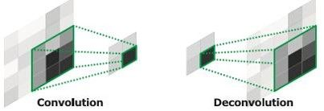
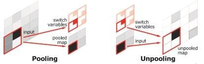

医疗图像分割——Random Forest，U-Net，MRF
=================================

[TOC]

## 1. 前言

**我的硕士论文是关于RF+U-Net+MRF实现医疗图像分割技术。此篇文章会复习RF，U-Net，MRF等知识。**


## 2. 决策树和随机森林


### 1. 什么是决策树，以及决策树运算

优点：训练时间复杂度低，预测的过程快速，决策树可视化好，
缺点：overfitting
常见的模型组合形式：Boosting，Bagging组合形成RF和GBDT。

从西瓜书学习决策树：

最主要的概念：信息熵，是度量样本集合纯度最常用的一种指标。

information entropy 信息熵


information gain 信息增益


一般来说，信息增益越大，意味着使用属性a来进行划分所获的的纯度提升越大。

另外，基尼系数Gini，是一种与信息熵类似的做特征选择的方式。检测数据的纯度。


对于分类问题（将某个样本划分到某一类），也就是离散变量问题，CART使用Gini值作为评判标准。定义为**Gini=1-∑(P(i)*P(i))**,P(i)为当前节点上数据集中第i类样本的比例。例如：分为2类，当前节点上有100个样本，属于第一类的样本有70个，属于第二类的样本有30个，则Gini=1-0.7×07-0.3×03=0.42，可以看出，类别分布越平均，Gini值越大，类分布越不均匀，Gini值越小。

在寻找最佳的分类特征和阈值时，评判标准为：argmax（Gini-GiniLeft-GiniRight），即寻找最佳的特征f和阈值th，使得当前节点的Gini值减去左子节点的Gini和右子节点的Gini值最大。

**剪枝 **

剪枝处理，pruning，是对付过拟合的主要手段。

包括预剪枝，后剪枝。

预剪枝，是指在决策树生成过程中，对每个结点在划分前进行评估，若当前划分不能给决策树带来泛化性提高，则停止划分，将当前结点作为叶结点。

后剪枝，先从训练集生成一颗完整的决策树，然后自底向上对非叶结点进行考察，若将该结点对应的子树替换为叶结点能带来决策树性能提升，则将该子树替换为叶结点。

**如何判断决策树泛化性能提升**


看划分前后验证集的精度是否有提升。1划分后高，所以要划分，23划分后减小了，所以不划分。

而且，后剪枝比预剪枝决策树保留了更多的分支，欠拟合风险小，泛化好。但时间久。

主要：information gain，决策树

决策树实际上是将空间用超平面进行划分的一种方法。


这样使得每一个叶子节点都是在空间中的一个不相交的区域。

用随机的方式建立一个森林。

建立决策树的时候，需要注意：采样，完全分裂。

RF对输入数据要进行行列采样，对于行采样，是有放回。

假设输入样本是N，采样样本也是N。这样训练时候，每棵树的输入都不是全部样本，相对不容易出现过拟合。

再进行列采样，M个feature里选择m个。之后就是对采样之后的数据使用完全分裂方式建立决策树，这样决策树的某个叶子要么无法完全分裂，要么所有样本都是指向同一个分类。

### 2. 随机森林 与 GBDT

自助法重采样，bootstrap，在N的数据集中，有放回的抽取N个样本；独立抽取k次，生成k个相互独立的自助样本集。

随机森林通过自助法生成k个自助样本集，每个自助样本是每棵树的全部训练数据。对于每棵分类树，在树的每个节点处，从M个特征随机挑选m个特征，一般m是M开方。按照**节点不纯度最小原则**从m个特征中选出一个特征进行生长。使得每个节点的不纯度达到最小。

每次抽样生成自助样本集，全体样本不在自助样本中的剩余样本成为out-of-bag，大约占1/3，用作预测分类正确率。汇总每棵树的OOB估计，得到分类器的正确率。

**关键问题是如何选择最优的m（或者是范围），这也是随机森林唯一的一个参数。 **

在随机森林算法的函数**randomForest()中有两个非常重要的参数**，而这两个参数又将影响模型的准确性，它们分别是**mtry和ntree**。**一般对mtry的选择是逐一尝试，直到找到比较理想的值，ntree的选择可通过图形大致判断模型内误差稳定时的值。**


## 3. 随机森林如何应用在医疗影像分割中

本章关于随机森林部分基础知识部分选自[博士论文][http://139.210.164.170:8080/http/g.wanfangdata.com.cn/details/detail.do?_type=degree&id=D01400550]。

#### 1，特征提取

从立体的原始医学图像中通常可以提取出大量的二维（每层特征单独提取，不考虑前后切片间的关系）和三维特征（在立体空间中考虑不同切片间的关系）。常用的二维特征通常包含 Hog 特征、Gabor 特征和 Hessian 特征等。

Hog 特征提取的大致过程为：首先把图像分成连通小区域，这些小区域被称为 cell，然后统计 cell 中各像素点的梯度或边缘的方向直方图。这些直方图组合起来就构成了特征。Hog 特征对图像几何的和光学的变化都能保持很好的不变性。医学图像由于图像成像设备的不同和病人个体之间的差异等原因，采集得到的图像亮度，组织形态总会存在一定差异，使用 Hog 特征可以描述出器官组织的方向特性。

在空间域中，一个二维的 Gabor 滤波器是一个正弦平面波和高斯核函数的乘积，能够在空间域和频率域同时获得局部最优化，这与人类的视觉系统类似。所以 Gabor 变换可以很好地表述图像的局部结构信息。纹理信息是医学图像的重要信息之一。本文使用 Gabor 滤波器组产生多组特征来描述 CT 和 OCT 图像中的纹理信息。

Hessian 特征也是用来描述图像边缘信息的特征。Hessian 矩阵是多变量情形下的二阶导数，它描述了各方向上灰度梯度的变化。Hessian 矩阵的定义为：


其中𝐼𝑥𝑥和𝐼𝑦𝑦是 X 和 Y 方向上的二阶偏导数，𝐼𝑥𝑦是 XY 方向上的二阶偏导数。

#### 2，随机森林训练

随机森林的训练是通过以随机形式学习带有标记的数据样本集来建立一系列决策树的过程。训练每一棵树的过程是建立一系列节点的过程。在每棵决策树的节点中，分为中间节点和叶子节点。每个中间节点都是一个弱分类器，也就是说，一个中间节点包含了一个问题，根据这个问题的回答分裂为左右两个孩子节点，目的是使得分裂后得到的某种衡量指标达到最大。这个衡量指标可以是信息增益（Information Gain）、信息增益率（Information Gain Ratio）或者是基尼指数（Gini Coefficient）。

以下是随机森林训练过程的伪代码：

```
**初始化 Initialization:**
	输入参数: 
	T, 树的棵数; D, 树的最大深度; G, 每个特征的特征值所在范围划分数目
	计算每棵树的特征抽取个数: F

**训练 Training:**
	For i = 1 to T
	Sub_initial:
        从总样本中有放回的抽取本次所需样本.
        对每个特征的特征值划分区间.
        创建节点分类器 Create classifier:
        1. 计算最佳得分，并存储当前特征、阈值，以及所到深度:
        	For j =1 to F
        		For k = 1 to G
        			计算当前得分
        		EndFor
        	EndFor
        2. 根据当前节点的特征和阈值，将当前样本分进左子节点或右子节点.
        3. If (left_child =0 or right_child=0 or current depth>D)
        		停止分裂
        	Else
        		创建子节点
        	Endif
EndFor
```

在随机森林的训练过程中包含有两种随机量：一种是在训练每棵树之前都要**从原始样本集中有放回的随机抽取本次训练的样本集**，保证每棵树的训练样本集都不相同，也就是 bagging 算法。另一种则是**在训练决策树时建立每个中间节点时随机选取特征**。

在每棵树训练之前随机选取 F 个特征作为候选特征集，F要远小于特征集特征总数。在实际操作时，特征是无放回的从候选特征集中被选出，以避免某一特征被重复选中，从而增加随机性，避免过拟合。在一个节点中当某个特征被选中以后，还需要设定一个阈值（threshold）来决定当前样本子集的分裂方式，以期望 IGR（也就是伪代码中的 score）得到最大值。

Threshold 的设置有几种不同方式。典型的是使用的特征服从**正态分布**，在设置 threshold 时将特征值范围按照正态分布划分，然后对每个划分点计算衡量指标并选取最高的值的位置作为 threshold 记录在当前节点中。

训练随机数是一个不断新建节点的过程，直到达到两个终止条件之一：（1）树的深度达到了设定的最大值；（2）IGR 为零，也就是说当前节点中样本达到最纯，所有样本都是同一类，已经无法再分裂。

在训练完成后，将会得到 T 棵树。每棵树的中间节点会包含有一个由一个特征和该特征所对应的阈值组成的分类器。而在叶子节点中包含了一个分类的结果（判断成为每一类的概率）。

#### 3，随机森林分类

**对图像中单个像素点 v 的分类过程，就是让点 v 从一棵树的根节点开始向下经过层层中间节点最后到达叶子节点的过程。V 进入一个中间节点，根据当前节点所记录的特征和阈值，以及点 v 在这个特征下的特征值来判断它该进入左子节点还是右子节点。当 v 进入最后的叶子节点时，这个叶子节点中会有各类别的概率分布**

​																		**𝑝(𝑐𝑗|𝑣, 𝑙𝑒𝑎𝑓(𝑡𝑟𝑒𝑒𝑡)) **

**根据这个概率分布可以判断出 v 的类别归属。所有 T 棵树的结果综合起来就是 v 的最终判断结果。在传统随机森林中通常使用平均投票法，将每颗树中的 v 所在叶子节点的概率分布综合起来。其数学表达式可以写成如下形式：**


**像素点v穿过T棵树得到了T个叶子节点的概率分布，综合，那么概率最大的那一类便是v的最终结果。**

平均投票法仅用到了叶子节点中的信息不考虑v在穿过每颗树的中间节点时所产生的信息，所以只有当树的数量大到一定程度时，分类结果才能相对精确。然而，在实际操作时，树的数量T与整个算法训练和分类的时间以及所耗计算平台的资源成正比，数量T往往会有所限制，尤其是在医学三维图像处理中，图像规模会比二维自然图像大的多。这样的话，在T有限的情况下，平均投票策略可能无法保证图像的正确分割。

为解决这一问题，本文采用了**权重投票策略**，在判断待测像素点时不仅利用了**叶子节点里的概率分布**，也利用了**决策树中间节点的信息**，比平均投票法更加合理。考虑到到训练过程中的每个中间节点，不仅包含了由一个选定特征和对应的阈值组成的分类器，也包含了**表示中间节点分裂好坏程度的信息量IGR**。我们使用待测点从根节点开始通过整棵树所经过的所有中间节点的IGR的平均值作为本条路径的得分，该得分反映了这条路径的可靠性。一条路径的长度通常是当前树的深度。图2.3演示了一个待测点在通过深度为3的树后，到达叶子节点时对路径得分的计算。

 


3. FCN的系列算法
-----------------------------------

U-Net的出现，使得医疗影像处理能够提上一个新的台阶。

### 1. FCN的原理

https://zhuanlan.zhihu.com/p/22308032

很关键的一篇关于FCN的文章【2015CVPR最佳论文】

Fully Convolutional Networks for Semantic Segmentation论文提出的结构。

主要用到的三个技术：卷积化，上采样，跳跃结构。

#### 卷积化 convolutional

将普通的分类网络丢弃全连接层，换上对应的卷积层即可。


#### 上采样和上池化 upsample unpooling

上采样即指反卷积deconvolution（也叫conv_transpose）。





#### 忽略连接结构 skip layer

优化结果。将不同的池化层结果进行上采样后优化输出。


### 2. U-Net的实现及特点

U-Net，先学习FCN的概念，再学习U-Net的网络设计以及实现效果。


U-Net的结构，主要讲述在FCN基础上做出的改进。


## 4. DeepLab系列

https://blog.csdn.net/orange_littlegirl/article/details/89761377

**deeplab**发表在ICLR 2015上。论文下载地址：[Semantic Image Segmentation with Deep Convolutional Nets and Fully Connected CRFS](http://arxiv.org/pdf/1412.7062v3.pdf).

### 1. Deeplab v1

在VGG16上做的优化：

1，VGG16的全连接层变为卷积（FCN思想）

2，最后两个池化层去掉了下采样

3，后续卷积层的卷积核改为空洞卷积

4，在ImageNet上预训练的VGG16权重上做finetune

**利用空洞卷积进行特征提取**


**带洞卷积减少了核的大小（减少了参数的数量），可以达到节省内存的作用。带洞卷积的有效性基于一个假设：紧密相邻的像素几乎相同，全部纳入属于冗余，不如跳H(hole size)个取一个。**

在DCNN中应用了**空洞卷积密集的提取特征**，对于普通利用pooling层进行缩减图像尺寸的方法：输出步幅是16，需要上采样16倍得到预测结果，结果是比较模糊的；而利用空洞卷积方法：空洞卷积采样率rate=2，保持步幅为8，只需要上采样8倍，结果清晰了很多。

用FCN得到coarse score map并插值到原图像大小，再用fully connected CRF对从FCN得到的分割结果进行细节上的refine。


下图展示了CRF处理前后的效果对比。


DCNN存在分类和定位之间的折中问题，预测到目标的大致位置但模糊，用MRF进行边界优化。

### 2. Deeplab v2

```
用多尺度获得更好的分割效果(使用ASPP)
基础层由VGG16转为ResNet
使用不同的学习策略(poly)
```

**提出ASSP（atrous spatial pyramid pooling）**


```
在多尺度上存储目标；
在给定的特征层上使用不同采样率的卷积有效的重采样；
使用不同采样率的空洞卷积并行采样。
```

ASPP中在给定的Input Feature Map上以r=(6,12,18,24)，r=(6,12,18,24)的3×3空洞卷积并行采样。

**deeplab V1V2使用了CRF模块，见下一章。而deeplab V3用poly策略替代了CRF。**


### 3. Deeplab V3

提出了更通用的框架，适用于任何网络；复制了ResNet最后的block，并级联起来；在ASPP中使用BN层，没使用CRF。


（a）图像金字塔。输入图像进行尺度变换得到不同分辨率input，然后将所有尺度的图像放入CNN中得到不同尺度的分割结果（b）编码-解码。类似FCN和UNet等结构（c）本文提出的串联结构。（d）本文提出的Deeplab v3结构。最后两个结构右边其实还需要8×/16×的upsample，在deeplab v3+中有所体现。

**ASSP的改进：多了个1x1的conv和global avg pool**

(1)1x1卷积，论文中3.3第一段解释的有点意思，当rate=feature map size时，dilation conv就变成了1x1 conv，所以这个1x1conv相当于rate很大的空洞卷积。(2)此外引入了全局池化这个branch，这个思想是来源于PSPnet,简言之就是spp在分割上的应用，多尺度pooling。(3)每个branch后面都没有relu，其实有BN, 而BN是线性操作，可以合并到conv里面，论文的Sec 4.1 说明了V3的所有层是用了BN的，BN可以加速训练还有弱正则，所以一般都会用。


**串联结构**

对RestNet进行改进，利用空洞卷积进行扩大视野的操作，提出了串联结构，经过实验发现有较高的精度，但还是不及改进的ASSP


### 4. Deeplab 3+

设计基于v3的decode module；用modify xception作为backbone。


5. MRF,CRF 改进
----------------------------------
**CRF是MRF中的一种，都用势函数(分子势函数除以分母势函数)表示概率。
只是CRF表示的是条件概率，MRF表示的是联合分布。由于CRF是条件概率故CRF建模的时候观测变量是给定的，不确定的是标签的分布。得到条件分布后，代入标签变量就可以得到具体的条件概率数值。**

**而一般意义的MRF由于表示联合分布，观测变量和标签变量都未给定，得到联合分布后需要代入观测变量和标签变量才能得到具体的联合概率数值。**

通过计算每个体素与已知类别的距离，考虑相邻体素的影响迭代更新产生已知类别的距离，引入最大后验概率准则，将最大似然估计问题转化为类概率与类条件概率乘积的最大问题，进行最后分类。MRF可以能有效避免噪声的影响，得到平滑分割结果。

### 1. MRF与CRF

https://wenku.baidu.com/view/87e45beb4431b90d6d85c7fc.html

本质上是一种概率无向图模型。

马尔科夫随机过程：下一个时间点的状态只与当前状态有关系，与以前状态没关，即未来状态决定于现在而不是过去。在已知“现在”的条件下，“未来”和“过去”彼此独立的特性就被称为马尔科夫性，具有这种特性的随机过程被叫做马尔科夫过程。


这是一维马尔科夫随机过程，对二维空间的图像，存在二维马尔科夫随机场，其平面网格结构可以较好的表现图像中像素之间的空间相关性，它考虑每个像元的邻近元的条件分布，有效的描述图像的局部统计特性。

**图像分割的过程就是估计标号的过程，其本质就是如何处理区域的标号分量和区域的一致性属性这两个分量之间的关系**

### 2. MRF如何与其他网络连起来

Conditional Random Fields Meet Deep Neural Networks for Semantic Segmentation（2018.1）

## 5. 我的论文

通过使用随机森林分类器的结果来初始化CRF的一元势，然后从训练数据中学习成对势。

【在Mac桌面的三篇论文，在文件传输助手里】

### 1. 如何结合FCN与MRF

https://github.com/tsogkas/brainseg/blob/master/cnn.m，把这篇代码看一遍。是不是U-Net的倒数第二层的特征图输出？ 最好能够实现一下。


### 2. 如何结合RF与CNN

Automated Mass Detection in Mammograms using Cascaded Deep Learning and Random Forests，CNN和RF结合的好论文。


## 5. 四篇论文详读

```
paper1 Automated Mass Detection in Mammogramss using Cascaded Deep Learning and Random Forest
Paper2 Mask-RCNN and U-Net ensembled for nuclei segmentation 
paper3 Sub-cortical Brain Structure Segmentation using F-CNN's
paper4 Conditional Random Fields meet Deep Neural Networks for Semantic Segmentation
```


