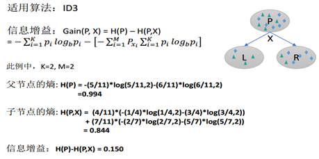
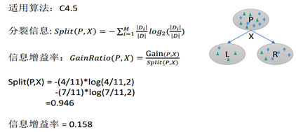

医疗图像分割——Random Forest，U-Net，MRF
=================================

[TOC]

## 1，前言

**我的硕士论文是关于RF+U-Net+MRF实现医疗图像分割技术。此篇文章会复习RF，U-Net，MRF等知识。**


## 2， 决策树和随机森林

https://www.cnblogs.com/fionacai/p/5894142.html

首先，在了解树模型之前，自然想到树模型和线性模型有什么区别呢？其中最重要的是，树形模型是一个一个特征进行处理，之前线性模型是所有特征给予权重相加得到一个新的值。决策树与逻辑回归的分类区别也在于此，逻辑回归是将所有特征变换为概率后，通过大于某一概率阈值的划分为一类，小于某一概率阈值的为另一类；而决策树是对每一个特征做一个划分。另外逻辑回归只能找到线性分割（输入特征x与logit之间是线性的，除非对x进行多维映射），而决策树可以找到非线性分割。

**而树形模型更加接近人的思维方式，可以产生可视化的分类规则，产生的模型具有可解释性（可以抽取规则）。**树模型拟合出来的函数其实是分区间的阶梯函数。

**决策树学习：采用自顶向下的递归的方法，基本思想是以信息熵为度量构造一棵熵值下降最快的树，到叶子节点处熵值为0（叶节点中的实例都属于一类）。**

  其次，需要了解几个重要的基本概念：根节点（最重要的特征）；父节点与子节点是一对，先有父节点，才会有子节点；叶节点（最终标签）。

**一、决策树**

**决策树生成的数学表达式：**


决策树的生成：

**决策树思想，实际上就是寻找最纯净的划分方法**，这个最纯净在数学上叫纯度，纯度通俗点理解就是目标变量要分得足够开（y=1的和y=0的混到一起就会不纯）。另一种理解是分类误差率的一种衡量。实际决策树算法往往用到的是，纯度的另一面也即不纯度，下面是不纯度的公式。不纯度的选取有多种方法，每种方法也就形成了不同的决策树方法，比如**ID3算法**使用信息增益作为不纯度；**C4.5算法**使用信息增益率作为不纯度；**CART算法**使用基尼系数作为不纯度。


**决策树要达到寻找最纯净划分的目标要干两件事，建树和剪枝**

**建树：**

**（1）如何按次序选择属性**

也就是首先树根上以及树节点是哪个变量呢？这些变量是从最重要到次重要依次排序的，那怎么衡量这些变量的重要性呢？　**ID3算法**用的是信息增益，**C4.5算法**用信息增益率；**CART算法**使用基尼系数。决策树方法是会把每个特征都试一遍，然后选取那个，能够使分类分的最好的特征，也就是说**将A属性作为父节点，产生的纯度增益（GainA）要大于B属性作为父节点，则A作为优先选取的属性。**


 

（根据log(x)的函数可知，p值越小，熵越大，所以当分组完全是会出现p=0此时熵最大）

**（2）** **如何分裂训练数据（对每个属性选择最优的分割点）**

如何分裂数据也即分裂准则是什么？也是通过不纯度来分裂数据的，通过比较划分前后的不纯度值，来确定如何分裂。

下面做具体的介绍：

**CART算法：**既可以做分类，也可以做回归。只能形成二叉树。

**分支条件：**二分类问题

**分支方法：**对于连续特征的情况：比较阈值，高于某个阈值就属于某一类，低于某个阈值属于另一类。对于离散特征：抽取子特征，比如颜值这个特征，有帅、丑、中等三个水平，可以先分为帅和不帅的，不帅的里面再分成丑和中等的。

**得分函数（y）：**就是上面提到的gt(x)，对于分类树取的是分类最多的那个结果（也即众数），对于回归树取得是均值。

**损失函数：其实这里的损失函数，就是分类的准则，也就是求最优化的准则**

对于分类树（目标变量为离散变量）：同一层所有分支假设函数的基尼系数的平均。

对于回归树（目标变量为连续变量）：同一层所有分支假设函数的平方差损失

**对于分类树（目标变量为离散变量）**：使用基尼系数作为分裂规则。比较分裂前的gini和分裂后的gini减少多少，减少的越多，则选取该分裂规则，这里的求解方法只能是离散穷举。关于基尼系数，可以参考周志华的西瓜书决策树那章，讲得比较简洁，也比较易懂。“直观来说，（数据集D的基尼系数）Gini(D)反映了从数据集D中随机抽取两个样本，其类别标记不一致的概率，因此Gini(D)越小，则数据集D的纯度越高。”

具体这个的计算，我觉得有例子才好理解，下面这个红绿球的例子很好的说明了，如何根据损失函数最小（也就是基尼系数最小）来选取分裂规则。最后，三者作比较，0.444,0.417,0.338，GIINs2更小，因此选择它作为分类规则。【若giniT最小，则选择不分；若GIINs1最小，则选S1作为分类规则】


**对于回归树（目标变量为连续变量）：**使用最小方差作为分裂规则。只能生成二叉树。


**CART与逻辑回归的比较：**


主要优缺点如下图。**缺点补充几点，不是很稳定，数据变化一点，你的树就会发生变化；没有考虑变量之间相关性，每次筛选都只考虑一个变量（因此不需要归一化）；只能线性分割数据；贪婪算法（可能找不到最好的树）。优点也补充三点，同时可以处理分类变量和数值变量（但是可能决策树对连续变量的划分并不合理，所以可以提前先离散化）**；**可以处理多输出问题；另外决策树不需要做变量筛选，它会自动筛选；适合处理高维度数据。**


**ID3算法：**使用信息增益作为分裂的规则，信息增益越大，则选取该分裂规则。多分叉树。信息增益可以理解为，有了x以后对于标签p的不确定性的减少，减少的越多越好，即信息增益越大越好。



**C4.5算法：**使用信息增益率作为分裂规则（需要用信息增益除以，该属性本身的熵），此方法避免了ID3算法中的归纳偏置问题，因为ID3算法会偏向于选择类别较多的属性（形成分支较多会导致信息增益大）。多分叉树。连续属性的分裂只能二分裂，离散属性的分裂可以多分裂，比较分裂前后信息增益率，选取信息增益率最大的。



**三种方法对比：**

**ID3的缺点，倾向于选择水平数量较多的变量，可能导致训练得到一个庞大且深度浅的树；另外输入变量必须是分类变量（连续变量必须离散化）；最后无法处理空值。**

**C4.5选择了信息增益率替代信息增益。**

**CART以基尼系数替代熵；最小化不纯度而不是最大化信息增益。**

**剪树：**

**（2）** **如何停止分裂**

   下面这六种情况都会停止分裂。其中第一种其实属于树的完全长成，但这会出现过拟合问题，所有之前很流行一种抑制这种情况的方法，叫树的剪枝。树的剪枝分为预剪枝和后剪枝，预剪枝，及早的停止树增长控制树的规模，方法可以参考如下6点停止分类的条件。后剪枝在已生成过拟合决策树上进行剪枝，删除没有意义的组，可以得到简化版的剪枝决策树，包括REP（设定一定的误分类率，减掉对误分类率上升不超过阈值的多余树）、PEP，还有一种CCP，即给分裂准则—基尼系数加上惩罚项，此时树的层数越深，基尼系数的惩罚项会越大。


**二、随机森林**

 尽管有剪枝等等方法，一棵树的生成肯定还是不如多棵树，因此就有了随机森林，解决决策树泛化能力弱的缺点。（可以理解成三个臭皮匠顶过诸葛亮）

而同一批数据，用同样的算法只能产生一棵树，这时Bagging策略可以帮助我们产生不同的数据集。**Bagging**策略来源于bootstrap aggregation：从样本集（假设样本集N个数据点）中重采样选出Nb个样本（有放回的采样，样本数据点个数仍然不变为N），在所有样本上，对这n个样本建立分类器（ID3\C4.5\CART\SVM\LOGISTIC），重复以上两步m次，获得m个分类器，最后根据这m个分类器的投票结果，决定数据属于哪一类。

**随机森林在bagging的基础上更进一步：**

**1.**  **样本的随机：从样本集中用Bootstrap随机选取n个样本**

**2.**  **特征的随机：从所有属性中随机选取K个属性，选择最佳分割属性作为节点建立CART决策树（泛化的理解，这里面也可以是其他类型的分类器，比如SVM、Logistics）**

**3.**  **重复以上两步m次，即建立了m棵CART决策树**

**4.**  **这m个CART形成随机森林，通过投票表决结果，决定数据属于哪一类（投票机制有一票否决制、少数服从多数、加权多数）**


**关于调参：**

**1.如何选取K，可以考虑有N个属性，取K=根号N**

**2.最大深度（不超过8层）**

**3.棵数**

**4.最小分裂样本树**

**5.类别比例**

 

**三、python实现代码**


决策树的重要参数都是防止过拟合的. 有2个参数是关键，min_samples_leaf 这个sklearn的默认值是1，经验上必须大于100，如果一个节点都没有100个样本支持他的决策，一般都被认为是过拟合；max_depth 这个参数控制树的规模。决策树是一个非常直观的机器学习方法。一般我们都会把它的决策树结构打印出来观察，如果深度太深对于我们的理解是有难度的。

## 补充：结构化随机森林

https://www.jianshu.com/p/776fbe81229d


## 3， CT图像与邻域近似随机森林

http://www.bewindoweb.com/226.html

**邻域近似随机森林NAFs**

NAFs的原论文是用于医学图像分割的，它是一个框架不是一个模型，主要作用是对任意距离定义的近似最近邻检索（approximate nearest neighbour retrieval for arbitrary distances），解决的问题类似于：给定一组带Ground Truth的灰度人体侧面CT图片去训练NAFs，然后对于一幅新的CT图片（out of samples），给出CT图像中各个内脏边缘的3D分割结果。


医学图像简介

我们平时拍的CT（计算机断层扫描技术，Computed Tomography）图片原始数据并不是平面的2D图像数据，而是3D的。它是利用精准的X射线和探测器对人体的某一部位做逐层的断面扫描，采集人体截面结构的信息，再通过重建（Reconstruction）来获得数值，最后通过一定显示手段去可视化。你可以想象成CT图像会一片一片地采集2D图像，再组装成3D的。每一片图像都会有一个“厚度”，由于是物理设备，是以毫米（mm）为单位的。在这个厚度的某个像素（实际是一个小方块）里面，很可能包含不止一种组织，那么它的取值通常是这些组织取值的平均数。还有一个概念是“层距”，相邻两片的距离如果太大，就可能不是连续的影像。又因为设备的不同，每个CT图像的层厚和层距取值可能会不同，那么如果要进行机器学习，我们需要对这些图像进行配准（Register），就是把所有的CT图像数据都转换到同一个世界坐标系XYZ下，如果多了就删去，如果少了就插入，如果坐标系不一样就旋转等等，有相应的算法可以处理。最后我们规定图像像素的大小应该是几mm厚，把CT扫描的“强度值”作为“像素值”来使用，就得到了灰度图像。灰度图像的数值通常是在-2048到2048之间的，如果要可视化，需要转为0~256，因为1000和1001的灰度你是看不出来区别的。

CT图像通常以DICOM（Digital Imaging and Communications in Medicine）格式存储，分辨率为4096级。我录制了一个gif来直观地感受一下（MITK workbench打开DICOM文件）：


Patches简介

看到这里显然有一个疑问，树模型不是一直都用来分类的吗，怎么可以用来分割呢？答案是作者通过巧妙的方式把分类转换为了分割。我们称2D图像中的像素点叫做Pixel，那么3D图像中的像素体就叫做Voxel（体像素），由一堆Voxel组成的小立方体就是Patches（块像素）。


那么将40张CT图像分割成30000重叠的块像素，每个块像素提取1400个特征，训练NAFs进行分类，类别是块像素中占比多的那个类型：


对于一幅新输入的待分割CT图像，我们也切分成重叠的块像素，提取同样的特征，遍历NAFs，每棵树都会找到很多30000训练patches中的“最近邻”patches，并且根据概率有一个相似度。我们只选择相似度最高的前20个最近邻patches。


对这20个最近邻Patches，创建一个搜索窗，用归一化积相关算法(NCC)进行相似度匹配，得分最高的Patches就会被选为候选Patches（candidate patches）。这样每一个voxel都会被若干候选Patches覆盖，他们的投票值最高的标签就作为这个Voxel的标签，这样一来就用Patches的分类完成了Voxel分割：


NAFs原理

整个分割过程大致有了了解，关键点有两个：如何构建随机森林去近似邻域？如何处理特征？

我们定义整个图像集为**I**，每张图像I∈**I**，一个图像子集为{Ip}p∈[1,**P**]，两幅图像之间的距离定义为ρ(·, ·)，具体数值为ρ(I, J)，J为新输入的图像。NAF就是寻找k个和J最相似的I∈**I**，也就是使得ρ(I, J)最小的k个I，定义这个最近邻图像集合为**N**_kρ(J)。可以想象直接搜索这个 **N**_kρ(J) 是十分费时间的，而且如果采用“年龄”来定义距离，新图像是没有“年龄”这种属性的，所以距离根本不可测。NAF就是通过构建随机森林来近似这种邻域关系，相当于把这种距离保存在了树的结构里，只需要遍历森林测试特征就可以了，完全不需要去计算距离。

**NAFs树的测试过程**

NAF的树是二叉决策树，给定一幅图像J，它会依次遍历每棵树，从根节点s0开始一直找到叶节点，叶节点里保存着训练图像ID，如果新图像和那些叶节点都走了相似的路径，那说明它们本身也是相似的，这就是最近邻图像集合。我们把单棵树产生的最近邻图像集合定义为**N**_T(ρ)(J)，也就是新图像J按照ρ定义遍历第T棵树产生的Neighbours。论文的示意图很容易看懂，就是简单的决策树测试而已：


**NAFs树的训练过程——特征降维**

定义图像I的特征向量为**f**(I)∈**R**^Q，因为是图像，所以f非常可能是一个高维的特征向量，例如Q=10000。那么必须得降维，否则就当场去世了。随机森林的随机是一个又鲁棒又能降维的东西，我们先随机挑选特征**f**_T(I)∈**R**^q，q<Q，**f**_T(I)∈**f**(I)，这样既降低了维度，又使得每棵树更加独立。然后在每棵树训练期间节点分叉的时候，我们总是再次从f_T(I)中随机挑选M个特征进行遍历来做出二分抉择，M<=q，**f**_MT(I) ∈**f**_T(I)。两次降维已经够了。我们定义节点的图像集合为**I**_S，分叉后左节点图像集合为**I**_SL，右节点图像集合为**I**_SR，那么对于图像In∈I_S来说，分叉条件为：


f_mT(In)指的是In这个图像的第m个特征值。我们的目标就是优化参数m和τ，使得划分得最开，很明显要使用熵了。但这里的距离ρ不是传统的距离，可能是语义距离，所以这里的熵需要进行特殊定义。我们首先定义集合**A**的空间紧凑性为：


很容易理解，两两距离求和再平均，如果这个值越小，说明两两之间距离越小，那么就越紧凑（图像越相似），所以定义熵为：


根节点的紧凑性减去分叉后的紧凑性的加权，反映了按照当前m和τ划分子树根节点的紧凑程度，熵越大，划分也就越好，所以整个问题变成了求最优化解：


其中Δ是树的停止条件之一，也就是叶节点必须要有的最小图片数目。求解的过程就是对于每个m取值，我们遍历所有的τ划分点取值，求得使得熵G取到最大值的m和τ，虽然前面两次降维，但这个遍历过程仍然是一个很费时的操作。

训练树的停止条件：树的深度、最小样本数Δ、G<0。前两个就是决策树的基本停止条件，G<0意味着划分下去反而变得不紧凑了（图片之间相似程度更低了），所以还不如不要分直接停止生长。

**NAFs的测试过程**

对于给定的图像J，测试每棵树，找到叶节点最近邻图像集合**N**_T(ρ)(J)，我们给这些图像计数，那么得分最高的前k个显然是整个森林都认为很相似的最近邻图像了。定义1A(x)为sign函数，若x∈A则1A(x)=1，否则1A(x)=0，那么测试的计数得分用数学公式表示为：


也就是新图像J在距离ρ的定义下，森林F中各棵树T判断是否和训练图像In相似的求和值。

**NAFs参数调整**

NAF有很多参数：

（1）叶节点最小图像数目Δ

Δ越大，划分越粗糙，降低KNN精确度；Δ越小，越容易过拟合。

（2）最大树深

树深越小，划分越粗糙，降低KNN精确度；树深越大，对内存和算法性能要求就越高。

（3）树的数目

刚开始增加明显提升精确度；当树的数目达到一定程度后，精确度就不会有明显提升了。

（4）特征空间大小Q和降维q、M

q/Q越大，那么树的独立性越小，都训练出一样的树那还要森林有什么用呢。q/Q通常根据具体的Q值来确定，例如Q=10000，则q/Q取0.1，q=1000；Q=3000，则q/Q取1/3，q=1000。

M同理，可以根据机器性能和期望的邻域近似准确度去调整。

**NAFs优势和劣势**

从前面可以看出，整个分割过程其实就是一个寻找KNN的过程，不过NAFs的好处在于，它不需要进行配准（因为使用块像素的相似来进行分割的，而不是建立严格的数学模型），并且它可以用于“语义距离”。举个例子，我们要对脑部CT图像进行分类，判断这个人是多少岁，通常定义的距离都是这两幅图像的相似程度，比如欧式距离，而NAFs可以将“年龄”这个语义属性作为两幅图像的距离，也就是年龄差作为图像距离。这个和图像的像素值一点关系也没有，只和图像属性有关系。同时，因为构建了随机森林来保存这种块像素之间的近似相似性，所以搜索的速度非常快，不需要每个块像素去单独比对，只需要遍历NAFs即可。使用随机特征和树模型，能够很好地避免过拟合。

然而，如果Patches很多，那么整个训练过程会异常缓慢，并且需要巨量的内存和硬盘；并且这种方法只能适用于图像非常近似的分割（比如CT图像几乎变化不大），不能用于图像变化剧烈的，那种剧烈的还是老老实实使用神经网络吧。使用树模型，要调整的参数非常多。


## 4，FCN的系列算法

U-Net的出现，使得医疗影像处理能够提上一个新的台阶。

### 1. FCN的原理

https://zhuanlan.zhihu.com/p/22308032

很关键的一篇关于FCN的文章【2015CVPR最佳论文】

Fully Convolutional Networks for Semantic Segmentation论文提出的结构。

主要用到的三个技术：卷积化，上采样，跳跃结构。

#### 卷积化 convolutional

将普通的分类网络丢弃全连接层，换上对应的卷积层即可。


#### 上采样和上池化 upsample unpooling

上采样即指反卷积deconvolution（也叫conv_transpose）。


#### 忽略连接结构 skip layer

优化结果。将不同的池化层结果进行上采样后优化输出。


### 2. U-Net的实现及特点

U-Net，先学习FCN的概念，再学习U-Net的网络设计以及实现效果。


U-Net的结构，主要讲述在FCN基础上做出的改进。


## 5，DeepLab系列

https://blog.csdn.net/orange_littlegirl/article/details/89761377

**deeplab**发表在ICLR 2015上。论文地址：[Semantic Image Segmentation with Deep Convolutional Nets and Fully Connected CRFS](http://arxiv.org/pdf/1412.7062v3.pdf).

### 1. Deeplab v1

在VGG16上做的优化：

1，VGG16的全连接层变为卷积（FCN思想）

2，最后两个池化层去掉了下采样

3，后续卷积层的卷积核改为空洞卷积

4，在ImageNet上预训练的VGG16权重上做finetune

**利用空洞卷积进行特征提取**


**带洞卷积减少了核的大小（减少了参数的数量），可以达到节省内存的作用。带洞卷积的有效性基于一个假设：紧密相邻的像素几乎相同，全部纳入属于冗余，不如跳H(hole size)个取一个。**

在DCNN中应用了**空洞卷积密集的提取特征**，对于普通利用pooling层进行缩减图像尺寸的方法：输出步幅是16，需要上采样16倍得到预测结果，结果是比较模糊的；而利用空洞卷积方法：空洞卷积采样率rate=2，保持步幅为8，只需要上采样8倍，结果清晰了很多。

用FCN得到coarse score map并插值到原图像大小，再用fully connected CRF对从FCN得到的分割结果进行细节上的refine。


下图展示了CRF处理前后的效果对比。


DCNN存在分类和定位之间的折中问题，预测到目标的大致位置但模糊，用MRF进行边界优化。

### 2. Deeplab v2

```
用多尺度获得更好的分割效果(使用ASPP)
基础层由VGG16转为ResNet
使用不同的学习策略(poly)
```

**提出ASSP（atrous spatial pyramid pooling）**


```
在多尺度上存储目标；
在给定的特征层上使用不同采样率的卷积有效的重采样；
使用不同采样率的空洞卷积并行采样。
```

ASPP中在给定的Input Feature Map上以r=(6,12,18,24)，r=(6,12,18,24)的3×3空洞卷积并行采样。

**deeplab V1V2使用了CRF模块，见下一章。而deeplab V3用poly策略替代了CRF。**


### 3，Deeplab V3

提出了更通用的框架，适用于任何网络；复制了ResNet最后的block，并级联起来；在ASPP中使用BN层，没使用CRF。


（a）图像金字塔。输入图像进行尺度变换得到不同分辨率input，然后将所有尺度的图像放入CNN中得到不同尺度的分割结果（b）编码-解码。类似FCN和UNet等结构（c）本文提出的串联结构。（d）本文提出的Deeplab v3结构。最后两个结构右边其实还需要8×/16×的upsample，在deeplab v3+中有所体现。

**ASSP的改进：多了个1x1的conv和global avg pool**

(1)1x1卷积，论文中3.3第一段解释的有点意思，当rate=feature map size时，dilation conv就变成了1x1 conv，所以这个1x1conv相当于rate很大的空洞卷积。(2)此外引入了全局池化这个branch，这个思想是来源于SPPnet,简言之就是spp在分割上的应用，多尺度pooling。(3)每个branch后面都没有relu，其实有BN, 而BN是线性操作，可以合并到conv里面，论文的Sec 4.1 说明了V3的所有层是用了BN的，BN可以加速训练还有弱正则，所以一般都会用。


**串联结构**

对RestNet进行改进，利用空洞卷积进行扩大视野的操作，提出了串联结构，经过实验发现有较高的精度，但还是不及改进的ASSP


### 4. Deeplab 3+

设计基于v3的decode module；用modify xception作为backbone。


### 总结

DeepLab v1是结合了深度卷积神经网络（DCNNs）和概率图模型（DenseCRFs）的方法。同时atrous（带孔）算法扩展感受野，获取更多的上下文信息。仍存在问题：**特征分辨率的降低、物体存在多尺度，DCNN 的平移不变性。**

DeepLabv2 在最后几个最大池化层中去除下采样，取而代之的是使用空洞卷积，以更高的采样密度计算特征映射。受到SPP的启发，提出了一个类似的结构，在给定的输入上以不同采样率的空洞卷积并行采样，ASPP模块。还采样全连接的 CRF 在增强模型捕捉细节的能力。

DeepLabv3 设计采用多比例的带孔卷积级联或并行来捕获多尺度背景，去掉了CRFs。


## 6，MRF,CRF 改进

**CRF是MRF中的一种，都用势函数(分子势函数除以分母势函数)表示概率。
只是CRF表示的是条件概率，MRF表示的是联合分布。由于CRF是条件概率故CRF建模的时候观测变量是给定的，不确定的是标签的分布。得到条件分布后，代入标签变量就可以得到具体的条件概率数值。**

**而一般意义的MRF由于表示联合分布，观测变量和标签变量都未给定，得到联合分布后需要代入观测变量和标签变量才能得到具体的联合概率数值。**

通过计算每个体素与已知类别的距离，考虑相邻体素的影响迭代更新产生已知类别的距离，引入最大后验概率准则，将最大似然估计问题转化为类概率与类条件概率乘积的最大问题，进行最后分类。MRF可以能有效避免噪声的影响，得到平滑分割结果。

### 1. MRF与CRF

https://wenku.baidu.com/view/87e45beb4431b90d6d85c7fc.html

本质上是一种概率无向图模型。

马尔科夫随机过程：下一个时间点的状态只与当前状态有关系，与以前状态没关，即未来状态决定于现在而不是过去。在已知“现在”的条件下，“未来”和“过去”彼此独立的特性就被称为马尔科夫性，具有这种特性的随机过程被叫做马尔科夫过程。


这是一维马尔科夫随机过程，对二维空间的图像，存在二维马尔科夫随机场，其平面网格结构可以较好的表现图像中像素之间的空间相关性，它考虑每个像元的邻近元的条件分布，有效的描述图像的局部统计特性。

**图像分割的过程就是估计标号的过程，其本质就是如何处理区域的标号分量和区域的一致性属性这两个分量之间的关系**

### 2. MRF如何与其他网络连起来

Conditional Random Fields Meet Deep Neural Networks for Semantic Segmentation（2018.1）

## 7，我的论文

通过使用随机森林分类器的结果来初始化CRF的一元势，然后从训练数据中学习成对势。

【在Mac桌面的三篇论文，在文件传输助手里】

### 1. 如何结合FCN与MRF

https://github.com/tsogkas/brainseg/blob/master/cnn.m，把这篇代码看一遍。是不是U-Net的倒数第二层的特征图输出？ 最好能够实现一下。


### 2. 如何结合RF与CNN

Deep Neural Decision Forests，2015ICCV最佳论文奖。

**1，前向传播**

由图可知，每个分离节点（split nodes）的参数由DNN来学习(representation learning)，DNN最后一层是全连接层，每个节点单元的输出作为分离节点决策函数(d1,d2,...)的输入参数，本篇论文采用的决策函数是sigmoid函数。知道决策函数后，我们可以计算其路径函数（routing function），每棵树的根节点，其路径函数的值赋予1，然后乘以该节点的决策函数值d，得到左边子节点的路径函数1*d，右边子节点的路径函数值为1*(1-d)，以此类推，可以计算出每颗决策树节点的路径函数。
首先，我们要初始化分离节点决策函数的参数（theta），以及对叶子节点分布参数(pai)初始化为均匀分布。然后根据上面内容计算各个节点的路径函数（routing function）。当数据集的标签确定时，叶子节点的预测类别也是确定的，初始化时是均匀分布，当训练完成时，其(prediction)满足一定的概率分布。
然后，当样本来时，通过DNN，得到分离节点决策函数的参数，从而计算出决策函数和路径函数(routing function)，到叶子节点时，我们使用该节点的路径函数乘以该节点监督类别的概率，作为预测输出，并通过对每个节点的预测输出进行求和，得到这棵树的预测输出，这样，我们就可以得到各个类别的概率输出。


