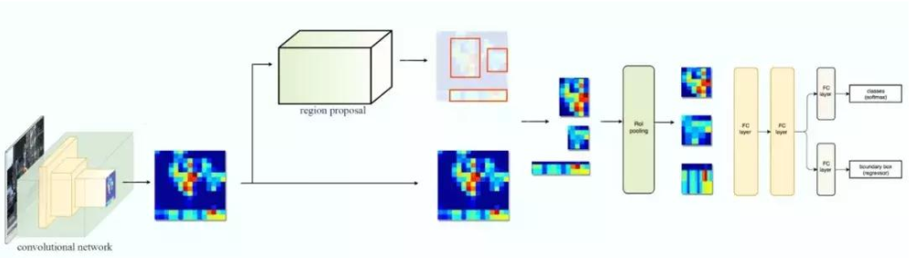
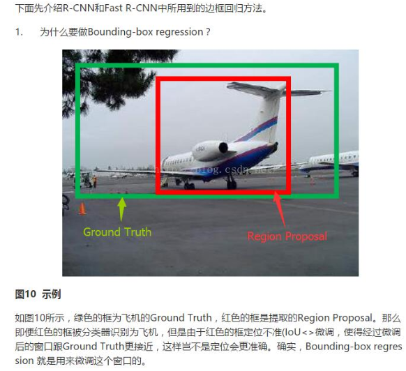
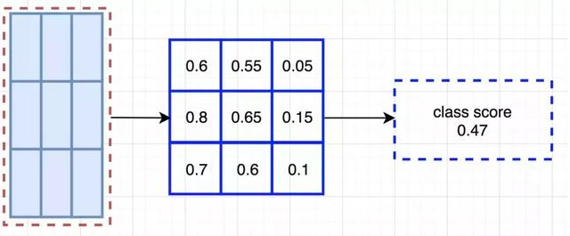

# 基于深度学习的目标检测算法

[TOC]


1，所有算法的简介：
===================

RCNN
----

　　1. 在图像中确定约1000-2000个候选框 (使用selective search)

　　2. 每个候选框内图像块缩放至相同大小，并输入到CNN内进行特征提取

　　3. 对候选框中提取出的特征，使用SVM判别是否属于一个特定类

　　4. 对于属于某一特征的候选框，用回归器进一步调整其位置

SPP Net
-------

　　1. 在图像中确定约1000-2000个候选框 (使用选择性搜索)

　　2. 对整张图片输进CNN，conv5后，空间金字塔池化，得到feature map

　　3. 经过FC，再对特征用SVM分类

Fast RCNN
---------

　　1. 在图像中确定约1000-2000个候选框 (使用选择性搜索)

　　2. 对整张图片输进CNN，得到feature map

　　3. 找到每个候选框在feature
map上的映射patch，将此patch作为每个候选框的卷积特征输入到SPP layer和之后的层

　　4. 对候选框中提取出的特征，使用分类器判别是否属于一个特定类

　　5. 对于属于某一特征的候选框，用回归器进一步调整其位置

Faster RCNN
-----------

　　1. 对整张图片输进CNN，得到feature map

　　2. 卷积特征输入到RPN，得到候选框的特征信息

　　3. 对候选框中提取出的特征，使用分类器判别是否属于一个特定类

4. 对于属于某一特征的候选框，用回归器进一步调整其位置

2，RCNN
=======


流程：
------

1. 输入图像；

2. 利用选择性搜索（Selective Search）区域生成算法在输入图像中提取Region
Proposal（大概2000个）；

3. 将第一步中产生的每个Region Proposal分别resize后（也即图中的warped
region，文章中是归一化为227×227）作为CNN网络的输入；

4. CNN网络提取到经过resize的region
proposal的特征送入每一类的SVM分类器分类别，判断是否属于该类。回归算法求boundary
box。

补充1：网络是如何使用SVM的
--------------------------

先通过所有样本训练出能提取特征的合理的CNN网络，再将这个合理的CNN提取每个样本的特征，最后将这大量的特征提供给各类别的SVM分类训练【SVM正负样本选取：GT为正样本，iou小于0.3为负样本，其余区域ignore。rcnn要处理的信息不仅信息量大而且信息间的相关性也很大，因此用svm来解决多标记学习问题是合理的】。在RCNN训练过程中SVM作为监督分类器也会被训练，目的是找到最优参数配置。

补充2：不用softmax而用SVM的原因
-------------------------------

SVM是寻找最优支持向量来分割平面。当问题是多分类时，SVM将线性不可分的数据映射到更高层次的超平面空间从而达到线性可分，主要依赖于数据中位于分割平面的一部分支持向量，在样本不平衡时依然可以不发生过拟合，而softmax是基于回归的原则，使用全局数据的随机采样进行训练。可见，SVM与LR是从两个不同角度去解决分类问题。

补充3：Region Proposal的方法Selective search
--------------------------------------------

用分割不同区域的办法来识别潜在的物体。在分割的时候，我们要合并那些在某些方面（如颜色、纹理）类似的小区域。相比滑窗法在不同位置和大小的穷举，候选区域算法将像素分配到少数的分割区域中。所以最终候选区域算法产生的数量比滑窗法少的多，从而大大减少运行物体识别算法的次数。同时候选区域算法所选定的范围天然兼顾了不同的大小和长宽比。

step1:计算区域集R里每个相邻区域的相似度S={s1,s2,…}

step2:找出相似度最高的两个区域，将其合并为新集，添加进R

step3:从S中移除所有与step2中有关的子集

step4:计算新集与所有子集的相似度

step5:跳至step2，直至S为空

【在每次迭代中，形成更大的区域并将其添加到区域提议列表中。以自下而上的方式创建从较小的细分segments到较大细分segments的区域提案】


【上图，得到区域的很多proposal，提取区域的空间金字塔的多样特征，组合成一个特征向量，然后训练SVM就可以分类出哪个区域是真正我们想要的目标】

【selective
search的策略是，既然是不知道尺度是怎样的，那我们就尽可能遍历所有的尺度好了，但是不同于暴力穷举，我们可以先得到小尺度的区域，计算每两个相邻的区域的相似度，然后每次合并最相似的两块，直到最终只剩下一块完整的图片。既然特征很多，那就把我们知道的特征都用上，但是同时也要照顾下计算复杂度，不然和穷举法也没啥区别了。最后还要做的是能够对每个区域进行排序，这样你想要多少个候选我就产生多少个】

3，SPP Net
==========


Spatial Pyramid Pooling，空间金字塔池化


,

1，不需要固定尺寸输入
---------------------

对于任意尺寸图像，卷积层都是可以接受的，只是卷积成不同大小的特征图。卷积完之后，我们得到了一组特征图(feature
maps）, 文中指出 第五卷积层一共有256个filter, 所以对应 256个不同大小的 feature
maps。

对每个 feature maps 进行 max pooling 操作得到一个输出（每个feature maps 被max
pooling成一个像素点，长度为1）, 于是256个feature maps，我们都 max
pooling，将这256个池化结果组成一个256\*1的向量。 256-d 指 256维。

接下来说中间那个4×256-d,我们将一个 feature map
等分为4块，就是将一幅图像等分为4块区域，max pooling得到4\*256的向量。

我们一共得到向量维数是： 256+4\*256+16\*256=（21\*256）维度。
对于任何输入尺寸图像，经过卷积之后，再用
SPP层处理，我们都会得到这个固定维度的特征向量。这个向量维度固定之后，后面的全链接层就可以固定了。

2，只对原图提取一次卷积特征
---------------------------

在R-CNN中，每个候选框先resize到统一大小，然后分别作为CNN的输入，这样是很低效的。


把整张待检测的图片，输入CNN中，进行一次性特征提取，得到feature
maps，然后在feature
maps中找到各个候选框的区域，再对各个候选框采用金字塔空间池化，提取出固定长度的特征向量。而R-CNN输入的是每个候选框，然后在进入CNN，因为SPP-Net只需要一次对整张图片进行特征提取，速度会大大提升。

4，Fast RCNN
============


RCNN的缺点：即使使用了selective search等预处理步骤来提取潜在的bounding
box作为输入，但是RCNN仍会有严重的速度瓶颈，原因也很明显，就是计算机对所有region进行特征提取时会有重复计算，Fast-RCNN共享卷积层，现在不是每一个候选框都当做输入进入CNN了，而是整张图片提一次特征，训练过程是端到端的（Sigle-stage）,并使用了一个多任务的损失函数，Fast
R-CNN网络的损失函数包含了Softmax的损失和Regressor的损失。输入一张完整的图片，在第五个卷积层再得到每个候选框的特征，SPP只需要计算一次特征，剩下的在conv5操作就好了。

**注意：fast rcnn的region proposal方法还是选择ss。**





原来的方法：许多候选框（比如两千个）--\>CNN--\>得到每个候选框的特征--\>分类+回归

现在的方法：一张完整图片--\>CNN--\>得到每张候选框的特征--\>分类+回归

1，fast rcnn中的ROI pooling操作
-------------------------------

Fast
rcnn中的ROI是spp的简化版，spp为三层金字塔，roi是单层金字塔；spp产生结果是4\*4+2\*2+1，roi产生结果7\*7.

RoI Pooling层的操作是将feature
map上的RoI区域划分为7×7的窗口，在每个窗口内进行max
pooling，然后得到（7×7）×256的输出，最后连接到全连接层得到固定长度的RoI特征向量，再通过全连接层作为Softmax和Regressor的输入。


2. Fast rcnn的实例展示
----------------------


输入图； 候选区域； 最后一个卷积层； 放大； 归一化的候选区域特征

5，Faster RCNN
==============


在fast rcnn基础上，舍弃了selective search，做了RPN，和权值共享。

1，基础网络做特征提取；

2，特征送入RPN做候选框提取；

3，分类层对候选框内物体进行分类，回归层对候选框的(x,y,w,h)进行精细调整。

Fast rcnn的问题是selective search找出所有的候选框非常耗时。

Faster rcnn的解决方法，构建一个提取边缘的神经网络，Region Proposal
Network(RPN)，RPN放在最后一个卷积层后面，直接训练得到候选区域。所以说这是一个完全end-to-end的CNN对象检测模型。

**四个损失：**

**区域生成网络的前后景分类损失（Object or not object）**

**区域生成网络的区域位置损失（Bounding box proposal）**

**Fast RCNN物体分类损失（Normal object classification）**

**Fast RCNN区域位置损失（Improve previous Bounding box proposal）**


**faster RCNN可以大致看做“区域生成网络+fast RCNN“的系统，用区域生成网络代替fast
RCNN中的Selective Search方法。**

我们整张图像上，所有的框，一开始就由Anchor和网络结构确定了，这些框都有各自初始的坐标（锚点）。所有后续的工作，RPN提取前景和背景，其实就是保留包含前景的框，丢掉包含背景的；包括后续的NMS，也都是丢掉多余的，并非重新新建一个框。

我们网络输出的两个Bounding-box
regression，都是输出的坐标偏移量，也就是在初始锚点的基础上做的偏移修正和缩放，并非输出一个原图上的绝对坐标。

**整张图片经过特征提取，得到FeatureMap；将FeatureMap中的每一点按照视野域找到原图中对应的位置，称为Anchor；每个Anchor生成不同大小不同长宽比的多个候选区域。selective-search的候选区域生成方式，它是按照颜色和纹理不断合并得到候选区域的，候选区域的产生没有规律，而RPN是每个Anchor都有对应的固定数量的候选区域，规律很明显。**


<https://zhuanlan.zhihu.com/p/24916624>

<https://www.cnblogs.com/zf-blog/p/7142463.html>

<https://www.cnblogs.com/skyfsm/p/6806246.html>


1，conv layer结构
-----------------

作为一种CNN网络目标检测方法，Faster
RCNN首先使用一组基础的conv+relu+pooling层提取image的feature maps。该feature
maps被共享用于后续RPN层和全连接层。

注意，faster
rcnn的conv层都是k=3，p=1，s=1，故卷积层不会改变输入输出矩阵的大小。而pooling层k=2，s=2，故池化层后会变为输入的1/2.

这样conv layer生成的feature map就可以跟原图对应起来了。Conv
layers部分共有13个conv层，13个relu层，4个pooling层。原图则变为1/16原图。


2，RPN结构
----------


生成anchors -\> softmax分类器提取anchors -\> bbox reg回归anchors -\> Proposal
Layer生成proposals

RPN网络实际分为2条线，上面一条通过**softmax分类anchors获得foreground和background**（检测目标是foreground），下面一条用于计算对于anchors的bounding
box
regression偏移量，以获得精确的proposal。而最后的Proposal层则负责综合foreground
anchors和bounding box
regression偏移量获取proposals，同时剔除太小和超出边界的proposals。其实整个网络到了Proposal
Layer这里，就完成了相当于目标定位的功能。

意义：

滑动窗口的位置提供了物体的大体位置信息，框的回归提供了框更精确的位置

### 2.1，多通道图像卷积基础知识


### 2.2，anchors的理解1

anchors实际上就是一组由rpn/generate_anchors.py生成的矩形。直接运行作者demo中的generate_anchors.py可以得到以下输出：


### 2.2，anchors的理解2


### 2.3 softmax判定foreground与background 


### 2.4 bounding box regression原理 



### 2.5 对proposals进行bounding box regression 


### 2.6 Proposal Layer 

缩进Proposal Layer负责综合所有[dx(A)，dy(A)，dw(A)，dh(A)]变换量和foreground
anchors，计算出精准的proposal，送入后续RoI Pooling Layer。


3，ROI Pooling结构
------------------

Roi pooling层也是pooling层的一种，只是是针对于Rois的pooling操作而已。

Roi
pooling层的过程就是为了将proposal抠出来的过程，然后resize到统一的大小。该层收集输入的feature
maps和proposals，计算出proposal feature maps，送入后续网络。


4，classification 
------------------

利用proposal feature maps计算proposal的类别，同时再次bounding box
regression获得检测框最终的精确位置。


# 6，MaskRCNN

https://blog.csdn.net/wangdongwei0/article/details/83110305

```
- Mask RCNN可以看做是一个通用实例分割架构
- Mask RCNN以Faster RCNN原型，增加了一个分支用于分割任务
- Mask RCNN比Faster RCNN速度慢一些，达到了5fps
- 可用于人的姿态估计等其他任务

MaskRCNN是faster的扩展，对每个proposal box都用FCN进行语义分割。（分割、定位、分类是同时进行的）；

RoI Align代替Faster RCNN中的RoI Pooling。因为RoI Pooling并不是按照像素一一对齐的（pixel-to-pixel alignment），也许这对bbox的影响不是很大，但对于mask的精度却有很大影响。使用RoI Align后mask的精度从10%显著提高到50%；
```


## 1，基本结构

**Mask R-CNN基本结构：**

与Faster RCNN采用了相同的two-state步骤：首先是找出RPN，然后对RPN找到的每个RoI进行分类、定位、并找到binary mask。
**Mask R-CNN的损失函数：**


Mask的表现形式(Mask Representation)：因为没有采用全连接层并且使用了RoIAlign，可以实现输出与输入的像素一一对应。

## 2，RoIAlign

http://blog.leanote.com/post/afanti.deng@gmail.com/b5f4f526490b

RoIPool的目的是为了从RPN网络确定的ROI中导出较小的特征图(a small feature map，eg 7x7)，ROI的大小各不相同，但是RoIPool后都变成了7x7大小。RPN网络会提出若干RoI的坐标以[x,y,w,h]表示，然后输入RoI Pooling，输出7x7大小的特征图供分类和定位使用。问题就出在RoI Pooling的输出大小是7x7上，如果RON网络输出的RoI大小是8*8的，那么无法保证输入像素和输出像素是一一对应，首先他们包含的信息量不同（有的是1对1，有的是1对2），其次他们的坐标无法和输入对应起来（1对2的那个RoI输出像素该对应哪个输入像素的坐标？）。这对分类没什么影响，但是对分割却影响很大。

下图为ROI Pooling的原理，它经历了两个量化的过程： 
第一个：将候选框边界量化为整数点坐标值。 第二个：将量化后的边界区域平均分割成 k x k 个单元(bin),对每一个单元的边界进行量化。这两种情况都会导致输入和输出之间像素级别上的一一对应，作者把它总结为“不匹配问题（misalignment）。

一个直观的例子：
具体分析一下上述区域不匹配问题。如下图所示，这是一个Faster-RCNN检测框架。输入一张800*800的图片，图片上有一个665*665的包围框(框着一只狗)。图片经过主干网络提取特征后，特征图缩放步长（stride）为32。因此，图像和包围框的边长都是输入时的1/32。800正好可以被32整除变为25。但665除以32以后得到20.78，带有小数，于是ROI Pooling **直接将它量化成20**。接下来需要把框内的特征池化7*7的大小，因此将上述包围框平均分割成7*7个矩形区域。显然，每个矩形区域的边长为2.86，又含有小数。于是ROI Pooling **再次把它量化到2**。经过这两次量化，候选        区域已经出现了较明显的偏差（如图中绿色部分所示）。更重要的是，该层特征图上0.1个像素的偏差，缩放到原图就是3.2个像素。**那么0.8的偏差，在原图上就是接近30个像素点的差别**，这一差别不容小觑。


**RoIAlign的输出坐标使用插值算法得到，不再量化；每个grid中的值也不再使用max，同样使用差值算法。**

去掉ROI Pooling过程中所有的量化过程，包括从原图proposal到最后一层feature map映射，以及把feature map划分成m*m的bin过程中的量化。

roi映射到feature map后，不再进行四舍五入。然后将候选区域分割成k x k个单元， 在每个单元中计算固定四个坐标位置，用双线性内插的方法计算出这四个位置的值，然后进行最大池化操作。


## 3，FPN


FPN


6，基于区域的全卷积神经网络（R-FCN）
====================================

R-FCN通过减少每个ROI所需的工作量实现加速（去掉全连接层）。

在ROI的基础上，又加上了3\*3区域里的9个部分的特征图。每个用来检测对应目标区域，这些特征图叫做**位置敏感得分图（position-sensitive score map）**。


下图的红色虚线矩形是建议的ROI。


将得分图和ROI映射到vote数组的过程叫位置敏感ROI池化。





# 7,  SSD （Single Shot multibox Detector）

<https://blog.csdn.net/ytusdc/article/details/86577939>


同时对类别和位置进行单次预测


使用多尺度特征用于检测

SSD使用卷积网络中较深的层来检测目标。


1，多尺度特征映射


SSD（右图）获得不同尺寸的特征映射，同时在不同尺寸映射上进行预测，有更多可能性，增加计算量的同时，提高检测精度。


对于Faster-rcnn而言，其在特定层的Feature
map上面的每一点生成9个预定义好的BBox，然后进行回归和分类操作来进行初步检测，然后进行ROI
Pooling和检测获得相应的BBox；而SSD则在不同的特征层的feature
map上的每个点同时获取6个（有的层是4个）不同的BBox，然后将这些BBox结合起来，最后经过NMS处理获得最后的BBox。

SSD效果好的原因：

浅层卷积层对边缘更加感兴趣，可以获得一些细节信息（位置信息），而深层网络对由浅层特征构成的复杂特征更感兴趣，可以获得一些语义信息。

对于检测任务而言，一幅图像中的目标有复杂的有简单的，对于简单的patch我们利用浅层网络的特征就可以将其检测出来，对于复杂的patch我们利用深层网络的特征就可以将其检测出来，因此，如果我们同时在不同的feature
map上面进行目标检测，理论上面应该会获得更好的检测效果。

2，Default box和Prior box（先验框）

图片被送进网络之后先生成一系列 feature map，传统框架会在 feature
map（或者原图）上进行 region proposal
提取出可能有物体的部分然后进行分类，这一步可能非常费时，所以 SSD 就放弃了 region
proposal，而选择直接生成一系列 defaul box（筛选出prior
boxes投入训练），然后以prior box
为初始bbox，将bboxes回归到正确的GT位置上去，预测出的定位信息实际上是回归后的bboxes和回归前的（prior
box）的相对坐标。整个过程通过网络的一次前向传播就可以完成。

Default box的数量越多，效果越好。

下图为default box的计算过程。


Prior box，是指实际中选择的要投入训练过程的Default box（每一个feature map cell
不是k个Default box都取）。

举个列子：假设一个训练样本中有2个ground truth box，所有的feature
map中获取的prior box一共有8732个。那可能分别有10、20个prior
box能分别与这2个ground truth box匹配上。


对于正样本训练来说，需要先将prior box与ground truth
box做匹配，匹配成功说明这个prior box所包含的是个目标，但离完整目标的ground truth
box还有段距离，训练的目的是保证default box的分类confidence的同时将prior
box尽可能回归到ground truth box。

SSD使用低层feature map检测小目标，使用高层feature map检测大目标。

3，SSD的训练过程


SSD算法的目标函数分为两部分：计算相应的default box与目标类别的confidence
loss以及相应的location loss(位置回归)。


【未完待续】

匹配策略

hard negative mining

数据增强

Atrous Algothrim（获得更加密集的得分映射）

非极大值抑制NMS

因为多个feature
map最后产生大量的bbox，设置IOU很重要，一般0.65，以作者设定的为好。靠经验。而NMS，就可以协助解决这一问题。

1）将所有的框得分排序，选中最高分以及其对应的框，

2）遍历其余框，如果与当前最高分框IOU大于一定值，就删除，

3）从未处理的框中继续选择一个得分最高的，重复上述过程。

# 8, FPN


# 9，RetinaNet


# 10, YOLO系列

YOLO（2015）
----------------

<https://blog.csdn.net/leviopku/article/details/82588059>


YOLO在对于预测框的位置、大小、物体类别，都是CNN暴力predict。

输入图片被划分为7\*7网格，每个单元格独立检测。

【网格只是对物体中心点的位置的划分，并不是对图片切片，不会脱离整体】


它没有像SSD一样使用多尺度特征图来做独立的检测，而是将特征图部分平滑化，并将其与另一个较低分辨率的特征图拼接。

输出是7\*7\*30的张量，7\*7表示网格，30=2\*5+20，代表2个框的五个参数（xywh，score）和20个类别。

**对于密集型目标检测和小物体检测很不好。**

损失函数如图所示：


V1的价值：

1，leaky ReLU，不会让负数直接为0，二十保留负数输出，但减弱其输出。


2，用网格来划分图片区域，每块区域独立检测。

3，端到端。Loss function贯穿整个网络。

YOLO-v2（2016）
----------------

<https://blog.csdn.net/leviopku/article/details/82588959>

在V1基础上的提升：

1）batch normalization

2）high resolution classifier

更高分辨率的分类网络。

3）conv with anchor boxes

faster rcnn的box主体来自anchor，RPN网络是精修offset量。

V2去除YOLO的全连接层，用anchor来预测bbox。

v1每张图可预测98张预测框，使用anchor后，可产生超过1000个。

4）dimension cluster【没有用到anchor】

作者不是手动设定prior，而是bbox训练上用k-means聚类来自动找prior。


【没太懂】

5）direct location prediction

原来的RPN网络中，预测框的修正值，没有加限制条件，任何anchor可以偏移到任意位置。

而v2没有预测偏移量，二十直接预测对于网格单元的相对位置。

yolo_v2的做法是既有保守又有激进，x和y直接暴力预测，而w和h通过bounding box
prior的调整来确定。yolo为每个bounding box预测出5个坐标(tx,ty,tw,th,to)


b-box的宽和高也是同时确定出来，并不会像RPN那样通过regression来确定。pw和ph都是kmeans聚类之后的prior(模板框)的宽和高，yolo直接预测出偏移量tw和th，相当于直接预测了bounding
box的宽和高。

6）fine-grained features

调整后的yolo将在13x13的特征图上做检测任务。虽然这对大物体检测来说用不着这么细粒度的特征图，但这对小物体检测十分有帮助。Fast
R-CNN和SSD都是在各种特征图上做推荐网络以得到一个范围内的分辨率。我们采用不同的方法，只添加了一个passthrough层，从26x26的分辨率得到特征。

7）multi-scale training

使用多种分辨率的输入图片进行训练。

8）faster rcnn用VGG，YOLO V2用darknet，而且用BN来加速收敛。

YOLO-v3（2018）
----------------

<https://blog.csdn.net/leviopku/article/details/82660381>

加入了特征金字塔。FPN。

是一个旨在提高准确率和速度的特征提取器。


V3保留的东西：

划分单元格来做检测；leaky
relu；端到端；BN做正则化、加速收敛、避免过拟合；多尺度训练。

V3提升的东西：

BN+LeakyReLU的组合构成基本组件DBL。要求输入图片是32的倍数。

使用darknet更好的版本，加入resnet的残差结构。【若要更快速，可以用tiny-darknet】

在保证36fps的基础上追求performance。

如上图，输出是y1y2y3三个不同尺寸的feature
map。其中255的来源是：设定每个网格单元预测3的box，每个box有5个参数(x, y, w, h,
confidence)，3\*（5+80）=255.

V3采用上采样实现多尺度feature map，（maybe是工程上的措施）

还有两点tricks：

1）bounding box prediction

v2是借鉴anchor机制，用k-means聚类确定anchor box
prior，发现k=5很好。后来嫌弃它线性回归不稳定，改为直接预测相对位置。预测出中心点相对坐标。

而V3对bbox预测使用logistic
regression，对anchor包围的部分做一个目标评分，即这块位置是目标的可能性多大，这一步在predict之前进行，可以去掉anchor，减少计算量。YOLO
V3只会对一个prior操作，就是那个最佳的prior。Logistic
regression是从9个anchor中找到得分最高的一个。

2）loss function

除了w, h的损失函数依然采用总方误差之外，其他部分的损失函数用的是二值交叉熵。


后 R-CNN时代， Faster R-CNN、SSD、YOLO 各类变体统治下的目标检测综述：Faster
R-CNN系列胜了吗？

<https://zhuanlan.zhihu.com/p/38709522>

yolo——SSD——yolov2——FPN、Focal loss、DSSD......——yolov3

<https://blog.csdn.net/qiu931110/article/details/81334884>

补充YOLO系列
----------------

**V1**

将物体检测当做一个回归问题来处理。

1，S\*S的网格，有object的中心落在这个网格，则这个网格负责预测这一个object。

2，损失函数均用均方差，由预测位置的误差、Bbox的尺寸的IOU误差、分类误差、置信度loss（判断是否有物体的中心落在某个格子）组成。

【大物体IOU误差和小物体IOU误差对网络训练中loss贡献值接近；小物体会对网络优化造成很大影响】

**V2**

<https://wyf0912.github.io/2018/04/04/YOLO-v1-v3/>

1.  direct location prediction

【不太懂】

3，实现在分类和检测数据集上的联合训练。

对于检测数据集，可以用来学习预测物体的边界框、置信度以及为物体分类，而对于分类数据集可以仅用来学习分类，但是其可以大大扩充模型所能检测的物体种类。

WordTree 中的根节点为 "physical
object"，每个节点的子节点都属于同一子类，可以对它们进行 softmax
处理。在给出某个类别的预测概率时，需要找到其所在的位置，遍历这个路径，然后计算路径上各个节点的概率之积。

在训练时，如果是检测样本，按照 YOLOv2 的 loss
计算误差，而对于分类样本，只计算分类误差。在预测时，YOLOv2 给出的置信度就是
，同时会给出边界框位置以及一个树状概率图。在这个概率图中找到概率最高的路径，当达到某一个阈值时停止，就用当前节点表示预测的类别。·


4，batch normalization，提高收敛性。

在每层卷积后加入BN，有助于规范化模型，不会过拟合。

5，high resolution classifier

以448\*448分辨率输入，先448微调分类网络，10epoch，再训练检测网络。

6，conv with anchor boxes

通过预测偏移量而不是坐标值，能够简化问题。

候选框变多了，召回率提升很明显。

7，dimension cluster（维度聚类）

传统聚类是用欧式距离，大的box有大error，作者采用IOU作为聚类的距离。

再训练集的bbox上跑一下k-means聚类（IOU作为聚类距离），找到一个比较好的值，k=5，网络在每个网格单元预测5个bbox，每个bbox有五个坐标值。

8，fine-grained feature（细粒化特征）

在不同层次的特征图上获取不同分辨率的特征。

将 26 × 26 × 512 feature map 转化成了 13 × 13 × 2048 的
featuremap，然后拼接在了原来 13 × 13 的 feature map 后面。

9，Multi-scale training

尺寸越大正确率越高，速度越慢。

多尺度训练，每10个batch随机选择一个新的图片尺寸，由于采用下采样参数32，所以不同尺寸大小选择为32的倍数，最小320，最大608.网络自动改变尺寸并继续训练。

9，改用darknet-19作为目标检测框架，加快运算速度。

10，分类和检测分开训练。

训练分类时，DarkNet19在ImageNet用SGD跑160epochs，输入尺寸224调到448，lr到0.001，跑10个epochs。

训练检测时，把分类网络改为检测网络，去掉原来网络最后的卷积层，而是使用3个3\*3\*1024的conv，并且每个新增的卷积层后都接一个1\*1卷积，数量是类别数量。

**V3**

多尺度预测，

V2有个passthrough层，类似resnet，讲最后层1313连接上一层的2626，加强对小目标检测的精度。V3使用类似FPN的上采样和融合做法，1313,2626,5252，虽然v3每个网格预测3个边界框，看起来比v2每个预测5个要少，但是多尺度融合，使得边界框的数量比以前多很多。

Bbox预测

Logistic回归预测objectness
score，每个GT只匹配一个bbox。如果此bbox不属于GT，则这个bbox的误差就仅仅含有objectness的loss，而不含有坐标和类别的loss。

# 11，SSD_MobileNet

SSD是一种one-stage的目标检测框架，MobileNet是这种算法所使用的的具体的网络结构，用来提取特征。

SSD_MobileNet就是SSD使用MobileNet作为特征提取器，SSD原始特征提取用VGG。

## MobileNet(2017,Google)

适用于手机端的神经网络模型。

主要使用深度可分离卷积Depthwise Separable Conv，将卷积核进行分解计算来减少计算量。

引入两个超参：

宽度乘数（Width Multiplier）【减少输入和输出的channel】

分辨率乘数（Resolution Multiplier）【减少输入输出的feature map大小】

##深度可分离卷积 Depthwise Separable Convolution
可以将标准卷积核分成一个深度卷积和一个1*1卷积。

###标准卷积
标准卷积：filter的大小是Dk×Dk，计算量是Dk⋅Dk⋅M⋅N⋅DF⋅DF

深度卷积：filter的大小是Dk×Dk×1×M，计算量是Dk⋅Dk⋅M⋅DF⋅DF

逐点卷积：filter的大小是1×1×M×N，计算量是M⋅N⋅DF⋅DF

和标准的卷积相比计算量比率为：


MobileNet使用的是3x3的卷积核，所以计算量可以减少8-9倍 (因为比率是1/N + 1/9)


###神经网络结构


###宽度乘数（Width Multiplier）

引入超参数α，使模型变瘦。

输入层的channel为M，变为αM，输出channel为N，变为αN

一般α取1,0.75,0.5,0.25，可以减少计算量。

同样，也引入分辨率参数ρ，Resolution Multiplier，降低图片分辨率。

###MobileNet V2

引入了shortcut结构（残差网络）

在进行depthwise之前先进行1x1的卷积增加feature map的通道数，实现feature maps的扩张。

pointwise结束之后弃用relu激活函数，改用linear激活函数，来防止relu对特征的破坏。

###MobileNet V3

结构没有多少创新，速度提升更快。

1. MobileNetV1 模型引入的深度可分离卷积（depthwise separable convolutions）；

2. MobileNetV2 模型引入的具有线性瓶颈的倒残差结构(the inverted residual with linear bottleneck)；

3. MnasNet 模型引入的基于squeeze and excitation结构的轻量级注意力模型。

4. 结合两种技术：资源受限的NAS（platform-aware NAS）与NetAdapt，
前者用于在计算和参数量受限的前提下搜索网络的各个模块，
所以称之为模块级的搜索（Block-wise Search），相当于整体结构搜索。
后者用于对各个模块确定之后网络层的微调。相当于局部搜索。二者互补。

5. 一种新的激活函数。swish x


超参数的选择是有trade off，做实验合理选择参数

## SSD_MobileNet


