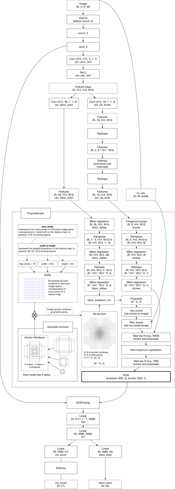
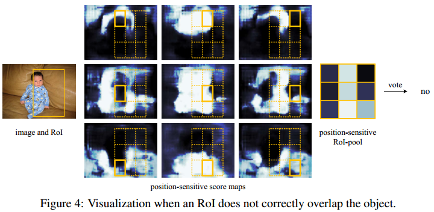
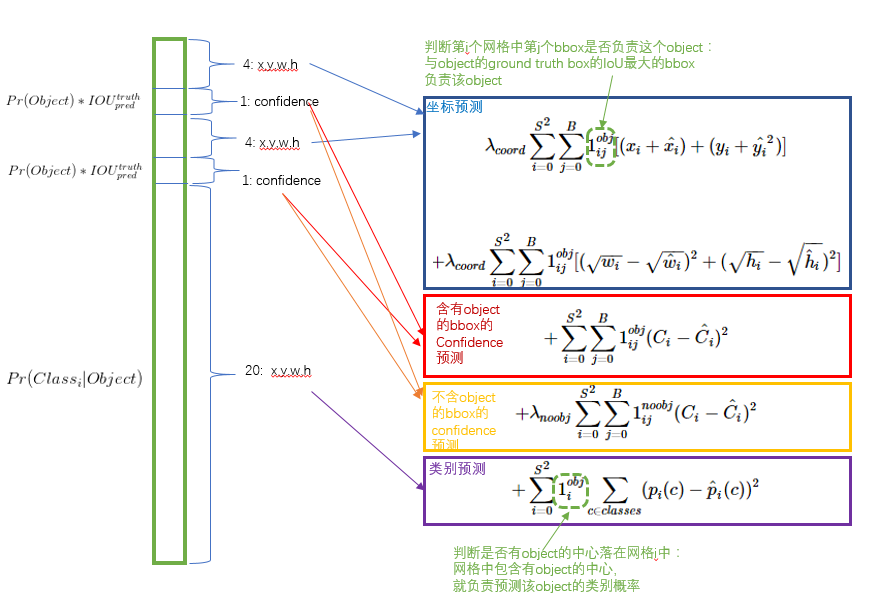

# 基于深度学习的目标检测算法

[TOC]


1，所有算法的简介：
===================

RCNN
----

　　1. 在图像中确定约1000-2000个候选框 (使用selective search)

　　2. 每个候选框内图像块缩放至相同大小，并输入到CNN内进行特征提取

　　3. 对经过CNN提取出的特征，使用SVM判别是否属于一个特定类

　　4. 对于属于某一特征的候选框，用回归器进一步调整其位置

SPP Net
-------

  　　1. 在图像中确定约1000-2000个候选框 (使用selective search)
        　　2. 对整张图片输进CNN，conv5后，**空间金字塔池化**，得到feature map
　　3. 经过FC，再对特征用SVM分类
        　　4. 对于属于某一特征的候选框，用回归器进一步调整其位置

Fast RCNN
---------

　　1. 在图像中确定约1000-2000个候选框 (使用selective search)

　　2. 对**整张图片**输进CNN，得到feature map

　　3. 找到每个候选框在feature map上的映射patch，将此patch作为每个候选框的卷积特征输入到SPP layer和之后的层

　　4. 对候选框中提取出的特征，使用分类器判别是否属于一个特定类

　　5. 对于属于某一特征的候选框，用回归器进一步调整其位置

Faster RCNN
-----------

     　　1. 对整张图片输进CNN，得到feature map
     　　2. 卷积特征输入到RPN，得到候选框的特征信息
     　　3. 对候选框中提取出的特征，使用分类器判别是否属于一个特定类
  　　4. 对于属于某一特征的候选框，用回归器进一步调整其位置

## Mask RCNN

1. 

## R-FCN

1. 对

## RetinaNet

1. 对

## YOLO

**V1**

**Step 1**：Resize成448x448，图片分割得到7x7网格(cell)。

**Step 2**：CNN提取特征和预测：卷积部分负责提取特征，全连接部分负责预测。

a) 7x7x2=98个bounding box(bbox) 的坐标xcenter,ycenter,w,hxcenter,ycenter,w,h和是否有物体的confidence。

b) 7x7=49个cell所属20个物体分类的概率。

**V3**

**Step 1**：对于所有 predict boxes，若其与所有的真实方框 IoU 小于 ignore_thresh，惩罚objectness，如果大于，不进行惩罚

**Step 2**：对于所有 true boxes，判断它的尺寸如何，该丢给哪一层检测（FPN 中的哪一层）

**Step 3**：得出了该哪一层检测后，找 true boxes 的中心点，并且找和它靠近的 predict boxes，指定它去学习 true box 

**Step 4**：location，objectness，classification 项的调整

## SSD_MobileNet

1. 对

2，RCNN
=======


流程：
------

1. 输入图像；

2. 利用选择性搜索（Selective Search）区域生成算法在输入图像中提取Region Proposal（大概2000个）；

3. 将第一步中产生的每个Region Proposal分别resize后（也即图中的warped region，文章中是统一转化为227×227）作为CNN网络的输入；

4. CNN网络提取到经过resize的region proposal的特征送入每一类的SVM分类器分类，判断是否属于该类。回归算法求boundary box。

补充1：网络是如何使用SVM的
--------------------------

先通过所有样本训练出能提取特征的合理的CNN网络，再将这个合理的CNN提取每个样本的特征，最后将这大量的特征提供给各类别的SVM分类训练【SVM正负样本选取：GT为正样本，iou小于0.3为负样本，其余区域ignore。rcnn要处理的信息不仅信息量大而且信息间的相关性也很大，因此用svm来解决多标记学习问题是合理的】。在RCNN训练过程中SVM作为监督分类器也会被训练，目的是找到最优参数配置。

补充2：不用softmax而用SVM的原因
-------------------------------

SVM是寻找最优支持向量来分割平面。当问题是多分类时，SVM将线性不可分的数据映射到更高层次的超平面空间从而达到线性可分，主要依赖于数据中位于分割平面的一部分支持向量，在样本不平衡时依然可以不发生过拟合，而softmax是基于回归的原则，使用全局数据的随机采样进行训练。可见，SVM与LR是从两个不同角度去解决分类问题。

补充3：Selective search
--------------------------------------------

用分割不同区域的办法来识别潜在的物体。在分割的时候，我们要合并那些在某些方面（如颜色、纹理）类似的小区域。相比滑窗法在不同位置和大小的穷举，候选区域算法将像素分配到少数的分割区域中。所以最终候选区域算法产生的数量比滑窗法少的多，从而大大减少运行物体识别算法的次数。同时候选区域算法所选定的范围天然兼顾了不同的大小和长宽比。

step1:计算区域集R里每个相邻区域的相似度S={s1,s2,…}

step2:找出相似度最高的两个区域，将其合并为新集，添加进R

step3:从S中移除所有与step2中有关的子集

step4:计算新集与所有子集的相似度

step5:跳至step2，直至S为空

【在每次迭代中，形成更大的区域并将其添加到区域提议列表中。以自下而上的方式创建从较小的细分segments到较大细分segments的区域提案】


【上图，得到区域的很多proposal，提取区域的空间金字塔的多样特征，组合成一个特征向量，然后训练SVM就可以分类出哪个区域是真正我们想要的目标】

【selective search的策略是，既然是不知道尺度是怎样的，那我们就尽可能遍历所有的尺度好了，但是不同于暴力穷举，我们可以先得到小尺度的区域，计算每两个相邻的区域的相似度，然后每次合并最相似的两块，直到最终只剩下一块完整的图片。既然特征很多，那就把我们知道的特征都用上，但是同时也要照顾下计算复杂度，不然和穷举法也没啥区别了。最后还要做的是能够对每个区域进行排序，这样你想要多少个候选我就产生多少个】

3，SPP Net
==========


Spatial Pyramid Pooling，空间金字塔池化


1，不需要固定尺寸输入
---------------------

对于任意尺寸图像，卷积层都是可以接受的，只是卷积成不同大小的特征图。卷积完之后，我们得到了一组特征图(feature maps）, 文中指出 第五卷积层一共有256个filter, 所以对应 256个不同大小的 feature maps。

对每个 feature maps 进行 max pooling 操作得到一个输出（每个feature maps 被max pooling成一个像素点，长度为1）, 于是256个feature maps，我们都 max pooling，将这256个池化结果组成一个256\*1的向量。 256-d 指 256维。接下来说中间那个4×256-d,我们将一个 feature map等分为4块，就是将一幅图像等分为4块区域，max pooling得到4\*256的向量。

我们一共得到向量维数是： 256+4\*256+16\*256=（21\*256）维度。对于任何输入尺寸图像，经过卷积之后，再用SPP层处理，我们都会得到这个固定维度的特征向量。这个向量维度固定之后，后面的全链接层就可以固定了。

2，只对原图提取一次卷积特征
---------------------------

在R-CNN中，每个候选框先resize到统一大小，然后分别作为CNN的输入，这样是很低效的。


把整张待检测的图片，输入CNN中，进行一次性特征提取，得到feature maps，然后在feature maps中找到各个候选框的区域，再对各个候选框采用金字塔空间池化，提取出固定长度的特征向量。而R-CNN输入的是每个候选框，然后在进入CNN，因为SPP-Net只需要一次对整张图片进行特征提取，速度会大大提升。

4，Fast RCNN
============


RCNN的缺点：即使使用了selective search等预处理步骤来提取潜在的bounding box作为输入，但是RCNN仍会有严重的速度瓶颈，原因也很明显，就是计算机对所有region进行特征提取时会有重复计算，Fast-RCNN共享卷积层，现在不是每一个候选框都当做输入进入CNN了，而是整张图片提一次特征，训练过程是端到端的（Single-stage）,并使用了一个**多任务的损失函数**，Fast R-CNN网络的损失函数包含了Softmax的损失和Regressor的损失。输入一张完整的图片，在第五个卷积层再得到每个候选框的特征，SPP只需要计算一次特征，剩下的在conv5操作就好了。

**注意：fast rcnn的region proposal方法还是选择selective search。**


fast rcnn中的ROI pooling操作
-------------------------------

Fast rcnn中的ROI是spp的简化版，spp为三层金字塔，roi是单层金字塔；spp产生结果是4\*4+2\*2+1，roi产生结果7\*7.RoI Pooling层的操作是将feature map上的RoI区域划分为7×7的窗口，在每个窗口内进行max pooling，然后得到（7×7）×256的输出，最后连接到全连接层得到固定长度的RoI特征向量，再通过全连接层作为Softmax和Regressor的输入。


2. Fast rcnn的实例展示
----------------------


输入图； 候选区域； 最后一个卷积层； 放大； 归一化的候选区域特征

5，Faster RCNN
==============


在fast rcnn基础上，舍弃了selective search，做了RPN，和权值共享。

1，基础网络做特征提取；

2，特征送入RPN做候选框提取；

3，分类层对候选框内物体进行分类，回归层对候选框的(x,y,w,h)进行精细调整。

Fast rcnn的问题是selective search找出所有的候选框非常耗时。

Faster rcnn的解决方法，构建一个提取边缘的神经网络，Region Proposal Network(RPN)，RPN放在最后一个卷积层后面，直接训练得到候选区域。所以说这是一个完全end-to-end的CNN对象检测模型。

**四个损失：**

**区域生成网络的前后景分类损失（Object or not object）**

**区域生成网络的区域位置损失（Bounding box proposal）**

**Fast RCNN物体分类损失（Normal object classification）**

**Fast RCNN区域位置损失（Improve previous Bounding box proposal）**


**faster RCNN可以大致看做“RPN+fast RCNN“的系统，用RPN代替fast RCNN中的Selective Search方法。**

**我们整张图像上，所有的框，一开始就由Anchor和网络结构确定了，这些框都有各自初始的坐标（anchor）。所有后续的工作，RPN提取前景和背景，其实就是保留包含前景的框，丢掉包含背景的；包括后续的NMS，也都是丢掉多余的，并非重新新建一个框。**我们网络输出的两个Bounding-box regression，都是输出的坐标偏移量，也就是在初始锚点的基础上做的偏移修正和缩放，并非输出一个原图上的绝对坐标。

**整张图片经过特征提取，得到FeatureMap；将FeatureMap中的每一点按照视野域找到原图中对应的位置，称为Anchor；每个Anchor生成不同大小不同长宽比的多个候选区域。selective-search的候选区域生成方式，它是按照颜色和纹理不断合并得到候选区域的，候选区域的产生没有规律，而RPN是每个Anchor都有对应的固定数量的候选区域，规律很明显。**


<https://zhuanlan.zhihu.com/p/24916624>

<https://www.cnblogs.com/zf-blog/p/7142463.html>

<https://www.cnblogs.com/skyfsm/p/6806246.html>



1，conv layer结构
-----------------

作为一种CNN网络目标检测方法，FasterRCNN首先使用一组基础的conv+relu+pooling层提取image的feature maps。该feature maps被共享用于后续RPN层和全连接层。注意，faster rcnn的conv层都是k=3，p=1，s=1，故卷积层不会改变输入输出矩阵的大小。而pooling层k=2，s=2，故池化层后会变为输入的1/2.这样conv layer生成的feature map就可以跟原图对应起来了。Conv layers部分共有13个conv层，13个relu层，4个pooling层。原图则变为1/16原图。


2，RPN结构（最核心）
----------


**生成anchors（feature map的每一个点生成一个anchor，在确定N H W后就确定了） -\> softmax分类器提取anchors -\> bbox reg回归anchors -\> Proposal Layer生成proposals**

RPN网络实际分为2条线，上面一条通过**softmax分类anchors获得foreground和background**（检测目标是foreground），下面一条用于**计算对应anchors的bounding box regression偏移量，以获得精确的proposal**。而最后的Proposal层则负责综合foreground anchors和bounding box regression偏移量获取proposals，同时剔除太小和超出边界的proposals。其实整个网络到了Proposal Layer这里，就完成了相当于目标定位的功能。

**意义：滑动窗口的位置提供了物体的大体位置信息，框的回归提供了框更精确的位置**

**2.1 多通道图像卷积基础知识**


**2.2 anchors的理解**

**生成anchors（feature map的每一个点生成一个anchor）**


**2.3 softmax判定foreground与background **


**2.4 bounding box regression原理 **


**2.5 对proposals进行bounding box regression **


**2.6 Proposal Layer **

**输入是所有的按照foreground softmax scores由大到小排列的foreground anchors，提取前6000个，经过剔除大范围超过边界和nms操作后，得到300个foreground anchors。**


3，ROI Pooling结构
------------------

**Roi pooling层的过程就是为了将proposal抠出来的过程，然后resize到统一的大小。该层收集输入的feature
maps和proposals，计算出proposal feature maps，送入后续网络。**


4，classification 
------------------

**利用proposal feature maps计算proposal的类别，同时再次bounding box regression获得检测框最终的精确位置。**


# 6，MaskRCNN

https://blog.csdn.net/wangdongwei0/article/details/83110305

```
- Mask RCNN可以看做是一个通用实例分割架构
- Mask RCNN以Faster RCNN原型，增加了一个分支用于分割任务
- Mask RCNN比Faster RCNN速度慢一些，达到了5fps
- 可用于人的姿态估计等其他任务

MaskRCNN是faster的扩展，对每个proposal box都用FCN进行语义分割。（分割、定位、分类是同时进行的）；

RoI Align代替Faster RCNN中的RoI Pooling。因为RoI Pooling并不是按照像素一一对齐的（pixel-to-pixel alignment），也许这对bbox的影响不是很大，但对于mask的精度却有很大影响。使用RoI Align后mask的精度从10%显著提高到50%；
```


## 1，基本结构

**Mask R-CNN基本结构：**

与Faster RCNN采用了相同的two-state步骤：首先是找出RPN，然后对RPN找到的每个RoI进行分类、定位、并找到binary mask。
**Mask R-CNN的损失函数：**


Mask的表现形式：因为没有采用全连接层并且使用了RoIAlign，可以实现输出与输入的像素一一对应。

## 2，RoIAlign

http://blog.leanote.com/post/afanti.deng@gmail.com/b5f4f526490b

RoIPool的目的是为了从RPN网络确定的ROI中导出较小的特征图(a small feature map，eg 7x7)，ROI的大小各不相同，但是RoIPool后都变成了7x7大小。RPN网络会提出若干RoI的坐标以[x,y,w,h]表示，然后输入RoI Pooling，输出7x7大小的特征图供分类和定位使用。问题就出在RoI Pooling的输出大小是7x7上，如果RON网络输出的RoI大小是8*8的，那么无法保证输入像素和输出像素是一一对应，首先他们包含的信息量不同（有的是1对1，有的是1对2），其次他们的坐标无法和输入对应起来（1对2的那个RoI输出像素该对应哪个输入像素的坐标？）。这对分类没什么影响，但是对分割却影响很大。

```
ROI Pooling经历了两个量化的过程： 

第一个：将候选框边界量化为整数点坐标值。
第二个：将量化后的边界区域平均分割成 k x k 个单元(bin),对每一个单元的边界进行量化。

这两种情况都会导致输入和输出之间像素级别上的一一对应，作者把它总结为“不匹配问题（misalignment）。
```

一个直观的例子：
具体分析一下上述区域不匹配问题。如下图所示，这是一个Faster-RCNN检测框架。输入一张800 * 800的图片，图片上有一个665 * 665的包围框(框着一只狗)。图片经过主干网络提取特征后，特征图缩放步长（stride）为32。因此，图像和包围框的边长都是输入时的1/32。800正好可以被32整除变为25。但665除以32以后得到20.78，带有小数，于是ROI Pooling **直接将它量化成20**。接下来需要把框内的特征池化7*7的大小，因此将上述包围框平均分割成7*7个矩形区域。显然，每个矩形区域的边长为2.86，又含有小数。于是ROI Pooling **再次把它量化到2**。经过这两次量化，候选区域已经出现了较明显的偏差（如图中绿色部分所示）。更重要的是，该层特征图上0.1个像素的偏差，缩放到原图就是3.2个像素。**那么0.8的偏差，在原图上就是接近30个像素点的差别**，这一差别不容小觑。


**RoIAlign的输出坐标使用插值算法得到，不再量化；每个grid中的值也不再使用max，同样使用插值算法。**

去掉ROI Pooling过程中所有的量化过程，包括从原图proposal到最后一层feature map映射，以及把feature map划分成m*m的bin过程中的量化。

roi映射到feature map后，不再进行四舍五入。然后将候选区域分割成k x k个单元， 在每个单元中计算固定四个坐标位置，用**双线性内插**的方法计算出这四个位置的值，然后进行最大池化操作。


## 3，FPN（feature pyramid networks）

论文：feature pyramid networks for object detection 
论文链接：https://arxiv.org/abs/1612.03144

**在MaskRCNN和YOLO V3中都用到过。**

```
作者提出的多尺度的object detection算法：FPN（feature pyramid networks）。原来多数的object detection算法都是只采用顶层特征做预测，但我们知道低层的特征语义信息比较少，但是目标位置准确；高层的特征语义信息比较丰富，但是目标位置比较粗略。另外虽然也有些算法采用多尺度特征融合的方式，但是一般是采用融合后的特征做预测，而本文不一样的地方在于预测是在不同特征层独立进行的。 
```

（a）图像金字塔，将图像做成不同的scale，然后不同scale的图像生成对应的不同scale的特征。这种方法的缺点在于增加了时间成本。
（b）像SPP net，Fast RCNN，Faster RCNN是采用这种方式，即仅采用网络最后一层的特征。 
（c）像SSD（Single Shot Detector）采用这种多尺度特征融合的方式，没有上采样过程，即从网络不同层抽取不同尺度的特征做预测，这种方式不会增加额外的计算量。作者认为SSD算法中**没有用到足够低层的特征（在SSD中，最低层的特征是VGG网络的conv4_3）**，而在作者看来足够低层的特征对于检测小物体是很有帮助的。 
（d）本文作者是采用这种方式，顶层特征通过上采样和低层特征做融合，而且每层都是独立预测的。


把高层特征**做2倍上采样（最邻近上采样法）**，然后将其和对应的前一层特征结合（前一层要经过1 * 1的卷积核才能用，目的是改变channels，应该是要和后一层的channels相同），结合方式就是**做像素间的加法**。重复迭代该过程，直至生成最精细的特征图。迭代开始阶段，作者在C5层后面加了一个1 * 1的卷积核来产生最粗略的特征图，最后，作者用3 * 3的卷积核去处理已经融合的特征图（为了消除上采样的混叠效应），以生成最后需要的特征图。{C2, C3, C4, C5}层对应的融合特征层为{P2, P3, P4, P5}，对应的层空间尺寸是相通的。 


**Faster rcnn中的特征金字塔网络**


7，基于区域的全卷积神经网络（R-FCN）
====================================

## 网络结构

faster rcnn这种都是RPN过来，区域直接对应当前层feature map，现在对应的是当前层的3X3个feature map。

ROI代表感兴趣区域，ROI其中每一个点都对应一个3X3的扫窗。而这种ROI是针对每个class的（C+1个class）

https://www.cnblogs.com/lillylin/p/6277094.html

.png)

**耗时的卷积都尽量移到前面共享的subnetwork上**。因此，和Faster RCNN中用的ResNet（前91层共享，插入ROI pooling，后10层不共享）策略不同，本文把所有的101层都放在了前面共享的subnetwork。最后用来prediction的卷积只有1层，大大减少了计算量。


## 几个重点

- **Backbone architecture:** ResNet 101——去掉原始ResNet101的最后一层全连接层，保留前100层，再接一个1\*1\*1024的全卷积层（100层输出是2048，为了降维，再引入了一个1\*1的卷积层）。

- **k^2(C+1)的conv:** ResNet101的输出是W*H*1024，用K^2(C+1)个1024*1*1的卷积核去卷积即可得到K^2(C+1)个大小为W * H的position sensitive的score map。这步的卷积操作就是在做prediction。k = 3，表示把一个ROI划分成3*3，对应的9个位置分别是：上左（左上角），上中，上右，中左，中中，中右，下左，下中，下右（右下角），如图Figuire 3。




- **k^2(C+1)个feature map的物理意义:** 共有k * k = 9个颜色，每个颜色的立体块（W * H * (C+1)）表示的是不同位置存在目标的概率值（第一块黄色表示的是左上角位置，最后一块淡蓝色表示的是右下角位置）。共有k^2*(C+1)个feature map。每个feature map，z(i,j,c)是第i+k(j-1)个立体块上的第c个map（1<= i,j <=3）。(i,j)决定了9种位置的某一种位置，假设为左上角位置（i=j=1），c决定了哪一类，假设为person类。在z(i,j,c)这个feature map上的某一个像素的位置是（x,y），像素值是value，则value表示的是原图对应的(x,y)这个位置上可能是人（c=‘person’）且是人的左上部位（i=j=1）的概率值。

- **ROI pooling:** 就是faster RCNN中的ROI pooling，也就是一层的SPP结构。主要用来将不同大小的ROI对应的feature map映射成同样维度的特征，思路是不论对多大的ROI，规定在上面画一个n * n 个bin的网格，每个网格里的所有像素值做一个pooling（平均），这样不论图像多大，pooling后的ROI特征维度都是n * n。注意一点ROI pooling是每个feature map单独做，不是多个channel一起的。

- **ROI pooling的输入和输出：**ROI pooling操作的**输入（对于C+1个类）是k^2 * (C+1) * W' * H'（W'和H'是ROI的宽度和高度）的score map上某ROI对应的那个立体块**，且该立体块组成一个新的k^2* (C+1)*W' * H'的立体块：每个颜色的立体块（C+1）都只抠出对应位置的一个bin，把这k* k个bin组成新的立体块，大小为（C+1）* W'* H'。例如，下图中的第一块黄色只取左上角的bin，最后一块淡蓝色只取右下角的bin。所有的bin重新组合后就变成了类似右图的那个薄的立体块（图中的这个是池化后的输出，即每个面上的每个bin上已经是一个像素。池化前这个bin对应的是一个区域，是多个像素）。ROI pooling的**输出为为一个（C+1）* k *k的立体块**，如下图中的右图。


**vote投票：**k*k个bin直接进行求和（每个类单独做）得到每一类的score，并进行softmax得到每类的最终得分，并用于计算损失


- **损失函数：**和faster RCNN类似，由分类loss和回归loss组成，分类用交叉熵损失（log loss），回归用L1-smooth损失


​	**训练的样本选择策略：**online hard example mining (OHEM) 。主要思想就是对样本按loss进行排序，选择前面loss较小的，这个策略主要用来对负样本进行筛选，使得正负样本更加平衡。

## 总结

**R-FCN是在Faster R-CNN的框架上进行改造，第一，把base的VGG16换车了ResNet，第二，把Fast R-CNN换成了先用卷积做prediction，再进行ROI pooling。由于ROI pooling会丢失位置信息，故在pooling前加入位置信息，即指定不同score map是负责检测目标的不同位置。pooling后把不同位置得到的score map进行组合就能复现原来的位置信息。**


# 8，RetinaNet

## focal loss

**作者2017年提出focal loss的出发点也是希望one-stage detector可以达到two-stage detector的准确率，同时不影响原有的速度。**作者认为原因是：**样本的类别不均衡导致的**。我们知道在object detection领域，一张图像可能生成成千上万的candidate locations，但是其中只有很少一部分是包含object的，这就带来了类别不均衡。那么类别不均衡会带来什么后果呢？引用原文讲的两个后果：(1) training is inefficient as most locations are easy negatives that contribute no useful learning signal; (2)  the easy negatives can overwhelm training and lead to degenerate models. 什么意思呢？**负样本数量太大，占总的loss的大部分，而且多是容易分类的，因此使得模型的优化方向并不是我们所希望的那样**。

**focal loss，这个损失函数是在标准交叉熵损失基础上修改得到的。这个函数可以通过减少易分类样本的权重，使得模型在训练时更专注于难分类的样本。**


加了(1-Pt)γ项这个权重，最大的类别所贡献的loss被大幅砍掉，最少的类别贡献几乎没什么降低。所以，训练过程中量少的类别有了更大的话语权，更加被模型关照了。

## RetinaNet

是一个FPN-based的one-stage detector，靠着最后面的focal loss来解决由于过量background而引起的类别不平衡。


在实验中，发现 γ=2，α=0.25γ=2，α=0.25 的取值组合效果最好。


# 9, YOLO系列

YOLO（2015）
----------------

<https://blog.csdn.net/leviopku/article/details/82588059>

[http://antkillerfarm.github.io/deep%20object%20detection/2018/11/20/Deep_Object_Detection_4.html](http://antkillerfarm.github.io/deep object detection/2018/11/20/Deep_Object_Detection_4.html)

http://antkillerfarm.github.io/


**YOLO在对于预测框的位置、大小、物体类别，都是CNN暴力predict。**

输入图片被划分为7\*7网格，每个单元格独立检测。

【网格只是对物体中心点的位置的划分，并不是对图片切片，不会脱离整体】


它没有像SSD一样使用多尺度特征图来做独立的检测，而是将特征图部分平滑化，并将其与另一个较低分辨率的特征图拼接。

输出是7\*7\*30的张量，7\*7表示网格，30=2\*5+20，代表2个框的五个参数（xywh，score）和20个类别。

**对于密集型目标检测和小物体检测很不好。**

损失函数如图所示：


**V1的价值：**

1，leaky ReLU，不会让负数直接为0，而是保留负数输出，但减弱其输出。


2，用网格来划分图片区域，每块区域独立检测。

3，端到端。Loss function贯穿整个网络。



YOLO-v2（2016）
----------------

<https://blog.csdn.net/leviopku/article/details/82588959>

[http://antkillerfarm.github.io/deep%20object%20detection/2018/12/01/Deep_Object_Detection_5.html](http://antkillerfarm.github.io/deep object detection/2018/12/01/Deep_Object_Detection_5.html)

```
1. BN引入（所有conv层加入BN）
2. finetune时高精度分类器的使用（YOLOv1先用224图片输入预训练网络，再将输入图片增大到448。而V2是将224的分类数据train过的模型先用448来finetune分类数据训练10个epochs，再用448的目标检测数据来finetune。【更好的过渡】）
3. 使用卷积操作的anchor boxes（YOLOv1是生成feature map后接FC，生成目标框类别位置等大量信息。而V2改进用conv filters来提取生成的anchors的位置偏移和类别，会对mAP造成少量下降，但是recall ratio大量提升。将对类别的预测放到anchor box中。如下对比图所示）
4. 使用k-means来选取anchor boxes（在目标检测数据集中对所有label的目标框进行k-means聚类，发现k=5个anchor box最合适，用kmeans聚类算法来找到合适的anchor box尺寸比例。5种boxes的Avg IOU(61.0)就和Faster R-CNN的9种Avg IOU(60.9)相当。更有代表性）
5. 直接目标框位置检测（RPN会预测坐标的修正值(Δx,Δy)，但是没有范围限制，所以可能预测到很远的object，造成效率低。现在每一个anchor只负责检测周围正负一个单位以内的目标box）
6. 细粒度特征的使用（没有对不同尺度特征层预测，而是变为相同size在channel level进行合并。passthrough layer，将浅层和深层合并成一个大tensor，如下图）
7. 多尺度训练（每经过10批训练（10 batches）就会随机选择新的图片尺寸。）
8. Darknet-19
9. 层次式分类，结构化标签，WordNet是一个有向图结构（而非树结构），作者从ImageNet的概念中构建了一个层次树结构（hierarchical tree）来代替图结构方案。这也就是作者论文中提到的WordTree。【在工作中，属性框预加载，会用到这个方法】
```


YOLO-v3（2018）
----------------

<https://blog.csdn.net/leviopku/article/details/82660381>

```
1. 多尺度先验框（多尺度特征提取在U-NET、DenseNet中，早就广泛使用了，用到这里也很自然，FPN）
2. 对象分类softmax改成logistic（预测对象类别时不使用softmax，改成使用logistic的输出进行预测。这样能够支持多标签对象（比如一个人有Woman和Person两个标签每个类别给出一个二分类（是/否）的置信度，如果某个对象是多标签的话，则它可能有多个类别的置信度接近1）
```

是一个旨在提高准确率和速度的特征提取器，主要是工程层面上的提升。


**V3提升的东西：**

BN+LeakyReLU的组合构成基本组件DBL。要求输入图片是32的倍数。

使用darknet更好的版本，加入resnet的残差结构。【若要更快速，可以用tiny-darknet】

如上图，输出是y1y2y3三个不同尺寸的feature map。其中255的来源是：设定每个网格单元预测3的box，每个box有5个参数(x, y, w, h, confidence) 3\*（5+80）=255.

V3采用上采样实现多尺度feature map，（maybe是工程上的措施）

**还有两点tricks：**

1）bounding box prediction

v2是借鉴anchor机制，用k-means聚类确定anchor box prior，发现k=5很好。后来嫌弃它线性回归不稳定，改为直接预测相对位置。预测出中心点相对坐标。而V3对bbox预测使用logistic regression，对anchor包围的部分做一个目标评分，即这块位置是目标的可能性多大，这一步在predict之前进行，可以去掉anchor，减少计算量。YOLO V3只会对一个prior操作，就是那个最佳的prior。Logistic regression是从9个anchor中找到得分最高的。

2）loss function

除了w, h的损失函数依然采用总方误差之外，其他部分的损失函数用的是二值交叉熵。

**为什么YOLOv3不适用focal loss？**

https://www.zhihu.com/question/293369755

focal loss对于减轻classifier的input imbalance很有用处。first stage会filter out特别容易的绝大多数背景，这个时候第二阶段的classifier再通过sampling heuristics之后被喂到的label就比较balanced。而yolo v3，如果objectness比较低YOLO的classifier是不会理这个box的，这就相当于把objectness比较低的box的alpha改成了0，可以理解为focal loss的调参，这样的话imbalance就得到了极大的缓解，这其实就是focal loss要解决的问题。所以不适用的原因，是YOLO classifier把大多数easy background已经过滤掉了，focal loss就没啥用了。

**YOLOv3与YOLOv2的anchor大小为何有明显区别**

在YOLOv2中，作者用最后一层feature map的相对大小来定义anchor大小。也就是说，在YOLOv2中，最后一层feature map大小为13X13（不同输入尺寸的图像最后的feature map也不一样的），相对的anchor大小范围就在（0x0，13x13]，如果一个anchor大小是9x9，那么其在原图上的实际大小是288x288。
而在YOLOv3中，作者又改用相对于原图的大小来定义anchor，anchor的大小为（0x0，input_w x input_h]。所以，在两份cfg文件中，anchor的大小有明显的区别。

# 10，SSD_MobileNet

SSD是一种one-stage的目标检测框架，MobileNet是这种算法所使用的的具体的网络结构，用来提取特征。

SSD_MobileNet就是SSD使用MobileNet作为特征提取器，SSD原始特征提取用VGG。

## SSD （Single Shot multibox Detector）

<https://blog.csdn.net/ytusdc/article/details/86577939>

兼顾了mAP和实时性的要求。其思路就是Faster R-CNN+YOLO V1。


同时对类别和位置进行单次预测


使用多尺度特征用于检测

SSD使用卷积网络中较深的层来检测目标。


### 多尺度特征映射


SSD（右图）获得不同尺寸的特征映射，同时在不同尺寸映射上进行预测，有更多可能性，增加计算量的同时，提高检测精度。


对于Faster-rcnn而言，其在特定层的Feature map上面的每一点生成9个预定义好的BBox，然后进行回归和分类操作来进行初步检测，然后进行ROI Pooling和检测获得相应的BBox；而SSD则在不同的特征层的feature map上的每个点同时获取6个（有的层是4个）不同的BBox，然后将这些BBox结合起来，最后经过NMS处理获得最后的BBox。

**SSD效果好的原因：**

**浅层卷积层对边缘更加感兴趣，可以获得一些细节信息（位置信息），而深层网络对由浅层特征构成的复杂特征更感兴趣，可以获得一些语义信息。**对于检测任务而言，一幅图像中的目标有复杂的有简单的，对于简单的patch我们利用浅层网络的特征就可以将其检测出来，对于复杂的patch我们利用深层网络的特征就可以将其检测出来，因此，如果我们同时在不同的feature map上面进行目标检测，理论上面应该会获得更好的检测效果。

### Default box和Prior box（先验框）

图片被送进网络之后先生成一系列 feature map，传统框架会在 feature map（或者原图）上进行 region proposal 提取出可能有物体的部分然后进行分类，这一步可能非常费时，所以 SSD 就放弃了 region proposal，而选择直接生成一系列 defaul box（筛选出prior boxes投入训练），然后以prior box为初始bbox，将bboxes回归到正确的GT位置上去，预测出的定位信息实际上是回归后的bboxes和回归前的（prior box）的相对坐标。整个过程通过网络的一次前向传播就可以完成。Default box的数量越多，效果越好。

下图为default box的计算过程。


Prior box，是指实际中选择的要投入训练过程的Default box（每一个feature map cell不是k个Default box都取）举个例子：假设一个训练样本中有2个ground truth box，所有的feature map中获取的prior box一共有8732个。那可能分别有10、20个prior box能分别与这2个ground truth box匹配上。

对于正样本训练来说，需要先将prior box与ground truth box做匹配，匹配成功说明这个prior box所包含的是个目标，但离完整目标的ground truth box还有段距离，训练的目的是保证default box的分类confidence的同时将prior box尽可能回归到ground truth box。

**SSD使用低层feature map检测小目标，使用高层feature map检测大目标。**

### SSD的训练过程


SSD算法的目标函数分为两部分：计算相应的default box与目标类别的confidence loss以及相应的location loss(位置回归)。


### Hard Negative Mining

Hard Negative Mining是机器学习领域的一个常用技巧。

对于正负样本数量不均衡的数据集（这里假设负样本数量远大于正样本数量），通常的做法有：

**1.增加正样本的数量。**这个过程通常叫做数据增强（Data Augmentation）。例如对图片进行旋转、位移得到新的正样本。

**2.减少负样本的数量。**这里实际上是一个筛选有价值的负样本的过程。Hard Negative Mining就属于这类方法，它认为负样本的分数越高，越有价值。

具体到图像分类任务就是：那些不包含该物体但分值却很高的样本。通俗的讲，就是那些容易被混淆的负样本。

**3.修改正负判定门限，以匹配正负样本比例。**例如，提高IOU门限。

**4.异常点检测。**

在SSD中，用于预测的feature map上的每个点都对应有6个不同的default box，绝大部分的default box都是负样本，导致了正负样本不平衡。

在训练过程中，采用了Hard Negative Mining的策略（根据confidence loss对所有的box进行排序，使正负例的比例保持在1:3）来平衡正负样本的比率。

在SSD中，一个GT box可能对应多个default box，YOLO v3的一个GT box只对应一个prior box。

**补充：**

训练过程中，负样本太多，远远多于正样本，如果都用来训练，效果很不好。所以就优先选择最难的负样本，而且保证选取比例。

R-CNN在训练SVM分类器时也使用了这种思想，但Fast R-CNN和Faster R-CNN由于使用端到端的训练策略并没有使用难分样本挖掘（只是设置了正负样本的比例并随机抽取）。CVPR2016的Training Region-based Object Detectors with Online Hard Example Mining(oral)将难分样本挖掘(hard example mining)机制嵌入到SGD算法中，使得Fast R-CNN在训练的过程中根据region proposal的损失自动选取合适的Region Proposal作为正负例训练。实验结果表明使用OHEM（Online Hard Example Mining）机制可以使得Fast R-CNN算法在VOC2007和VOC2012上mAP提高 4%左右。

## MobileNet(2017,Google)

适用于手机端的神经网络模型。

主要使用深度可分离卷积Depthwise Separable Conv，将卷积核进行分解计算来减少计算量。

引入两个超参：

宽度乘数（Width Multiplier）【减少输入和输出的channel】

分辨率乘数（Resolution Multiplier）【减少输入输出的feature map大小】

### 深度可分离卷积 Depthwise Separable Convolution

可以将标准卷积核分成一个深度卷积和一个1*1卷积。

###标准卷积
标准卷积：filter的大小是Dk×Dk，计算量是Dk⋅Dk⋅M⋅N⋅DF⋅DF

深度卷积：filter的大小是Dk×Dk×1×M，计算量是Dk⋅Dk⋅M⋅DF⋅DF

逐点卷积：filter的大小是1×1×M×N，计算量是M⋅N⋅DF⋅DF

和标准的卷积相比计算量比率为：


MobileNet使用的是3x3的卷积核，所以计算量可以减少8-9倍 (因为比率是1/N + 1/9)


###神经网络结构


### 宽度乘数（Width Multiplier）

引入超参数α，使模型变瘦。

输入层的channel为M，变为αM，输出channel为N，变为αN

一般α取1,0.75,0.5,0.25，可以减少计算量。

同样，也引入分辨率参数ρ，Resolution Multiplier，降低图片分辨率。

### MobileNet V2

引入了shortcut结构（残差网络）

在进行depthwise之前先进行1x1的卷积增加feature map的通道数，实现feature maps的扩张。

pointwise结束之后弃用relu激活函数，改用linear激活函数，来防止relu对特征的破坏。

### MobileNet V3

结构没有多少创新，速度提升更快。

1. MobileNetV1 模型引入的深度可分离卷积（depthwise separable convolutions）；

2. MobileNetV2 模型引入的具有线性瓶颈的倒残差结构(the inverted residual with linear bottleneck)；

3. MnasNet 模型引入的基于squeeze and excitation结构的轻量级注意力模型。

4. 结合两种技术：资源受限的NAS（platform-aware NAS）与NetAdapt，前者用于在计算和参数量受限的前提下搜索网络的各个模块，所以称之为模块级的搜索（Block-wise Search），相当于整体结构搜索。后者用于对各个模块确定之后网络层的微调。相当于局部搜索。二者互补。

5. 一种新的激活函数。swish x


超参数的选择是有trade off，做实验合理选择参数

## SSD_MobileNet


## DSSD算法

https://blog.csdn.net/u010725283/article/details/79115477

deconvolutional single shot detector，在常见的目标检测算法中加入上下文信息。更好结合利用多层信息。浅层feature map的表征能力不强，DSSD用了更好的基础网络ResNet和Deconvolution层，skip连接给浅层feature map带来更好表征能力。

提高浅层的表征能力，是可以提高类似检测器对小目标的检测能力。按照这个方向走是正确的。


# More

更多的，要仔细看看 http://antkillerfarm.github.io/


