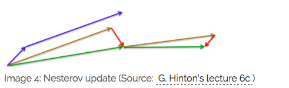

# 如何调参

[TOC]

## 1, 神经网络的参数优化方法

<https://www.cnblogs.com/bonelee/p/8528863.html>

### 1. 普通的全连接神经网络的效果

我们使用一个隐藏层，包含100个隐藏神经元，输入层是784，输出层是one-hot编码的形式，最后一层是Softmax层。训练过程采用对数似然代价函数，60次迭代，学习速率η=0.1，随机梯度下降的小批量数据大小为10，没有正则化。**在测试集上得到的结果是97.8%**，代码如下：

### 2.使用卷积神经网络 — 仅一个卷积层

输入层是卷积层，5 * 5的局部感受野，也就是一个5 * 5的卷积核，一共20个特征映射。最大池化层选用2*2的大小。后面是100个隐藏神经元的全连接层。结构如图所示 

在这个架构中，我们把卷积层和chihua层看做是学习输入训练图像中的局部感受野，而后的全连接层则是一个更抽象层次的学习，从整个图像整合全局信息。也是60次迭代，批量数据大小是10，学习率是0.1.代码如下，

**经过三次运行取平均后，准确率是98.78%**，这是相当大的改善。错误率降低了1/3，。卷积神经网络开始显现威力。

### 3.使用卷积神经网络 — 两个卷积层

我们接着插入第二个卷积-混合层，把它插入在之前的卷积-混合层和全连接层之间，同样的5*5的局部感受野，2*2的池化层。

**这一次，我们拥有了99.06%的准确率。**

### 4.使用卷积神经网络 — 两个卷积层+线性修正单元(ReLU)+正则化

我们使用的 Sigmod 激活函数，现在我们换成线性修正激活函数 ReLU ，我们选择 60 个迭代期，学习速率η=0.03, 使用 L2 正则化，正则化参数λ=0, 代码如下

**这一次，我们获得了99.23%的准确率**，超过了S型激活函数的99.06%. ReLU的优势是*max(0,z)*中z取最大极限时不会饱和，不像是S函数，这有助于持续学习。

## 深度学习优化方法 SGD

**SGD一般指代的是minibatch的随机梯度下降，这是网络建立好后，必须经过的，目的是找到全局最优解。**

<https://zhuanlan.zhihu.com/p/22252270>

<https://www.cnblogs.com/guoyaohua/p/8542554.html>

### gradient descent

用当前位置的负梯度方向作为搜索方向，亦即为当前位置下降最快的方向，也称“最速下降法”。越接近目标值时，步长越小，下降越慢。

如下图所示，梯度下降不一定能找到全局最优解，可能寻找到的是局部最优解。

### batch gradient descent

BGD 采用整个训练集的数据来计算 cost function 对参数的梯度：

**由于这种方法是在一次更新中，就对整个数据集计算梯度，所以计算起来非常慢，遇到很大量的数据集也会非常棘手，而且不能投入新数据实时更新模型。**

###  stochastic gradient descent

**SGD的噪音较BGD要多，使得SGD并不是每次迭代都向着整体最优化方向**。**所以虽然训练速度快，但是准确度下降，并不是全局最优**。**虽然包含一定的随机性，但是从期望上来看，它是等于正确的导数的。**

**SGD 因为更新比较频繁，会造成 cost function 有严重的震荡。**

**BGD 可以收敛到局部极小值，当然 SGD 的震荡可能会跳到更好的局部极小值处。**

**当我们稍微减小 learning rate，SGD 和 BGD 的收敛性是一样的。**

### mini-batch gradient descent

**MBGD 每一次利用一小批样本，即 n 个样本进行计算，这样它可以降低参数更新时的方差，收敛更稳定，另一方面可以充分地利用深度学习库中高度优化的矩阵操作来进行更有效的梯度计算。**

BGD与SGD的结合，对于m个样本，选取n个子样本进行迭代，计算梯度，然后更新参数。

​	1，选择n个训练样本，batchsize=n，样本总数为m，随机选择，作为一个batch；

​	2，在这n个样本中进行n次迭代，每次使用一个样本；

​	3，对n次迭代得出的n个gradient进行加权平均再求和，作为这次mini-batch的下降梯度；

​	4，不断在训练集中重复上述步骤，直到收敛。

缺点：

1，选择合适学习率很困难；我们希望将不常出现的特征更新快点，常出现的更新慢点。

2，SGD容易收敛到局部最优，有可能困在鞍点。

### Momentum

SGD 在 ravines 的情况下容易被困住， ravines 就是曲面的一个方向比另一个方向更陡，这时 SGD 会发生震荡而迟迟不能接近极小值：

**加速SGD，并且抑制震荡。可以使得梯度方向不变的维度上速度变快，梯度方向有所改变的维度上的更新速度变慢，这样就可以加快收敛并减小震荡。**

### Nesterov Accelerated Gradient

**用 θ−γv_t−1 来近似当做参数下一步会变成的值，则在计算梯度时，不是在当前位置，而是未来的位置上**

效果比较：

蓝色是 Momentum 的过程，会先计算当前的梯度，然后在更新后的累积梯度后会有一个大的跳跃。
而 NAG 会先在前一步的累积梯度上(brown vector)有一个大的跳跃，然后衡量一下梯度做一下修正(red vector)，这种预期的更新可以避免我们走的太快。

NAG 可以使 RNN 在很多任务上有更好的表现。

目前为止，我们可以做到，**在更新梯度时顺应 loss function 的梯度来调整速度，并且对 SGD 进行加速**。

**我们还希望可以根据参数的重要性而对不同的参数进行不同程度的更新。**

### Adagrad （Adaptive gradient algorithm）

 这个算法就**可以对低频的参数做较大的更新**，**对高频的做较小的更新**，也因此，**对于稀疏的数据它的表现很好，很好地提高了 SGD 的鲁棒性**，例如识别 Youtube 视频里面的猫，训练 Glove word embeddings，因为它们都是需要在低频的特征上有更大的更新。

**一般η选取0.01**

优点是减少了学习率的手动调节。

缺点是分母会不断积累，学习率就会收缩到非常小。

### Adadelta

**还将学习率 η 换成了 RMS[Δθ]，这样的话，我们甚至都不需要提前设定学习率了**

**超参数设定值:  γ 一般设定为 0.9**

### RMSprop

RMSprop 是 Geoff Hinton 提出的一种自适应学习率方法。

**RMSprop 和 Adadelta 都是为了解决 Adagrad 学习率急剧下降问题的**，

**梯度更新规则:**

RMSprop 与 Adadelta 的第一种形式相同：**（使用的是指数加权平均，旨在消除梯度下降中的摆动，与Momentum的效果一样，某一维度的导数比较大，则指数加权平均就大，某一维度的导数比较小，则其指数加权平均就小，这样就保证了各维度导数都在一个量级，进而减少了摆动。允许使用一个更大的学习率η）**

**Hinton 建议设定 γ 为 0.9, 学习率 η 为 0.001**

### Adam：Adaptive Moment Estimation

### 效果比较

### 如何选择优化算法

**如果数据是稀疏的，就用自适用方法，即 Adagrad, Adadelta, RMSprop, Adam。**

**RMSprop, Adadelta, Adam 在很多情况下的效果是相似的。**

**Adam 就是在 RMSprop 的基础上加了 bias-correction 和 momentum，**

**随着梯度变的稀疏，Adam 比 RMSprop 效果会好。**

整体来讲，**Adam 是最好的选择**。

很多论文里都会用 SGD，没有 momentum 等。**SGD 虽然能达到极小值，但是比其它算法用的时间长，而且可能会被困在鞍点**。

如果需要更快的收敛，或者是训练更深更复杂的神经网络，需要用一种自适应的算法。

## 2，如何调参

### 1，超参数的类型

