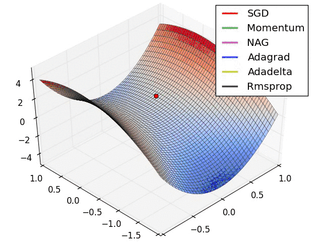

# 如何调参

[TOC]

## 1, 神经网络的参数优化方法

<https://www.cnblogs.com/bonelee/p/8528863.html>

### 1. 普通的全连接神经网络的效果

我们使用一个隐藏层，包含100个隐藏神经元，输入层是784，输出层是one-hot编码的形式，最后一层是Softmax层。训练过程采用对数似然代价函数，60次迭代，学习速率η=0.1，随机梯度下降的小批量数据大小为10，没有正则化。**在测试集上得到的结果是97.8%**，代码如下：


### 2.使用卷积神经网络 — 仅一个卷积层

输入层是卷积层，5 * 5的局部感受野，也就是一个5 * 5的卷积核，一共20个特征映射。最大池化层选用2*2的大小。后面是100个隐藏神经元的全连接层。结构如图所示 


在这个架构中，我们把卷积层和chihua层看做是学习输入训练图像中的局部感受野，而后的全连接层则是一个更抽象层次的学习，从整个图像整合全局信息。也是60次迭代，批量数据大小是10，学习率是0.1.代码如下，


**经过三次运行取平均后，准确率是98.78%**，这是相当大的改善。错误率降低了1/3，。卷积神经网络开始显现威力。

### 3.使用卷积神经网络 — 两个卷积层

我们接着插入第二个卷积-混合层，把它插入在之前的卷积-混合层和全连接层之间，同样的5*5的局部感受野，2*2的池化层。


**这一次，我们拥有了99.06%的准确率。**

### 4.使用卷积神经网络 — 两个卷积层+线性修正单元(ReLU)+正则化

我们使用的 Sigmod 激活函数，现在我们换成线性修正激活函数 ReLU ，我们选择 60 个迭代期，学习速率η=0.03, 使用 L2 正则化，正则化参数λ=0, 代码如下


**这一次，我们获得了99.23%的准确率**，超过了S型激活函数的99.06%. ReLU的优势是*max(0,z)*中z取最大极限时不会饱和，不像是S函数，这有助于持续学习。


## 深度学习优化方法 SGD

**SGD一般指代的是minibatch的随机梯度下降，这是网络建立好后，必须经过的，目的是找到全局最优解。**

<https://zhuanlan.zhihu.com/p/22252270>

<https://www.cnblogs.com/guoyaohua/p/8542554.html>

<https://blog.csdn.net/u012328159/article/details/80252012>

### gradient descent


用当前位置的负梯度方向作为搜索方向，亦即为当前位置下降最快的方向，也称“最速下降法”。越接近目标值时，步长越小，下降越慢。

如下图所示，梯度下降不一定能找到全局最优解，可能寻找到的是局部最优解。

### batch gradient descent

BGD 采用整个训练集的数据来计算 cost function 对参数的梯度。

**由于这种方法是在一次更新中，就对整个数据集计算梯度，所以计算起来非常慢，遇到很大量的数据集也会非常棘手，而且不能投入新数据实时更新模型。**

```python
X = data_input
Y = labels
parameters = initialize_parameters(layers_dims)
for i in range(0, num_iterations): #num_iterations--迭代次数
    # Forward propagation
    a, caches = forward_propagation(X, parameters)
    # Compute cost.
    cost = compute_cost(a, Y)
    # Backward propagation.
    grads = backward_propagation(a, caches, parameters)
    # Update parameters.
    parameters = update_parameters(parameters, grads)
```

Batch gradient descent的优点是理想状态下经过足够多的迭代后可以达到全局最优。但是缺点也很明显，就是如果你的数据集非常的大（现在很常见），根本没法全部塞到内存（显存）里，所以BGD对于小样本还行，大数据集就没法娱乐了。而且因为每次迭代都要计算全部的样本，所以对于大数据量会非常的慢。

###  stochastic gradient descent

**SGD的噪音较BGD要多，使得SGD并不是每次迭代都向着整体最优化方向**。**所以虽然训练速度快，但是准确度下降，并不是全局最优**。**虽然包含一定的随机性，但是从期望上来看，它是等于正确的导数的。**

**SGD 因为更新比较频繁，会造成 cost function 有严重的震荡。**

**BGD 可以收敛到局部极小值，当然 SGD 的震荡可能会跳到更好的局部极小值处。**

**当我们稍微减小 learning rate，SGD 和 BGD 的收敛性是一样的。**

```python
X = data_input
Y = labels
permutation = list(np.random.permutation(m))
shuffled_X = X[:, permutation]
shuffled_Y = Y[:, permutation].reshape((1, m))
for i in range(0, num_iterations):
    for j in range(0, m):  # 每次训练一个样本
        # Forward propagation
        AL,caches = forward_propagation(shuffled_X[:, j].reshape(-1,1), parameters)
        # Compute cost
        cost = compute_cost(AL, shuffled_Y[:, j].reshape(1,1))
        # Backward propagation
        grads = backward_propagation(AL, shuffled_Y[:,j].reshape(1,1), caches)
        # Update parameters.
        parameters = update_parameters(parameters, grads, learning_rate)
```

如果我们的数据集很大，比如几亿条数据，num_iterations. num_iterations 基本上 设置1，2，（10以内的就足够了）就可以。但是SGD也有缺点，因为每次只用一个样本来更新参数，会导致不稳定性大些(可以看下图（图片来自ng deep learning 课），每次更新的方向，不想batch gradient descent那样每次都朝着最优点的方向逼近，会在最优点附近震荡）。因为每次训练的都是随机的一个样本，会导致导致梯度的方向不会像BGD那样朝着最优点。 

注意：代码中的随机把数据打乱很重要，因为这个随机性相当于引入了“噪音”，正是因为这个噪音，使得SGD可能会避免陷入局部最优解中。


下面来对比下SGD和BGD的代价函数随着迭代次数的变化图:


SGD的代价函数随着迭代次数是震荡式的下降的（因为每次用一个样本，有可能方向是背离最优点的）


### mini-batch gradient descent

**mini-batch gradient descent 是batch gradient descent和stochastic gradient descent的折中方案，就是mini-batch gradient descent每次用一部分样本来更新参数，即 batch_sizebatch_size。因此，若batch_size=1batch_size=1 则变成了SGD，若batch_size=mbatch_size=m 则变成了batch gradient descent。**

mini-batch的原理：


```python
# GRADED FUNCTION: random_mini_batches
def random_mini_batches(X, Y, mini_batch_size = 64, seed = 0):
    """
    Creates a list of random minibatches from (X, Y)
    Arguments:
    X -- input data, of shape (input size, number of examples)
    Y -- true "label" vector (1 for blue dot / 0 for red dot), of shape (1, number of examples)
    mini_batch_size -- size of the mini-batches, integer

    Returns:
    mini_batches -- list of synchronous (mini_batch_X, mini_batch_Y)
    """
    np.random.seed(seed)            # To make your "random" minibatches the same as ours
    m = X.shape[1]                  # number of training examples
    mini_batches = []

    # Step 1: Shuffle (X, Y)
    permutation = list(np.random.permutation(m))
    shuffled_X = X[:, permutation]
    shuffled_Y = Y[:, permutation].reshape((1,m))

    # Step 2: Partition (shuffled_X, shuffled_Y). Minus the end case.
    num_complete_minibatches = m//mini_batch_size # number of mini batches
    for k in range(0, num_complete_minibatches):
        mini_batch_X = shuffled_X[:, k * mini_batch_size: (k + 1) * mini_batch_size]
        mini_batch_Y = shuffled_Y[:, k * mini_batch_size: (k + 1) * mini_batch_size]
        mini_batch = (mini_batch_X, mini_batch_Y)
        mini_batches.append(mini_batch)

    # Handling the end case (last mini-batch < mini_batch_size)
    if m % mini_batch_size != 0:
        mini_batch_X = shuffled_X[:, num_complete_minibatches * mini_batch_size : m]
        mini_batch_Y = shuffled_Y[:, num_complete_minibatches * mini_batch_size : m]
        mini_batch = (mini_batch_X, mini_batch_Y)
        mini_batches.append(mini_batch)

    return mini_batches
```

下面是在model中使用mini-batch gradient descent 进行更新参数:

```python
seed = 0
for i in range(0, num_iterations):
    # Define the random minibatches. We increment the seed to reshuffle differently the dataset after each epoch
    seed = seed + 1
    minibatches = random_mini_batches(X, Y, mini_batch_size, seed)
    for minibatch in minibatches:
        # Select a minibatch
        (minibatch_X, minibatch_Y) = minibatch
        # Forward propagation
        AL, caches = forward_propagation(minibatch_X, parameters)
        # Compute cost
        cost = compute_cost(AL, minibatch_Y)
        # Backward propagation
        grads = backward_propagation(AL, minibatch_Y, caches)
        parameters = update_parameters(parameters, grads, learning_rate)
```

下面来看mini-batch gradient descent 和 stochastic gradient descent 在下降时的对比图：


下面是mini-batch gradient descent的代价函数随着迭代次数的变化图： 


从图中能够看出，mini-batch gradient descent 相对SGD在下降的时候，相对平滑些（相对稳定），不像SGD那样震荡的比较厉害。mini-batch gradient descent的一个缺点是增加了一个超参数 batch_size，需要调节这个参数。

缺点：

1，选择合适学习率很困难；我们希望将不常出现的特征更新快点，常出现的更新慢点。

2，SGD容易收敛到局部最优，有可能困在鞍点。

### Adam：Adaptive Moment Estimation

Adam 算法和传统的随机梯度下降不同。随机梯度下降保持单一的学习率（即 alpha）更新所有的权重，学习率在训练过程中并不会改变。而 Adam 通过计算梯度的一阶矩估计和二阶矩估计而为不同的参数设计独立的自适应性学习率。

适应性梯度算法（AdaGrad）为每一个参数保留一个学习率以提升在稀疏梯度（即自然语言和计算机视觉问题）上的性能。其中 g 为：t 时刻参数 θ_i 的梯度。


 均方根传播（RMSProp）基于权重梯度最近量级的均值为每一个参数适应性地保留学习率。这意味着算法在非稳态和在线问题上有很有优秀的性能。


 Adam 算法同时获得了 AdaGrad 和 RMSProp 算法的优点。Adam 不仅如 RMSProp 算法那样基于一阶矩均值计算适应性参数学习率，它同时还充分利用了梯度的二阶矩均值。

**超参数设定值:**
**建议 lr = 0.001, β1 ＝ 0.9，β2 ＝ 0.999，ϵ ＝ 10e−8，其中 g 为：t 时刻参数 θ_i 的梯度**


m_t，n_t分别是对梯度的一阶矩估计和二阶矩估计，可以看作对期望!E|g_t|，E|g_t^2|的估计；hat{m_t}，hat{n_t}是对m_t，n_t的校正，这样可以近似为对期望的无偏估计。 可以看出，直接对梯度的矩估计对内存没有额外的要求，而且可以根据梯度进行动态调整，而结合项对学习率形成一个动态约束，而且有明确的范围。


它的名称来源于适应性矩估计（adaptive moment estimation）。在介绍这个算法时，原论文列举了将 Adam 优化算法应用在非凸优化问题中所获得的优势：

> 直截了当地实现
>  高效的计算
>  所需内存少
>  梯度对角缩放的不变性（第二部分将给予证明）
>  适合解决含大规模数据和参数的优化问题
>  适用于非稳态（non-stationary）目标
>  适用于解决包含很高噪声或稀疏梯度的问题
>  超参数可以很直观地解释，并且基本上只需极少量的调参


### 效果比较





### 如何选择优化算法

**如果数据是稀疏的，就用自适用方法，即 Adagrad, Adadelta, RMSprop, Adam。**

**RMSprop, Adadelta, Adam 在很多情况下的效果是相似的。**

**Adam 就是在 RMSprop 的基础上加了 bias-correction 和 momentum，**

**随着梯度变的稀疏，Adam 比 RMSprop 效果会好。**

整体来讲，**Adam 是最好的选择**。

很多论文里都会用 SGD，没有 momentum 等。**SGD 虽然能达到极小值，但是比其它算法用的时间长，而且可能会被困在鞍点**。

如果需要更快的收敛，或者是训练更深更复杂的神经网络，需要用一种自适应的算法。


## 2，如何调参

### 1，超参数的类型


