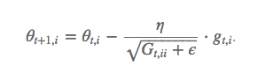

# 如何调参

[TOC]

## 1, 神经网络的参数优化方法

<https://www.cnblogs.com/bonelee/p/8528863.html>

### 1. 普通的全连接神经网络的效果

我们使用一个隐藏层，包含100个隐藏神经元，输入层是784，输出层是one-hot编码的形式，最后一层是Softmax层。训练过程采用对数似然代价函数，60次迭代，学习速率η=0.1，随机梯度下降的小批量数据大小为10，没有正则化。**在测试集上得到的结果是97.8%**，代码如下：


### 2.使用卷积神经网络 — 仅一个卷积层

输入层是卷积层，5 * 5的局部感受野，也就是一个5 * 5的卷积核，一共20个特征映射。最大池化层选用2*2的大小。后面是100个隐藏神经元的全连接层。结构如图所示 


在这个架构中，我们把卷积层和chihua层看做是学习输入训练图像中的局部感受野，而后的全连接层则是一个更抽象层次的学习，从整个图像整合全局信息。也是60次迭代，批量数据大小是10，学习率是0.1.代码如下，


**经过三次运行取平均后，准确率是98.78%**，这是相当大的改善。错误率降低了1/3，。卷积神经网络开始显现威力。

### 3.使用卷积神经网络 — 两个卷积层

我们接着插入第二个卷积-混合层，把它插入在之前的卷积-混合层和全连接层之间，同样的5*5的局部感受野，2*2的池化层。


**这一次，我们拥有了99.06%的准确率。**

### 4.使用卷积神经网络 — 两个卷积层+线性修正单元(ReLU)+正则化

我们使用的 Sigmod 激活函数，现在我们换成线性修正激活函数 ReLU ，我们选择 60 个迭代期，学习速率η=0.03, 使用 L2 正则化，正则化参数λ=0, 代码如下


**这一次，我们获得了99.23%的准确率**，超过了S型激活函数的99.06%. ReLU的优势是*max(0,z)*中z取最大极限时不会饱和，不像是S函数，这有助于持续学习。


## 深度学习优化方法 SGD

**SGD一般指代的是minibatch的随机梯度下降，这是网络建立好后，必须经过的，目的是找到全局最优解。**

<https://zhuanlan.zhihu.com/p/22252270>

<https://www.cnblogs.com/guoyaohua/p/8542554.html>

<https://blog.csdn.net/u012328159/article/details/80252012>

### gradient descent


用当前位置的负梯度方向作为搜索方向，亦即为当前位置下降最快的方向，也称“最速下降法”。越接近目标值时，步长越小，下降越慢。

如下图所示，梯度下降不一定能找到全局最优解，可能寻找到的是局部最优解。

### batch gradient descent

BGD 采用整个训练集的数据来计算 cost function 对参数的梯度。

**由于这种方法是在一次更新中，就对整个数据集计算梯度，所以计算起来非常慢，遇到很大量的数据集也会非常棘手，而且不能投入新数据实时更新模型。**

```python
X = data_input
Y = labels
parameters = initialize_parameters(layers_dims)
for i in range(0, num_iterations): #num_iterations--迭代次数
    # Forward propagation
    a, caches = forward_propagation(X, parameters)
    # Compute cost.
    cost = compute_cost(a, Y)
    # Backward propagation.
    grads = backward_propagation(a, caches, parameters)
    # Update parameters.
    parameters = update_parameters(parameters, grads)
```

Batch gradient descent的优点是理想状态下经过足够多的迭代后可以达到全局最优。但是缺点也很明显，就是如果你的数据集非常的大（现在很常见），根本没法全部塞到内存（显存）里，所以BGD对于小样本还行，大数据集就没法娱乐了。而且因为每次迭代都要计算全部的样本，所以对于大数据量会非常的慢。

###  stochastic gradient descent

**SGD的噪音较BGD要多，使得SGD并不是每次迭代都向着整体最优化方向**。**所以虽然训练速度快，但是准确度下降，并不是全局最优**。**虽然包含一定的随机性，但是从期望上来看，它是等于正确的导数的。**

**SGD 因为更新比较频繁，会造成 cost function 有严重的震荡。**

**BGD 可以收敛到局部极小值，当然 SGD 的震荡可能会跳到更好的局部极小值处。**

**当我们稍微减小 learning rate，SGD 和 BGD 的收敛性是一样的。**

```python
X = data_input
Y = labels
permutation = list(np.random.permutation(m))
shuffled_X = X[:, permutation]
shuffled_Y = Y[:, permutation].reshape((1, m))
for i in range(0, num_iterations):
    for j in range(0, m):  # 每次训练一个样本
        # Forward propagation
        AL,caches = forward_propagation(shuffled_X[:, j].reshape(-1,1), parameters)
        # Compute cost
        cost = compute_cost(AL, shuffled_Y[:, j].reshape(1,1))
        # Backward propagation
        grads = backward_propagation(AL, shuffled_Y[:,j].reshape(1,1), caches)
        # Update parameters.
        parameters = update_parameters(parameters, grads, learning_rate)
```

如果我们的数据集很大，比如几亿条数据，num_iterations. num_iterations 基本上 设置1，2，（10以内的就足够了）就可以。但是SGD也有缺点，因为每次只用一个样本来更新参数，会导致不稳定性大些(可以看下图（图片来自ng deep learning 课），每次更新的方向，不想batch gradient descent那样每次都朝着最优点的方向逼近，会在最优点附近震荡）。因为每次训练的都是随机的一个样本，会导致导致梯度的方向不会像BGD那样朝着最优点。 

注意：代码中的随机把数据打乱很重要，因为这个随机性相当于引入了“噪音”，正是因为这个噪音，使得SGD可能会避免陷入局部最优解中。


下面来对比下SGD和BGD的代价函数随着迭代次数的变化图:


SGD的代价函数随着迭代次数是震荡式的下降的（因为每次用一个样本，有可能方向是背离最优点的）


### mini-batch gradient descent

**mini-batch gradient descent 是batch gradient descent和stochastic gradient descent的折中方案，就是mini-batch gradient descent每次用一部分样本来更新参数，即 batch_sizebatch_size。因此，若batch_size=1batch_size=1 则变成了SGD，若batch_size=mbatch_size=m 则变成了batch gradient descent。**

mini-batch的原理：


```python
# GRADED FUNCTION: random_mini_batches
def random_mini_batches(X, Y, mini_batch_size = 64, seed = 0):
    """
    Creates a list of random minibatches from (X, Y)
    Arguments:
    X -- input data, of shape (input size, number of examples)
    Y -- true "label" vector (1 for blue dot / 0 for red dot), of shape (1, number of examples)
    mini_batch_size -- size of the mini-batches, integer

    Returns:
    mini_batches -- list of synchronous (mini_batch_X, mini_batch_Y)
    """
    np.random.seed(seed)            # To make your "random" minibatches the same as ours
    m = X.shape[1]                  # number of training examples
    mini_batches = []

    # Step 1: Shuffle (X, Y)
    permutation = list(np.random.permutation(m))
    shuffled_X = X[:, permutation]
    shuffled_Y = Y[:, permutation].reshape((1,m))

    # Step 2: Partition (shuffled_X, shuffled_Y). Minus the end case.
    num_complete_minibatches = m//mini_batch_size # number of mini batches
    for k in range(0, num_complete_minibatches):
        mini_batch_X = shuffled_X[:, k * mini_batch_size: (k + 1) * mini_batch_size]
        mini_batch_Y = shuffled_Y[:, k * mini_batch_size: (k + 1) * mini_batch_size]
        mini_batch = (mini_batch_X, mini_batch_Y)
        mini_batches.append(mini_batch)

    # Handling the end case (last mini-batch < mini_batch_size)
    if m % mini_batch_size != 0:
        mini_batch_X = shuffled_X[:, num_complete_minibatches * mini_batch_size : m]
        mini_batch_Y = shuffled_Y[:, num_complete_minibatches * mini_batch_size : m]
        mini_batch = (mini_batch_X, mini_batch_Y)
        mini_batches.append(mini_batch)

    return mini_batches
```

下面是在model中使用mini-batch gradient descent 进行更新参数:

```python
seed = 0
for i in range(0, num_iterations):
    # Define the random minibatches. We increment the seed to reshuffle differently the dataset after each epoch
    seed = seed + 1
    minibatches = random_mini_batches(X, Y, mini_batch_size, seed)
    for minibatch in minibatches:
        # Select a minibatch
        (minibatch_X, minibatch_Y) = minibatch
        # Forward propagation
        AL, caches = forward_propagation(minibatch_X, parameters)
        # Compute cost
        cost = compute_cost(AL, minibatch_Y)
        # Backward propagation
        grads = backward_propagation(AL, minibatch_Y, caches)
        parameters = update_parameters(parameters, grads, learning_rate)
```

下面来看mini-batch gradient descent 和 stochastic gradient descent 在下降时的对比图：


下面是mini-batch gradient descent的代价函数随着迭代次数的变化图： 


从图中能够看出，mini-batch gradient descent 相对SGD在下降的时候，相对平滑些（相对稳定），不像SGD那样震荡的比较厉害。mini-batch gradient descent的一个缺点是增加了一个超参数 batch_size，需要调节这个参数。

缺点：

1，选择合适学习率很困难；我们希望将不常出现的特征更新快点，常出现的更新慢点。

2，SGD容易收敛到局部最优，有可能困在鞍点。

### Adam：Adaptive Moment Estimation

Adam 算法和传统的随机梯度下降不同。随机梯度下降保持单一的学习率（即 alpha）更新所有的权重，学习率在训练过程中并不会改变。而 Adam 通过计算梯度的一阶矩估计和二阶矩估计而为不同的参数设计独立的自适应性学习率。

适应性梯度算法（AdaGrad）为每一个参数保留一个学习率以提升在稀疏梯度（即自然语言和计算机视觉问题）上的性能。其中 g 为：t 时刻参数 θ_i 的梯度。




 均方根传播（RMSProp）基于权重梯度最近量级的均值为每一个参数适应性地保留学习率。这意味着算法在非稳态和在线问题上有很有优秀的性能。


 Adam 算法同时获得了 AdaGrad 和 RMSProp 算法的优点。Adam 不仅如 RMSProp 算法那样基于一阶矩均值计算适应性参数学习率，它同时还充分利用了梯度的二阶矩均值。

**超参数设定值:**
**建议 lr = 0.001, β1 ＝ 0.9，β2 ＝ 0.999，ϵ ＝ 10e−8，其中 g 为：t 时刻参数 θ_i 的梯度**


m_t，n_t分别是对梯度的一阶矩估计和二阶矩估计，可以看作对期望!E|g_t|，E|g_t^2|的估计；hat{m_t}，hat{n_t}是对m_t，n_t的校正，这样可以近似为对期望的无偏估计。 可以看出，直接对梯度的矩估计对内存没有额外的要求，而且可以根据梯度进行动态调整，而结合项对学习率形成一个动态约束，而且有明确的范围。


它的名称来源于适应性矩估计（adaptive moment estimation）。在介绍这个算法时，原论文列举了将 Adam 优化算法应用在非凸优化问题中所获得的优势：

> 直截了当地实现
>  高效的计算
>  所需内存少
>  梯度对角缩放的不变性（第二部分将给予证明）
>  适合解决含大规模数据和参数的优化问题
>  适用于非稳态（non-stationary）目标
>  适用于解决包含很高噪声或稀疏梯度的问题
>  超参数可以很直观地解释，并且基本上只需极少量的调参


### 效果比较


### 如何选择优化算法

**如果数据是稀疏的，就用自适用方法，即 Adagrad, Adadelta, RMSprop, Adam。**

**RMSprop, Adadelta, Adam 在很多情况下的效果是相似的。**

**Adam 就是在 RMSprop 的基础上加了 bias-correction 和 momentum，**

**随着梯度变的稀疏，Adam 比 RMSprop 效果会好。**

整体来讲，**Adam 是最好的选择**。

很多论文里都会用 SGD，没有 momentum 等。**SGD 虽然能达到极小值，但是比其它算法用的时间长，而且可能会被困在鞍点**。

如果需要更快的收敛，或者是训练更深更复杂的神经网络，需要用一种自适应的算法。


## 2，如何调参

### 1，超参数的类型


## 3，Detectron的学习


### 1，如何测试

`infer_simple.py`是采用 end-to-end 训练得到的 Mask RCNN 模型，ResNet-101-FPN Backbone:

```python
python2 tools/infer_simple.py \
    --cfg configs/12_2017_baselines/e2e_mask_rcnn_R-101-FPN_2x.yaml \
    --output-dir /tmp/detectron-visualizations \
    --image-ext jpg \
    --wts https://s3-us-west-2.amazonaws.com/detectron/35861858/12_2017_baselines/e2e_mask_rcnn_R-101-FPN_2x.yaml.02_32_51.SgT4y1cO/output/train/coco_2014_train:coco_2014_valminusminival/generalized_rcnn/model_final.pkl \
    demo
# yaml文件为模型参数； pkl文件为模型的保存格式
```

采用单块 GPU 运行 end-to-end 训练的 Mask RCNN 模型.

对 `coco_2014_minival` 的所有图片进行推断：

```python
python2 tools/test_net.py \
    --cfg configs/12_2017_baselines/e2e_mask_rcnn_R-101-FPN_2x.yaml \
    TEST.WEIGHTS https://s3-us-west-2.amazonaws.com/detectron/35861858/12_2017_baselines/e2e_mask_rcnn_R-101-FPN_2x.yaml.02_32_51.SgT4y1cO/output/train/coco_2014_train:coco_2014_valminusminival/generalized_rcnn/model_final.pkl \
    NUM_GPUS 1
    # NUM_GPUS $4
```

### 2，Detectron训练

简单介绍在 COCO Dataset 上训练模型.

采用 ResNet-50-FPN Backbone 进行 end-to-end 的 Faster R-CNN 训练.

这里简单进行模型训练，小尺寸的输入图片，能够使训练和推断的速度相对较快.

```python
# 单GPU训练
python2 tools/train_net.py \
    --cfg configs/getting_started/tutorial_1gpu_e2e_faster_rcnn_R-50-FPN.yaml \
    OUTPUT_DIR /tmp/detectron-output

# 多GPU训练(yaml文件要变为多GPU版本)
python2 tools/train_net.py \
    --multi-gpu-testing \
    --cfg configs/getting_started/tutorial_2gpu_e2e_faster_rcnn_R-50-FPN.yaml \
    OUTPUT_DIR /tmp/detectron-output
```

### 3，config.py 文件参数

**1，训练参数 Training Options**

```python
# ---------------------------------------------------------------------------- #
# 训练默认参数
# ---------------------------------------------------------------------------- #
__C.TRAIN = AttrDict()

# 从 .pkl 文件初始化网络权重参数；.pkl 可以是预训练模型.
__C.TRAIN.WEIGHTS = b''

# 训练数据集 Datasets
# 训练数据集列表设定：datasets.dataset_catalog.DATASETS.keys()
# 如果设定了多个 datasets，则会在其并集上进行模型训练.
__C.TRAIN.DATASETS = ()

# 训练所采用的缩放尺度 Scales
# 每一个 scale 是图像短边的像素值
# 如果给定了多个 scales 值，则对于每个训练图片随机选取一个 scale，如尺度抖动数据增强scale jitter data augmentation
__C.TRAIN.SCALES = (600, )

# 缩放后输入图片最长边的最大像素值
__C.TRAIN.MAX_SIZE = 1000

# 训练 mini-batch 每张 GPU 的图片数
# 每个 mini-batch 的总图片数 = 每张 GPU 的图片数 * GPUs 数
# Total images per minibatch = TRAIN.IMS_PER_BATCH * NUM_GPUS
__C.TRAIN.IMS_PER_BATCH = 2

# 每张图片的 RoI mini-batch，即每张图片的 RoIs 数.
# 每张训练 mini-batch 中总的 RoIs 数 = 每张图片 mini-batch RoIs 数 * mini-batch 图片数 * GPUs 数
# 典型配置： 512 * 2 * 8 = 8192
# RoI minibatch size *per image* (number of regions of interest [ROIs])
# Total number of RoIs per training minibatch =
#   TRAIN.BATCH_SIZE_PER_IM * TRAIN.IMS_PER_BATCH * NUM_GPUS
__C.TRAIN.BATCH_SIZE_PER_IM = 64

# mini-batch 中被标记为 foreground RoIs(i.e. class > 0) 的目标分数Target fraction 
__C.TRAIN.FG_FRACTION = 0.25

# RoI 的重叠区域大于 FG_THRESH 则被标记为 foreground
__C.TRAIN.FG_THRESH = 0.5

# RoI 的重叠区域在 [LO, HI] 区间内则被标记为 background (i.e. class = 0)
__C.TRAIN.BG_THRESH_HI = 0.5
__C.TRAIN.BG_THRESH_LO = 0.0

# 训练是否水平翻转图片
__C.TRAIN.USE_FLIPPED = True

# 如果 RoI 和 groundtruth box 的重叠区域大于阈值BBOX_THRESH，则(RoI gt_box)对作为边界框 bounding-box 回归训练样本.
__C.TRAIN.BBOX_THRESH = 0.5

# 模型保存周期，即多少次迭代进行一次模型断点保存.
# 需要除以 GPUs 数 NUM_GPUS，e.g., 20000/8 => 2500 iters
__C.TRAIN.SNAPSHOT_ITERS = 20000

# 训练采用指定的 proposals 
# 训练过程中，所有的 proposals 是在 proposal 文件中指定的.
# proposals 文件与 TRAIN.DATASETS 数据集相对应.
__C.TRAIN.PROPOSAL_FILES = ()

# 确保图片 mini-batches 具有相同的长宽比，(i.e. both tall and thin or both short and wide)
# 对于节省内存很重要，可以稍微加快训练.
__C.TRAIN.ASPECT_GROUPING = True
```

**2，RPN 训练参数 RPN training options**

```python
# ---------------------------------------------------------------------------- #
# RPN 训练默认参数
# ---------------------------------------------------------------------------- #

# 如果 anchor 和 groundtruth box 的最小重叠区域大于阈值 RPN_POSITIVE_OVERLAP， 
# 则 (anchor, gt_box) 对作为 positive 训练样本
# (IOU >= thresh ==> positive RPN example)
__C.TRAIN.RPN_POSITIVE_OVERLAP = 0.7

# 如果 anchor 和 groundtruth box 的最大重叠区域小于阈值 RPN_NEGATIVE_OVERLAP， 
# 则 (anchor, gt_box) 对作为 negative 训练样本
# (IOU < thresh ==> negative RPN example)
__C.TRAIN.RPN_NEGATIVE_OVERLAP = 0.3

# 每个 RPN mini-batch 中被标记为 foreground (positive) 样本的目标分数Target fraction
__C.TRAIN.RPN_FG_FRACTION = 0.5

# 每张图片的 RPN 样本总数
__C.TRAIN.RPN_BATCH_SIZE_PER_IM = 256

# RPN proposals 所采用的 NMS 阈值 (end-to-end training with RPN 时使用)
__C.TRAIN.RPN_NMS_THRESH = 0.7

# NMS 处理前，top 分数的 RPN proposals 数
# When FPN is used, this is *per FPN level* (not total)
__C.TRAIN.RPN_PRE_NMS_TOP_N = 12000

# NMS 处理后，保留的 top 分数的 RPN proposals 数
# 所产生的 RPN proposals 总数(FPN 和 non-FPN 一样)
__C.TRAIN.RPN_POST_NMS_TOP_N = 2000

# 设定阈值像素值 RPN_STRADDLE_THRESH，丢弃超出图片边界的 PRN anchors
# 设定 RPN_STRADDLE_THRESH = -1 或 RPN_STRADDLE_THRESH = Large_Value(e.g. 100000)，则不进行 anchors 裁剪.
__C.TRAIN.RPN_STRADDLE_THRESH = 0

# proposal 的 height 和 width 需要同时大于阈值RPN_MIN_SIZE
# (相对于原始图片尺度，不是训练或测试时的尺度)
__C.TRAIN.RPN_MIN_SIZE = 0

# 根据阈值CROWD_FILTER_THRESH 过滤在 crowd 区域的 proposals.
# "Inside" 的度量：proposal-with-crowd 交叉区域面积除以 proposal面积.
# "Inside" is measured as: proposal-with-crowd intersection area divided by proposal area.
__C.TRAIN.CROWD_FILTER_THRESH = 0.7

# 忽略面积小于阈值GT_MIN_AREA 的 groundtruth 物体
__C.TRAIN.GT_MIN_AREA = -1

# 如果FREEZE_CONV_BODY设定为 True，则冻结骨干backbone网络结构参数
__C.TRAIN.FREEZE_CONV_BODY = False

# 设定AUTO_RESUME=True 时，从输出路径中的最近模型断点snapshot 恢复训练
__C.TRAIN.AUTO_RESUME = True
```

### 3，模型参数 Model options 

```python
# ---------------------------------------------------------------------------- #
# 模型参数
# ---------------------------------------------------------------------------- #
__C.MODEL = AttrDict()

# 使用模型的类型
# 字符串形式，与 modeling.model_builder 内的对应函数名一致，
# (e.g., 'generalized_rcnn', 'mask_rcnn', ...)
__C.MODEL.TYPE = b''

# 使用的骨干卷积网络 backbone conv body
# 字符串形式，与 modeling.model_builder 内的对应函数名一致，
# (e.g., 'FPN.add_fpn_ResNet101_conv5_body' 指定 ResNet-101-FPN 为骨干网络backbone)
__C.MODEL.CONV_BODY = b''

# 数据集内的类别classes 数；必须设定
# E.g., 81 for COCO (80 foreground + 1 background)
__C.MODEL.NUM_CLASSES = -1

# 采用类别未知边界框回归器(class agnostic bounding box regressor)；
# 而不是默认逐类回归器(default per-class regressor)
__C.MODEL.CLS_AGNOSTIC_BBOX_REG = False

# (dx, dy, dw, dh)的默认权重，用于归一化 bbox 回归目标targets
# 经验值，逼近到单位方差目标(unit variance targets)
__C.MODEL.BBOX_REG_WEIGHTS = (10., 10., 5., 5.)

# FASTER_RCNN 的意思取决于其内容(training vs. inference):
# 1) 训练时，FASTER_RCNN = True 表示使用 end-to-end 训练方式联合训练 RPN 子网络和 Fast R-CNN 子网络
#    (Faster R-CNN = RPN + Fast R-CNN).
# 2) 推断时，FASTER_RCNN = True 表示使用模型的 RPN 子网络来生成 proposals，而不是预先计算的 proposals.
#    即使 Faster R-CNN 模型是逐阶段训练的(即，交替训练 RPN 和 Fast R-CNN 得到的)，
#    也可以在推断时使用 FASTER_RCNN = True.
__C.MODEL.FASTER_RCNN = False

# True，表示模型输出示例分割预测结果 instance mask predictions (如 Mask R-CNN)
__C.MODEL.MASK_ON = False

# True，表示模型输出关键点预测结果 keypoint predictions (如 Mask R-CNN for keypoints)
__C.MODEL.KEYPOINTS_ON = False

# True，表示模型的计算终止于生成 RPN proposals
# (i.e., 只输出 proposals，不进行真正的目标检测)
__C.MODEL.RPN_ONLY = False

# Caffe2 网络net 执行类型
# 使用 'prof_dag' 进行分析统计
__C.MODEL.EXECUTION_TYPE = b'dag'
```

### 4，求解器 Solver 参数

```python
# ----------------------------------------------------------------------------#
# 求解器参数Solver
# 所有的 solver 参数被精确指定；意味着，如果训练从 1 GPU 切换到 N GPUs，必须调整对应的 solver 参数.
# 建议使用 gradual warmup 和 linear learning rate scaling rule，基于于论文
# "Accurate, Large Minibatch SGD: Training ImageNet in 1 Hour" Goyal et al.
# https://arxiv.org/abs/1706.02677
# ---------------------------------------------------------------------------- 
__C.SOLVER = AttrDict()

# 指定方案的基础学习率Base learning rate
__C.SOLVER.BASE_LR = 0.001

# 学习率策略，如 utils.lr_policy 中参数的对应函数)
# E.g., 'step', 'steps_with_decay', ...
__C.SOLVER.LR_POLICY = b'step'

# 一些 LR 策略例示:
# 'step'
#   lr = SOLVER.BASE_LR * SOLVER.GAMMA ** (cur_iter // SOLVER.STEP_SIZE)
# 'steps_with_decay'
#   SOLVER.STEPS = [0, 60000, 80000]
#   SOLVER.GAMMA = 0.1
#   lr = SOLVER.BASE_LR * SOLVER.GAMMA ** current_step
#   iters [0, 59999] are in current_step = 0, iters [60000, 79999] are in
#   current_step = 1, and so on
# 'steps_with_lrs'
#   SOLVER.STEPS = [0, 60000, 80000]
#   SOLVER.LRS = [0.02, 0.002, 0.0002]
#   lr = LRS[current_step]

# 指定方案的超参数
# 对于 'step',在每一步，当前 LR 乘以因子 SOLVER.GAMMA
__C.SOLVER.GAMMA = 0.1

# 'steps'策略均匀化步长Uniform step size
__C.SOLVER.STEP_SIZE = 30000

# 'steps_with_decay' 和 'steps_with_lrs'策略非均匀化步长 Non-uniform step iterations
__C.SOLVER.STEPS = []

# 采用 'steps_with_lrs' 策略的学习率
__C.SOLVER.LRS = []

# SGD 迭代的最多次数
__C.SOLVER.MAX_ITER = 40000

# SGD 动量 Momentum
__C.SOLVER.MOMENTUM = 0.9

# L2 正则化参数
__C.SOLVER.WEIGHT_DECAY = 0.0005

# SOLVER.BASE_LR 热身的 SGD 迭代次数
__C.SOLVER.WARM_UP_ITERS = 500

# 从 SOLVER.BASE_LR * SOLVER.WARM_UP_FACTOR 开始热身
__C.SOLVER.WARM_UP_FACTOR = 1.0 / 3.0

# WARM_UP_METHOD 方法可以是 'constant' 或 'linear' (i.e., gradual)
__C.SOLVER.WARM_UP_METHOD = 'linear'

# 当更新学习率时，采用 new_lr / old_lr 对动量momentum更新历史的缩放尺度scale：
# (this is correct given MomentumSGDUpdateOp)
__C.SOLVER.SCALE_MOMENTUM = True
# 仅当相对 LR 变化大于阈值时，才进行修正
# (避免小因子缩放动量momentum 时 linear warm up 所发生的变换；
#  如果 LR 变换较大时，momentum 缩放才比较重要)
# prevents ever change in linear warm up from scaling the momentum by a tiny
# amount; momentum scaling is only important if the LR change is large)
__C.SOLVER.SCALE_MOMENTUM_THRESHOLD = 1.1

# Suppress logging of changes to LR unless the relative change exceeds this
# threshold (prevents linear warm up from spamming the training log)
__C.SOLVER.LOG_LR_CHANGE_THRESHOLD = 1.1
```

### 5，faster rcnn 参数

```python
# ---------------------------------------------------------------------------- 
# Fast R-CNN 参数
# ---------------------------------------------------------------------------- #
__C.FAST_RCNN = AttrDict()

# 用于边界框分类和回归的 RoI head 类型
# 字符串形式，必须与  modeling.model_builder 中对应的函数一致
# (e.g., 'head_builder.add_roi_2mlp_head' 指定了两个隐层的 MLP)
__C.FAST_RCNN.ROI_BOX_HEAD = b''

# 当使用 MLP 作为 RoI box head 时的隐层维度
__C.FAST_RCNN.MLP_HEAD_DIM = 1024

# RoI 变换函数(e.g., RoIPool or RoIAlign)
# (RoIPoolF 与 RoIPool 相同; 忽略尾部的 'F')
__C.FAST_RCNN.ROI_XFORM_METHOD = b'RoIPoolF'

# RoIAlign 中，网格采样(grid sampling points)点数(一般为 2)
# 只在 RoIAlign 中使用
__C.FAST_RCNN.ROI_XFORM_SAMPLING_RATIO = 0

# RoI 变换的输出分辨率
# 注：某些模型可能对于其可以使用什么有约束；
# e.g. they use pretrained FC layers like in VGG16, and will ignore this option
__C.FAST_RCNN.ROI_XFORM_RESOLUTION = 14
```

### 6，RPN 参数

```python
# ----------------------------------------------------------------------------#
# RPN 参数
# ----------------------------------------------------------------------------#
__C.RPN = AttrDict()

# [推测值；不直接在 config 中设定]
# True，表示模型包含 RPN 子网络
__C.RPN.RPN_ON = False

# 关于缩放网络输入的 RPN anchor 尺寸，以绝对像素值的形式
# RPN anchor sizes given in absolute pixels w.r.t. the scaled network input
# Note: these options are *not* used by FPN RPN; see FPN.RPN* options
__C.RPN.SIZES = (64, 128, 256, 512)

# RPN attached 的特征图步长
__C.RPN.STRIDE = 16

# RPN anchor 的长宽比aspect ratios
__C.RPN.ASPECT_RATIOS = (0.5, 1, 2)
```

### 7，FPN 参数

```python
# --------------------------------------------------------------------------- #
# FPN 参数
# --------------------------------------------------------------------------- #
__C.FPN = AttrDict()

# True，开启 FPN
__C.FPN.FPN_ON = False

# FPN 特征层的通道维度Channel dimension
__C.FPN.DIM = 256

# True，初始化侧向连接lateral connections 输出 0
__C.FPN.ZERO_INIT_LATERAL = False

# 最粗糙coarsest FPN 层的步长
# 用于将输入正确地补零，是需要的
__C.FPN.COARSEST_STRIDE = 32

#
# FPN 可以只是 RPN、或只是目标检测，或两者都用.
#

# True, 采用 FPN 用于目标检测 RoI 变换
__C.FPN.MULTILEVEL_ROIS = False
# RoI-to-FPN 层的映射启发式 超参数
__C.FPN.ROI_CANONICAL_SCALE = 224  # s0
__C.FPN.ROI_CANONICAL_LEVEL = 4  # k0: where s0 maps to
# FPN 金字塔pyramid 的最粗糙层Coarsest level
__C.FPN.ROI_MAX_LEVEL = 5
# FPN 金字塔pyramid 的最精细层Finest level
__C.FPN.ROI_MIN_LEVEL = 2

# True，在 RPN 中使用 FPN
__C.FPN.MULTILEVEL_RPN = False
# FPN 金字塔pyramid 的最粗糙层Coarsest level
__C.FPN.RPN_MAX_LEVEL = 6
# FPN 金字塔pyramid 的最精细层Finest level
__C.FPN.RPN_MIN_LEVEL = 2
# FPN RPN anchor 长宽比aspect ratios
__C.FPN.RPN_ASPECT_RATIOS = (0.5, 1, 2)
# 在 RPN_MIN_LEVEL 上 RPN anchors 开始的尺寸
# RPN anchors start at this size on RPN_MIN_LEVEL
# The anchor size doubled each level after that
# With a default of 32 and levels 2 to 6, we get anchor sizes of 32 to 512
__C.FPN.RPN_ANCHOR_START_SIZE = 32
# 使用额外的 FPN 层levels, as done in the RetinaNet paper
__C.FPN.EXTRA_CONV_LEVELS = False
```

### 8，Mask RCNN 参数

```python
# --------------------------------------------------------------------------- #
# Mask R-CNN 参数 ("MRCNN" means Mask R-CNN)
# --------------------------------------------------------------------------- #
__C.MRCNN = AttrDict()

# 实例 mask 预测所用的 RoI head 类型
# 字符串形式，与 modeling.model_builder 对应的函数一致
# (e.g., 'mask_rcnn_heads.ResNet_mask_rcnn_fcn_head_v1up4convs')
__C.MRCNN.ROI_MASK_HEAD = b''

# 预测 mask 的分辨率
__C.MRCNN.RESOLUTION = 14

# RoI 变换函数和相关参数
__C.MRCNN.ROI_XFORM_METHOD = b'RoIAlign'

# RoI 变换函数 (e.g., RoIPool or RoIAlign)
__C.MRCNN.ROI_XFORM_RESOLUTION = 7

# RoIAlign 中网格采样点(grid sampling points)数(通常为2)
# 只用于 RoIAlign
__C.MRCNN.ROI_XFORM_SAMPLING_RATIO = 0

# mask head 中的通道channels 数
__C.MRCNN.DIM_REDUCED = 256

# mask head 中使用 dilated convolution
__C.MRCNN.DILATION = 2

# 预测 masks 的上采样因子
__C.MRCNN.UPSAMPLE_RATIO = 1

# True，采用全连接FC 层来预测最终的 masks
# False，采用卷积conv 层来预测最终的 masks
__C.MRCNN.USE_FC_OUTPUT = False

# mask head 和mask 输出层的权重初始化方法
__C.MRCNN.CONV_INIT = b'GaussianFill'

# True，使用类别特定 mask 预测(class specific mask predictions)
# False，使用类别未知 mask 预测(class agnostic mask predictions)
__C.MRCNN.CLS_SPECIFIC_MASK = True

# masks 的 multi-task loss 的权重
__C.MRCNN.WEIGHT_LOSS_MASK = 1.0

# soft masks 转换为 hard masks 的二值化阈值(Binarization threshold)
__C.MRCNN.THRESH_BINARIZE = 0.5
```

### 9，训练过程和数据加载流程


### 10， Detectron 之  utils函数

```python
"""
    box的规格：
    Detectron 默认的 box 格式为：[x1, y1, x2, y2]
        - (x1, y1): box 的左上角(top-left) 坐标
        - (x2, y2): box 的右下角(bottom-right) 坐标
    如果是其它格式 box ，如 [x, y, w, h]，需要进行转换.
    
    soft-NMS：
    基于重叠部分的大小为相邻检测框设置一个衰减函数而非彻底将其分数置为零。
    简单来讲，如果一个检测框与 M 有大部分重叠，它会有很低的分数；
    而如果检测框与 M 只有小部分重叠，那么它的原有检测分数不会受太大影响。
"""

```


