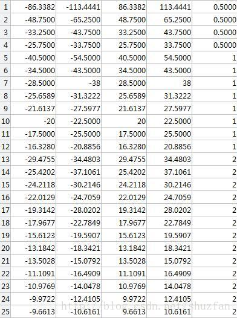

[TOC]

# 为什么SSD对小目标检测效果不好？

起源于一个知乎问题，[为什么SSD(Single Shot MultiBox Detector)对小目标的检测效果不好？][https://www.zhihu.com/question/49455386]

SSD是一种基于全卷积的网络的检测器，用不同层检测不同大小的物体。这中间有个矛盾，前面的featmap大，但semantic不够，后面的sematic够了，但经过太多的pooling，featmap太小了。

要检测小物体，既需要一张足够大的feature map来提供更加精细的特征和做更加密集的采样，同时也需要足够的semantic meaning来与背景区分开。


小目标像素少特征不明显，因此和大目标相比，小目标的检测率低，这个用任何算法上都是无法避免的。

小目标检测需要较高的分辨率，因此主要在底部的特征层进行检测，比如SSD中的conv4_3，但底部特征层的语义信息不够丰富，这是一个矛盾，但卷积层加足够深的话影响其实没这么大。我觉得最重要的因素还是因为scale设置的不好导致的，SSD中默认最低一层的anchor为10%~20%，对于720p的图像最小检测尺寸就有72个像素，还是太大了。事实上SSD的源码允许一个特征层做多个尺度的滑窗，将参数min_sizes里的每个元素初始化为一个列表，就可以在相应特征层中生成不同尺度的anchor，如果你设计的足够仔细，基本就可以覆盖足够小的目标了，不过此时anchor的数量估计会涨不少，速度也会降下来。

```
1 小目标往往更依赖浅层特征，因为浅层特征有更高的分辨率，然而对语义区分较差。
2 ssd检测和分类一起做，会把一些检测到但是分类模糊，分数不高的结果过滤掉。而rpn不会，前200个候选继续分类，都会有个结果。
3 为了速度，本来是全卷积网络，却也固定了输入尺寸。对大图的小目标影响很大
```

一种理解：
每一个feature map上面的pixel对应几个anchor，这个网络对anchor进行训练，以此驱动对feature进行训练。

作为小物体，其所对应的anchor比较少 (gt overlap > 0.5 的 anchor)，也就是说对应feature map上的pixel难以得到充分训练。读者可以脑补每一个大的ROI可能覆盖很多 anchor，那么这些 anchor 【关联的正锚点】均有机会得到训练。然而一个小物体并不能覆盖很多 anchor。

没有得到充分训练有什么问题？在test的时候这个pixel的预测结果可能就是乱的，会极大干扰正常结果。

为什么SSD的data augmentation能涨这么多点，就是因为通过randomly crop，让每一个anchor都得到充分训练。SSD对小目标检测不好的主要矛盾还是在浅层语义不够，无法很好的检测到小目标，深层anchor box密度不够，导致无法同时兼顾大小目标。

只能说这种without region propisal的结果自然地不擅长小物体。可以结合使用不同层的特征，比如高层特征做上采样与底层特征结合使用，FPN。也保证感受野不缩小的情况下，feature map的分辨率不至于缩小太多，deeplab的hole思想。

# 小目标检测的技术难点在哪？

检测小物体的难度真正在定位和提取特征。one stage的很多anchor覆盖不到小物体（因为限制overlap>0.5）或者说anchor很少，得不到充足的训练。另一问题是分辨率低，图像模糊，信息少，表征能力弱。还有小物体和背景之间的尺寸差异大，如果使用较小的感受野去关注物体本身的特征，则很难提取到背景中包含的全局语义信息。如果使用较大感受野去关注背景信息，那么小物体本身的特征就会被丢失。

**搞好特征（context，放大图片，增加数据）和检测策略（anchor设计分布啥的）的针对调整**

https://www.zhihu.com/question/269877902

https://www.zhihu.com/question/272322209

https://www.zhihu.com/question/64861580

```
（1）scale。最简单粗暴的方法就是放大图片。这就是在尺度上做文章，如FPN（Feature Pyramid Network），SNIP（An Analysis of Scale Invariance in Object Detection – SNIP）都是在做尺度的事情，利用图像金字塔思想。特征图的分辨率 stride 的设置也算在这个里面。另，如果图像尺寸特别大，可以考虑 YOLT（You only look twice）中切图的方法。
（2）context。小物体需要有更多的周边信息来帮助识别，如何利用这些信息，two stage 可以从 ROI Pooling 上下手，另也有 Jifeng Dai 老师的 Relation Network for Object Detection。
（3）anchor。回归的好不如预设的好，S3FD 做了非常细致的 anchor 的实验,可以帮助我们更合理地设计anchor。也可以增加小目标的anchor数量。也可以学习find tiny face中的针对不同anchor size选择不同的缩放系数。
（4）matching strategy。对于小物体不设置过于严格的 IoU threshold，或者借鉴 Cascade R-CNN 的思路。
（5）用GAN对小目标生成super-resolved feature叠加在原来的小目标特征上，增强特征表达。PGAN。
```

## PGAN for small object detection

用GAN训练生成小目标的feature映射成大目标的feature来增强特征表达。一种思路。https://www.jianshu.com/p/df19be8fd035

```
small object 不好检测，而large object好检测，那PGAN就让generator 学习一个映射，把small object 的features 映射成 large object 的features，然后就好检测了。

1 小目标检测的一个常用思路是提升图片输入分辨率，来增强小目标的分辨率和生成高分辨率的特征图，但这会导致训练和验证极度费时。
2 本文提出的PGAN方法对小目标生成高分辨率特征表示，使小目标的特征表示与大目标特征表示类似。
3 生成器网络通过较前层提取细粒度特征将小目标分辨率较低的特征转换为分辨率较高的特征。
4 判别器网络不仅用于生成小目标高分辨表示，同时证明带感知损失的生成高分辨女特征对检测准确率是有帮助的。
5 生成器网络被训练欺骗辨别器通过产生最像大目标表征的小目标，同时提升检测准确率。
6 辨别器被训练用于提升正确从实际大目标中分辨出生成的高分辨率表征，同时将定位准确率反馈给生成器。
7 小目标检测典型应用领域：交通标志检测、行人检测
```

perception branch首先利用仅包含大目标的图片进行训练，然后利用仅包含小目标的图片进行训练，generator network 被训练用于对小目标生成高分辨率的类似大目标的表征。adversarial branch被训练用于区分生成的小目标高分辨率表征与实际大目标的原始表征。


generator 从底层提取细粒度特征，放入深度残差网络，通过element-wise加和操作，将深度残差网络学习到的残差特征与conv5学习到的特征结合，得到高分辨率特征图；discriminator将大目标和小目标的高分辨特征作为输入，adversarial分支 用于判断输入相片属于真的大目标的概率值，perception分支用于分类和边界框回归，验证从生成高分辨率特征获得的检测准确率提升。


## Finding Tiny Face

```
1. 文章充分利用一个模型的不同层级特征，采用一种multi-task模式，针对不同尺度训练了多个检测器。
2. ImageNet上80%的目标尺寸分布在40~140像素，所以测大目标(140像素以上)，采用0.5倍分辨率的模板；检测小目标(40像素一下)，采用2倍分辨率的模板；其它保持一致。
```

**1，不同级别特征融合是检测小目标的关键，对于大目标效果就不是很明显了。**

通过尺度不变方式，来处理图像金字塔以捕获大规模变化，并采用特定尺度混合检测器，如下图：


图 a) 是 一个尺度模板，多尺度图像 
图 b) 是 多个尺度模板，单尺度图像 
图 c) 是 多个尺度模板，多尺度图像 
图 d) 和 图 e) 考虑了上下文信息，即人脸周边信息。e定义了从深度模型的多个层中提取的特征模板，也就是foveal descriptors


采用ResNet-50的FCN结构，输出二分类概率图。resX表示不同层级的特征，X越大表示感受野越大。


不同级别特征融合是检测小目标的关键，对于大目标效果就不是很明显了。

**2， 检测大目标(140像素以上)，采用0.5倍分辨率的模板；检测小目标(40像素一下)，采用2倍分辨率的模板；其它保持一致。**


125=25+4×25, 即每个点对应25种不同大小的模板(bounding box，可以理解成anchor)，每个模板又对应了4个描述bounding box 坐标偏移量的参数。如下图，针对不同分辨率的模板：



下图为检测示意图，流程如下：
(1) 将原始图像以 √2/2 的缩放系数，构建一个图像金字塔。(具体要构建多少金字塔，由输入图像大小以及最大模板尺寸决定)

(2) 依次处理每一张金字塔图像。每一张输入图像都会得到 n×n×125的输出，对应25种不同尺寸的模板(类似于R-CNN或者YOLO中的anchor)。 
重点来了， **并不是25种模板都会使用，针对不同的输入图像分辨率以及待检测目标大小，只会从中选一部分来使用。**

具体地：如果图像变小了(检测大目标)，则只使用编号5-12的针对1X分辨率的模板；如果图像变大了(检测小目标)，则使用编号5-12和19-25的模板；

(3) 根据一定阈值，在不同模板对应的feature map上选出目标，并进行boundingbox矫正，最后使用NMS融合。


