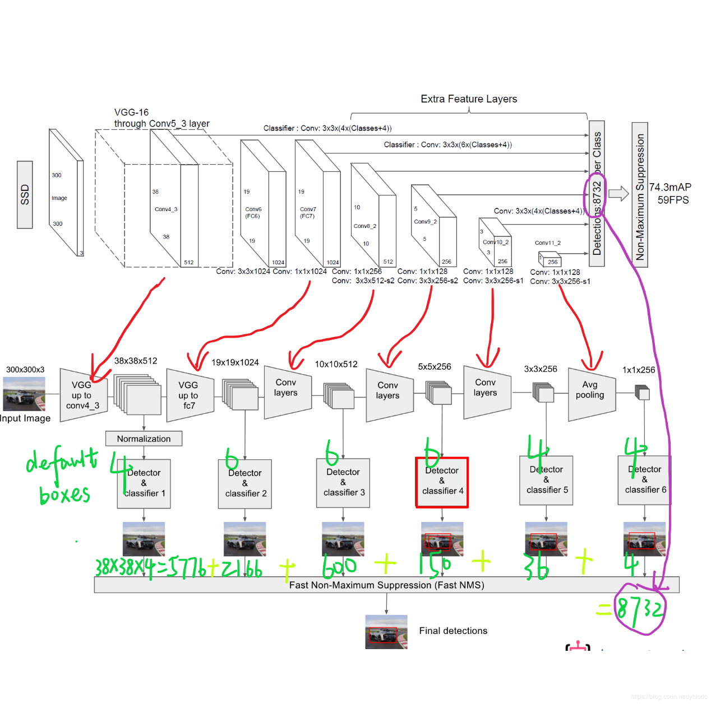

起源于一个知乎问题，

[为什么SSD(Single Shot MultiBox Detector)对小目标的检测效果不好？][https://www.zhihu.com/question/49455386]

SSD是一种基于全卷积的网络的检测器，用不同层检测不同大小的物体。这中间有个矛盾，前面的featmap大，但semantic不够，后面的sematic够了，但经过太多的pooling，featmap太小了。

要检测小物体，既需要一张足够大的featmap来提供更加精细的特征和做更加密集的采样，同时也需要足够的semantic meaning来与背景区分开。




小目标像素少特征不明显，因此和大目标相比，小目标的检测率低，这个用任何算法上都是无法避免的。

小目标检测需要较高的分辨率，因此主要在底部的特征层进行检测，比如SSD中的conv4_3，但底部特征层的语义信息不够丰富，这是一个矛盾，但卷积层加足够深的话影响其实没这么大。我觉得最重要的因素还是因为scale设置的不好导致的，SSD中默认最低一层的anchor为10%~20%，对于720p的图像最小检测尺寸就有72个像素，还是太大了。事实上SSD的源码允许一个特征层做多个尺度的滑窗，将参数min_sizes里的每个元素初始化为一个列表，就可以在相应特征层中生成不同尺度的anchor，如果你设计的足够仔细，基本就可以覆盖足够小的目标了，不过此时anchor的数量估计会涨不少，速度也会降下来。

1 小目标往往更依赖浅层特征，因为浅层特征有更高的分辨率，然而对语义区分较差。
2 ssd检测和分类一起做，会把一些检测到但是分类模糊，分数不高的结果过滤掉。而rpn不会，前200个候选继续分类，都会有个结果。
3 为了速度，本来是全卷积网络，却也固定了输入尺寸。对大图的小目标影响很大

一种理解：
每一个feature map上面的pixel对应几个anchor，这个网络对anchor进行训练，以此驱动对feature进行训练。

作为小物体，其所对应的anchor比较少 (gt overlap > 0.5 的 anchor)，也就是说对应feature map上的pixel难以得到充分训练。读者可以脑补每一个大的ROI可能覆盖很多 anchor，那么这些 anchor 【关联的正锚点】均有机会得到训练。然而一个小物体并不能覆盖很多 anchor。

没有得到充分训练有什么问题？在test的时候这个pixel的预测结果可能就是乱的，会极大干扰正常结果。

为什么SSD的data augmentation能涨这么多点，就是因为通过randomly crop，让每一个anchor都得到充分训练。SSD对小目标检测不好的主要矛盾还是在浅层语义不够，无法很好的检测到小目标，深层anchor box密度不够，导致无法同时兼顾大小目标。

只能说这种without region propisal的结果自然地不擅长小物体。

几种思路：
1，小目标，减少pooling，可以尝试conv的时候stride=2；

2，使用不同层的特征

3，保证感受野不缩小的情况下，feature map的分辨率不至于缩小太多，deeplab的hole algorithm


```
可以尝试的论文：

    PVANet

    Feature Pyramid Networks for Object Detection

    Finding Tiny Face

    A MultiPath Network for Object Detection

    deeplab hole algorithm
```

