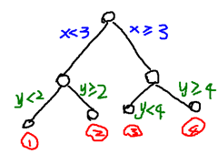
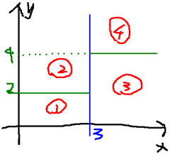

Random Forest，GBDT，U-Net，MRF
=================================

Decision Tree，boosting，bagging，FCN，MRF CRF
----------------------------------

<http://www.cnblogs.com/LeftNotEasy/archive/2011/03/07/random-forest-and-gbdt.html>

**我的硕士论文是关于RF+CNN，U-Net+MRF实现医疗图像分割技术。**

**此篇文章会复习RF，GBDT，U-Net，MRF等知识。**

**决策树**
----------------------------------
**学习什么是决策树，以及运算（机器学习每周课程）**

优点：训练时间复杂度低，预测的过程快速，决策树可视化好，
缺点：overfitting
常见的模型组合形式：Boosting，Bagging组合形成RF和GBDT。

随机森林 GBDT
----------------------------------

主要：information gain，决策树

决策树实际上是将空间用超平面进行划分的一种方法。

这样使得每一个叶子节点都是在空间中的一个不相交的区域。

Random forest：
----------------------------------

用随机的方式建立一个森林。

建立决策树的时候，需要注意：采样，完全分裂。

RF对输入数据要进行行列采样，对于行采样，是有放回。

假设输入样本是N，采样样本也是N。这样训练时候，每棵树的输入都不是全部样本，相对不容易出现过拟合。

再进行列采样，M个feature里选择m个。之后就是对采样之后的数据使用完全分裂方式建立决策树，这样决策树的某个叶子要么无法完全分裂，要么所有样本都是指向同一个分类。

一般很多决策树算法都有一个重要的步骤，是剪枝。 

U-Net
-----------------------------------
U-Net，先学习FCN的概念，再学习U-Net的网络设计以及实现效果。

MRF
----------------------------------
在图像分割领域，为何很强
